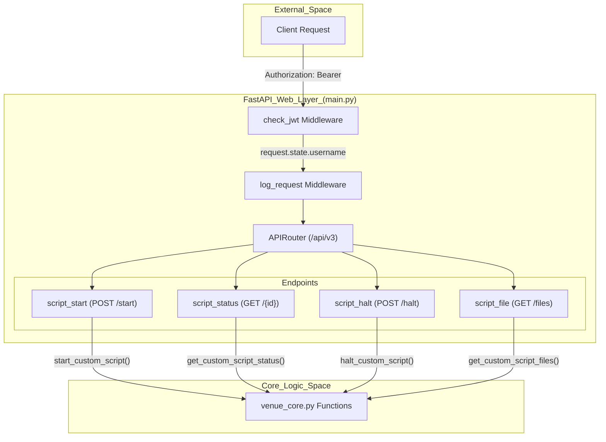
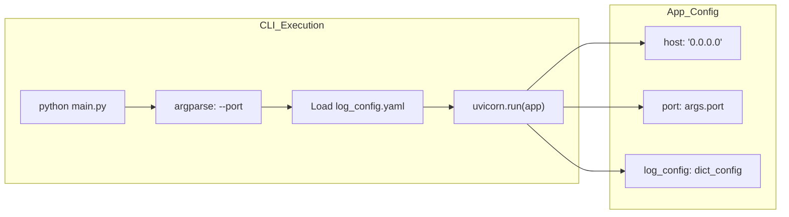

# Page: FastAPI Web Layer (main.py)

# FastAPI Web Layer (main.py)

Relevant source files

The following files were used as context for generating this wiki page:

- [main.py](main.py)
- [utils.py](utils.py)

The FastAPI web layer serves as the primary entry point for the VenueServer. It defines the RESTful interface, manages security through JWT middleware, handles request logging, and orchestrates calls to the underlying execution engine.

## Overview and Purpose

The `main.py` file initializes the FastAPI application, configures routing for the `/api/v3/` namespace, and sets up global middleware for authentication and observability. It bridges the gap between external HTTP requests and the internal logic managed by `venue_core.py`.

**Key Responsibilities:**
*   **Routing:** Defines endpoints for script lifecycle management (start, status, halt, download) and health checks [main.py:52-164]().
*   **Security:** Implements JWT validation and scope-based authorization via middleware [main.py:167-204]().
*   **Observability:** Provides detailed request/response logging, including timing and payload capture [main.py:207-251]().
*   **Lifecycle:** Handles CLI startup and environment initialization [main.py:9-37]().

### Request Lifecycle Diagram
This diagram traces a request from the NGINX ingress through the FastAPI middleware stack to the core execution logic.

**Request Flow: Ingress to Execution**

Sources: [main.py:52-164](), [main.py:167-251](), [main.py:78-86](), [main.py:105-108](), [main.py:127-129](), [main.py:149-151]().

---

## REST API Endpoints

All functional endpoints are grouped under the `/api/v3` prefix [main.py:52]().

| Method | Path | Summary | Description |
| :--- | :--- | :--- | :--- |
| `GET` | `/health` | Check health status | Returns `HealthStatus` model. Does not require JWT [main.py:55-64](). |
| `POST` | `/custom_script/start` | Start execution | Accepts `ScriptStartBodyModel`, returns `ScriptRunInfo` [main.py:67-92](). |
| `GET` | `/custom_script/{id}` | Retrieve status | Returns `ScriptStatusResp` with logs and state [main.py:95-114](). |
| `POST` | `/custom_script/{id}/halt` | Halt script | Sends termination signal to the running process [main.py:117-136](). |
| `GET` | `/custom_script/{id}/files` | Download artifacts | Returns a `tar.gz` of input/output/log files [main.py:139-159](). |

### Endpoint Implementation Details
*   **`script_start`**: Extracts the `username` from `request.state.username` (populated by JWT middleware) and injects it into the script inputs before calling `venue_core.start_custom_script` [main.py:80-86]().
*   **`script_file`**: Uses FastAPI's `FileResponse` to stream the tarball generated by the core engine back to the client [main.py:151-153]().

Sources: [main.py:52-164](), [core/schema.py:1-100]().

---

## Middleware Stack

The application utilizes two primary asynchronous middleware functions to handle cross-cutting concerns.

### 1. Authentication: `check_jwt`
This middleware intercepts every request (except `/docs`, `/openapi.json`, and `/health`) to validate the `Authorization` header [main.py:171-183]().

*   **Token Extraction:** Calls `utils.get_decoded_token()` to parse the Bearer token [main.py:187]().
*   **Identity Injection:** Stores the `username` in `request.state.username` for downstream use in endpoints [main.py:190]().
*   **Authorization:** Validates that the token contains at least one of the `ACCEPTED_SCOPES` using `utils.has_permission()` [main.py:195-201]().
*   **Error Handling:** Returns a `401 Unauthorized` or `403 Forbidden` if validation fails [main.py:192-204]().

### 2. Logging: `log_request`
Captures telemetry for every incoming request and outgoing response [main.py:207]().

*   **Request ID:** Generates a unique 10-character alphanumeric `request_id` for correlation [main.py:209-210]().
*   **Payload Capture:** Iterates through the request body stream to log the raw input [main.py:217-224]().
*   **Performance Monitoring:** Calculates the elapsed time (process time) for each request [main.py:243]().
*   **Response Logging:** Logs the HTTP status code and response body [main.py:231-245]().

Sources: [main.py:167-251](), [utils.py:36-65]().

---

## Startup and Configuration

The server is designed to be started via the command line, typically through the `start_venueserver.sh` wrapper which eventually invokes `main.py`.

### Environment Initialization
At module load time, the server prints critical environment variables to the log for debugging:
*   `ING_VENUE_DIR`
*   `ING_LOG_DIR`
*   `CUSTOM_SCRIPT_BASE_DIR`
*   `sys.path` (Python search paths)

Sources: [main.py:9-24]().

### CLI Entry Point
The script uses `argparse` to handle startup parameters when run as `__main__` [main.py:270-273]().

*   **Port Configuration:** Defaults to `19443` if not specified [main.py:272]().
*   **Logging Setup:** Loads configuration from `log_config.yaml` using `pyaml_env` to allow environment variable substitution within the YAML [main.py:275-280]().
*   **Uvicorn:** Launches the ASGI server with the specified host and port [main.py:282-287]().

Sources: [main.py:270-287](), [log_config.yaml:1-50]().

---

## OpenAPI Schema Customization

The server overrides the default FastAPI OpenAPI generation to provide a cleaner UI and consistent metadata [main.py:254]().

*   **Title:** "VenueServer API"
*   **Version:** "3.0.0"
*   **Customization:** It removes the `422 Unprocessable Entity` response from the schema if it contains no content, reducing clutter in the Swagger UI [main.py:261-265]().

Sources: [main.py:254-268]().
