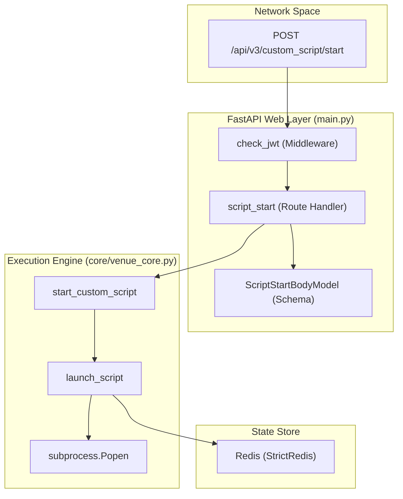
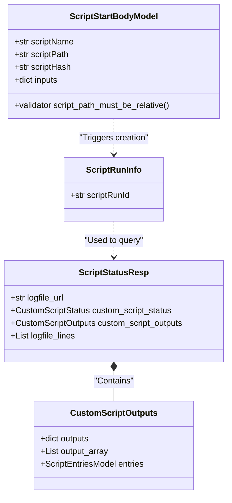

# Page: Glossary

# Glossary

Relevant source files

The following files were used as context for generating this wiki page:

- [README.md](README.md)
- [config/venueserver_dev_envs.sh](config/venueserver_dev_envs.sh)
- [core/schema.py](core/schema.py)
- [core/venue_core.py](core/venue_core.py)
- [main.py](main.py)
- [openapi.yaml](openapi.yaml)
- [start_venueserver.sh](start_venueserver.sh)
- [tests/custom_script_for_tests/test_cs.py](tests/custom_script_for_tests/test_cs.py)
- [tests/test_custom_script.py](tests/test_custom_script.py)
- [utils.py](utils.py)

This page provides definitions for codebase-specific terminology, domain concepts, and architectural components within the Ingenium Venue Agent (VenueServer). It serves as a technical reference for onboarding engineers to map natural language requirements to specific code entities.

## Core Concepts and Terminology

### Custom Script
A user-provided Python script executed by the VenueServer to perform automated testing or venue interaction. These scripts follow a specific execution contract involving `input.json` and `output.json` files.
*   **Implementation**: Scripts are launched as sub-processes using `subprocess.Popen` in `core/venue_core.py` [core/venue_core.py:154-155]().
*   **Validation**: Scripts must reside within the `CUSTOM_SCRIPT_BASE_DIR` and are validated for path safety (no `..` or `~`) [core/schema.py:27-35]() and integrity via SHA256 hashing [core/venue_core.py:187-203]().

### Script Run ID
A unique UUID (version 4) assigned to every execution instance of a custom script.
*   **Generation**: Created during the directory setup phase in `create_temp_dir_and_logfiles` [core/venue_core.py:64]().
*   **Purpose**: Acts as the primary key in Redis for retrieving process metadata [core/venue_core.py:169]() and as the identifier for API consumers to poll status [main.py:95-105]().

### Venue Workspace
The ephemeral filesystem area where a script's execution artifacts are stored.
*   **Base Path**: Defined by the `CUSTOM_SCRIPT_LOG_PATH_BASE` variable (default `/tmp/cs`) [core/venue_core.py:22]().
*   **Structure**: Each run creates a subfolder named `{timestamp}-{script_run_id}` [core/venue_core.py:68-71]().

### Input/Output Contract
The mechanism by which the VenueServer communicates with the sub-process script.
*   **input.json**: Contains the `inputs` dictionary provided in the REST API request [core/venue_core.py:107-108]().
*   **output.json**: The script is expected to write its results and status to this file. The VenueServer polls this file to update its state [core/venue_core.py:111-114]().
*   **script.log**: Captures `stdout` and `stderr` of the script process [core/venue_core.py:117-155]().

---

## Architectural Mapping

The following diagram bridges the gap between high-level system operations and the specific code entities that implement them.

### Diagram: Request Lifecycle to Code Entities
"This diagram maps a 'Start Script' request from the Network Space through the Web Layer into the Execution Engine."

**Sources**: [main.py:67-78](), [main.py:167-168](), [core/venue_core.py:125-171](), [core/venue_core.py:206-217]()

---

## Domain Abbreviations

| Abbreviation | Full Term | Description | Code Pointer |
| :--- | :--- | :--- | :--- |
| **CS** | Custom Script | General term for the execution engine logic. | `core/venue_core.py` |
| **JWT** | JSON Web Token | Used for Bearer authentication. Validated against a public RSA key. | `utils.py:36-56` |
| **MTAK** | Multi-Testbed Automation Kernel | Internal JPL toolset; paths are added to `PYTHONPATH` during startup. | `start_venueserver.sh:80` |
| **GDS** | Ground Data System | The broader environment where the VenueServer is deployed. | `README.md:74` |
| **SHA256** | Secure Hash Algorithm 256 | Used to verify the integrity of the script file before execution. | `core/venue_core.py:193` |

---

## Technical Definitions

### Redis State Management
The VenueServer uses Redis as a volatile key-value store to track active and recently finished script processes.
*   **Data Structure**: A JSON string containing `process_id`, `output_path`, `logfile_path`, and `custom_script_temp_dir` [core/venue_core.py:160-166]().
*   **Key**: The `script_run_id` [core/venue_core.py:169]().

### Log Tailing
The ability to retrieve the most recent execution logs without reading the entire file.
*   **Implementation**: Uses the `tailer` library to fetch the last 25 lines of the `script.log` [core/venue_core.py:174-184]().

### Process Halting
The mechanism to terminate a running script.
*   **Implementation**: Sends a `SIGTERM` to the process group (using `os.killpg`) to ensure child processes are also cleaned up [core/venue_core.py:290-297]().

---

## Code Entity Space Mapping

### Diagram: Data Model Relationships
"This diagram shows how Pydantic schemas in `core/schema.py` relate to the internal state managed in `core/venue_core.py`."

**Sources**: [core/schema.py:18-35](), [core/schema.py:37-38](), [core/schema.py:61-74]()

### Table: Key Environment Variables

| Variable | Usage | Implementation Site |
| :--- | :--- | :--- |
| `CUSTOM_SCRIPT_BASE_DIR` | Root directory for locating relative script paths. | `core/venue_core.py:24` |
| `ING_LOG_DIR` | Directory where the main application log (`ing_vs.log`) is stored. | `log_config.yaml` (referenced in `main.py`) |
| `PYTHONUNBUFFERED` | Set to `YES` for sub-processes to ensure real-time log tailing. | `core/venue_core.py:152` |

**Sources**: [config/venueserver_dev_envs.sh:3-7](), [core/venue_core.py:24-152](), [main.py:12-14]()