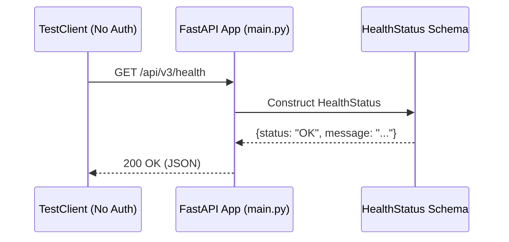
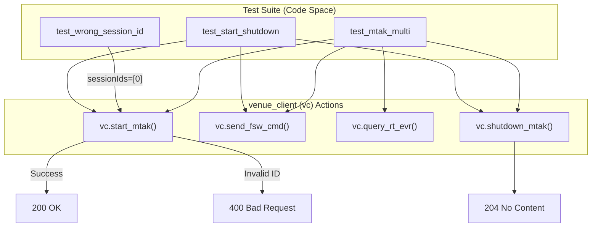

# Page: Health and MTAK Tests

# Health and MTAK Tests

Relevant source files

The following files were used as context for generating this wiki page:

- [tests/test_health.py](tests/test_health.py)
- [tests/test_mtak.py](tests/test_mtak.py)
- [tests/test_mtak_multi.py](tests/test_mtak_multi.py)

This page documents the test suites for the system health monitoring and the Mission Tool Automation Kit (MTAK) integration. These tests ensure the VenueServer remains responsive and correctly interfaces with the AMPCS-based MTAK backend for spacecraft command and telemetry operations.

## Health Check Verification

The `test_health.py` suite validates the `/api/v3/health` endpoint. This endpoint is critical for external monitoring tools, systemd health checks, and load balancers to determine the operational state of the VenueServer instance.

### Nominal and Off-Nominal Scenarios
The health check is a public endpoint that does not require JWT authentication [tests/test_health.py:5]().

| Test Case | Method | Expected Status | Description |
| :--- | :--- | :--- | :--- |
| `test_health_success` | GET | 200 OK | Verifies the response contains a `status` field (OK, ERROR, or UNKNOWN) and a `message` [tests/test_health.py:7-15](). |
| `test_health_invalid_method` | POST | 405 Method Not Allowed | Rejects POST requests [tests/test_health.py:17-20](). |
| `test_health_invalid_method_patch` | PATCH | 405 Method Not Allowed | Rejects PATCH requests [tests/test_health.py:22-25](). |
| `test_health_invalid_method_delete` | DELETE | 405 Method Not Allowed | Rejects DELETE requests [tests/test_health.py:27-30](). |

### Health Data Flow
The following diagram illustrates the interaction between the `TestClient` and the `HealthStatus` schema during a health check.

**Health Endpoint Logic**

Sources: [tests/test_health.py:7-15](), [main.py:4-5]()

---

## MTAK Session Lifecycle Tests

MTAK tests (`test_mtak.py` and `test_mtak_multi.py`) verify the integration with the AMPCS (Advanced Multi-Mission Operations System) backend. These tests rely on a `venue_client` wrapper to interact with the MTAK session management endpoints.

### Prerequisites and Configuration
For these tests to succeed, the environment must be configured with valid AMPCS session IDs and the appropriate environment variables.
*   **AMPCS Sessions**: Real session IDs (e.g., `session_id_a`) must be active in the target environment.
*   **Environment Setup**: The `env.csh` or equivalent configuration must point to the correct `ING_MTAK_DIR`.

### MTAK Single Session Lifecycle
The `test_mtak.py` file covers the basic lifecycle of a single MTAK session, including startup, commanding, and shutdown.

*   **Session Startup**: `vc.start_mtak` initializes the connection to AMPCS using a list of session IDs [tests/test_mtak.py:6]().
*   **Command Execution**: `vc.send_fsw_cmd` sends a Flight Software (FSW) command (e.g., `CMD_NO_OP`) to a specific session [tests/test_mtak.py:10-11]().
*   **Session Shutdown**: `vc.shutdown_mtak` terminates the MTAK process and releases resources, returning a 204 No Content status [tests/test_mtak.py:15-16]().

### Error Handling (Off-Nominal)
*   **Wrong Session ID**: Passing an invalid session ID (e.g., `0`) results in a 400 Bad Request [tests/test_mtak.py:21-22]().
*   **Short Timeout**: Requesting a session with an insufficient timeout value results in a 400 Bad Request [tests/test_mtak.py:27-28]().

Sources: [tests/test_mtak.py:4-29]()

---

## Multi-Session and EVR Querying

The `test_mtak_multi.py` suite validates the ability to manage multiple concurrent AMPCS sessions and retrieve Event Records (EVRs).

### Multi-Session Coordination
The test initializes two distinct sessions (`session_id_a` and `session_id_b`) and sends commands to both independently to ensure no cross-talk or session interference [tests/test_mtak_multi.py:10-26]().

### EVR Polling Logic
The suite demonstrates a polling loop that queries for Real-Time EVRs using a time window [tests/test_mtak_multi.py:31-52]().

1.  **Time Sync**: Uses `datetime.now(tz=timezone.utc)` to define `query_start_time` and `query_end_time` in the format `%Y-%jT%H:%M:%S` [tests/test_mtak_multi.py:14, 33]().
2.  **Query**: Calls `vc.query_rt_evr` for a specific EVR name (e.g., `CMD_COMP_EVR`) [tests/test_mtak_multi.py:35-36]().
3.  **Validation**: Sorts the resulting EVRs by Earth Received Time (`ert`) and ensures at least one record is received for each session [tests/test_mtak_multi.py:38, 54-55]().

### MTAK Code Entity Mapping
The following diagram maps the test functions to the underlying `venue_client` (vc) operations and expected status codes.

**MTAK Operation Mapping**

Sources: [tests/test_mtak.py:4-29](), [tests/test_mtak_multi.py:5-60]()
