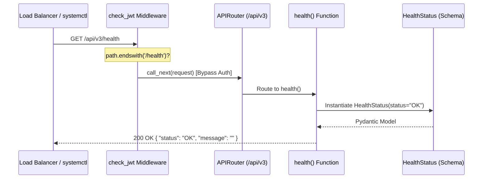
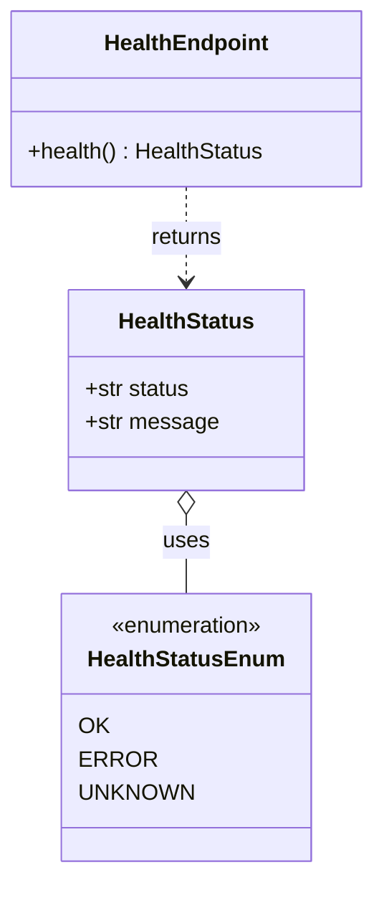

# Page: Health Check Endpoint

# Health Check Endpoint

Relevant source files

The following files were used as context for generating this wiki page:

- [main.py](main.py)
- [tests/test_health.py](tests/test_health.py)

The Health Check endpoint provides a simple mechanism to verify the operational status of the VenueServer. It is designed for consumption by automated systems such as load balancers, container orchestrators, and `systemctl` monitoring scripts to ensure the service is responsive.

## Overview and Implementation

The health check is implemented as a synchronous GET request at the `/api/v3/health` path [main.py:55-64](). It returns a standardized JSON response indicating the current status of the application.

### Implementation Details
The endpoint is defined within the `prefix_router` in `main.py` [main.py:52](). Unlike most other endpoints in the VenueServer, the health check is explicitly excluded from JSON Web Token (JWT) validation within the `check_jwt` middleware [main.py:181-183](). This allows infrastructure components to probe the service without requiring valid authentication credentials.

### Data Flow: Health Request
The following diagram illustrates the flow of a health check request through the FastAPI application layer.

**Health Check Request Lifecycle**

Sources: [main.py:55-64](), [main.py:181-183](), [core/schema.py:44]()

## Response Schema

The endpoint returns a `HealthStatus` model as defined in the core schema.

| Field | Type | Description |
| :--- | :--- | :--- |
| `status` | `HealthStatusEnum` | The operational state. Valid values: `OK`, `ERROR`, `UNKNOWN`. |
| `message` | `str` | Additional context or error details (typically empty if status is `OK`). |

In the current implementation, the `health()` function returns a hardcoded `HealthStatusEnum.OK` value [main.py:64]().

**Code Entity Mapping**

Sources: [main.py:44](), [main.py:63-64](), [core/schema.py:44]()

## Access Control and Constraints

### Authentication
The endpoint is **no-auth**. The `check_jwt` middleware in `main.py` contains a conditional check that allows any request ending in `/health` to proceed without an `Authorization` header [main.py:181-183]().

### HTTP Methods
The health check only supports the `GET` method. Other HTTP methods are explicitly rejected by the FastAPI router with a `405 Method Not Allowed` status code. This behavior is verified by the test suite [tests/test_health.py:17-30]().

| Method | Expected Status | Result |
| :--- | :--- | :--- |
| `GET` | `200 OK` | Success [tests/test_health.py:10-11]() |
| `POST` | `405 Method Not Allowed` | Failure [tests/test_health.py:19-20]() |
| `PATCH` | `405 Method Not Allowed` | Failure [tests/test_health.py:24-25]() |
| `DELETE` | `405 Method Not Allowed` | Failure [tests/test_health.py:29-30]() |

## Usage in Infrastructure

The endpoint is utilized by the system's deployment and monitoring components:

1.  **Load Balancers/NGINX**: Used to determine if a specific instance of the VenueServer (e.g., on ports 19443, 19444, or 19445) is ready to accept traffic.
2.  **Service Management**: Can be used in conjunction with `systemd` or custom watchdog scripts to restart the `uvicorn` process if the endpoint becomes unresponsive or returns an `ERROR` status.
3.  **Deployment Verification**: The `test_health_success` test case ensures the server has initialized correctly and the FastAPI router is functional [tests/test_health.py:7-15]().

Sources: [main.py:55-64](), [tests/test_health.py:1-30]()
