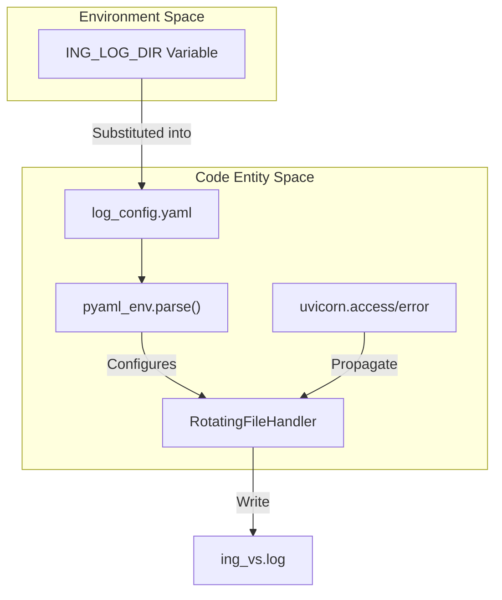
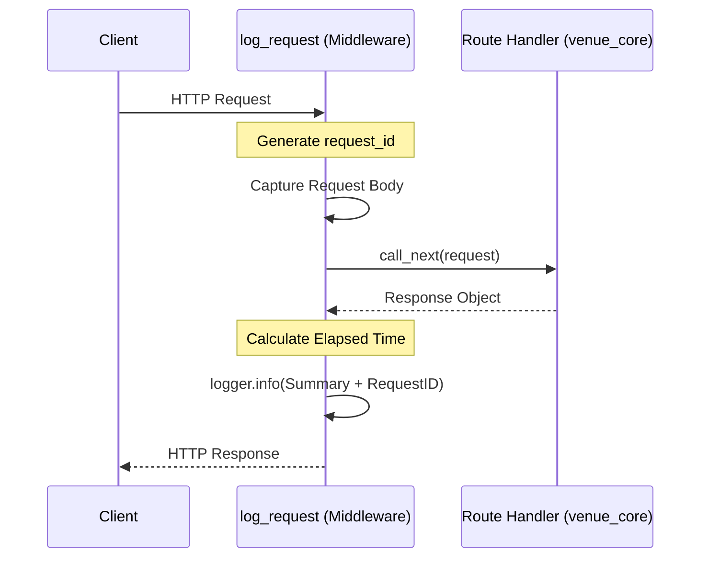

# Page: Logging Configuration

# Logging Configuration

Relevant source files

The following files were used as context for generating this wiki page:

- [log_config.yaml](log_config.yaml)
- [main.py](main.py)

The VenueServer employs a centralized logging strategy designed for high-volume request tracking and long-term forensic analysis. The configuration integrates standard Python `logging` handlers with `pyaml-env` for environment-aware pathing and FastAPI middleware for granular request lifecycle monitoring.

## 1. Global Configuration (log_config.yaml)

The system uses `log_config.yaml` to define a structured logging hierarchy. This configuration is loaded during the application startup sequence in `main.py` using the `pyaml_env` package, which allows for dynamic environment variable substitution within the YAML file [main.py:34-37](), [main.py:50-51]().

### 1.1 Environment Variable Substitution
The configuration utilizes the `!ENV` tag provided by `pyaml-env` to resolve the log file destination at runtime. This ensures that logs are written to the directory specified by the `ING_LOG_DIR` environment variable [log_config.yaml:19-20]().

### 1.2 Handlers and Rotation
The system implements two primary handlers to balance real-time observability with persistent storage:

| Handler | Class | Configuration Details |
| :--- | :--- | :--- |
| `console` | `logging.StreamHandler` | Outputs to `sys.stdout` with `DEBUG` level [log_config.yaml:8-12](). |
| `rotating_file` | `RotatingFileHandler` | Writes to `${ING_LOG_DIR}/ing_vs.log`. Features a `maxBytes` limit of 50MB (50,000,000 bytes) and retains 20 backup files [log_config.yaml:13-20](). |

### 1.3 Uvicorn Integration
To ensure a unified log stream, the configuration explicitly manages `uvicorn` internal loggers. Both `uvicorn.error` and `uvicorn.access` are set to `DEBUG` level and configured with `propagate: yes`, allowing their output to be captured by the root handlers defined in the YAML [log_config.yaml:26-32]().

**Log Configuration Data Flow**

Sources: [log_config.yaml:1-32](), [main.py:34-51]()

## 2. Request Logging Middleware

Beyond static configuration, `main.py` implements a custom asynchronous middleware named `log_request` to capture the full context of every HTTP interaction.

### 2.1 Implementation Details
The `log_request` middleware performs the following operations for every incoming call to the `/api/v3` prefix:
1.  **Request Identification**: Generates a unique `request_id` using a random 5-character string to correlate log entries across a single execution flow [main.py:214-215]().
2.  **Body Capture**: For non-GET requests, it consumes the request stream to log the payload. It uses `iterate_in_threadpool` to ensure the body remains available for subsequent route handlers [main.py:218-232]().
3.  **Execution Timing**: Records the start time and calculates the total elapsed time once the response is generated [main.py:213](), [main.py:243-244]().

### 2.2 Logged Metadata
Each request log entry includes:
*   `request_id`
*   HTTP Method and URL path
*   Client Host information
*   Request Body (if applicable)
*   Response Status Code
*   Elapsed time in seconds

**Middleware Execution Logic**

Sources: [main.py:211-250]()

## 3. Startup Diagnostics

Upon initialization, the VenueServer executes `print_env_variables()` to log the environment state. This provides immediate visibility into the configuration used by the `venue_core` execution engine and the Python path resolution [main.py:9-24]().

Variables logged at startup include:
*   `ING_VENUE_DIR`: Base directory for venue data [main.py:12]().
*   `ING_LOG_DIR`: Target directory for the rotating log files [main.py:13]().
*   `CUSTOM_SCRIPT_BASE_DIR`: Root path where user scripts are stored and executed [main.py:14]().
*   `sys.path`: The full list of directories searched for Python modules [main.py:21-22]().

**Entity Association Table**

| System Concept | Code Entity | File Reference |
| :--- | :--- | :--- |
| Log Formatter | `timestamped` | [log_config.yaml:4-6]() |
| Env Helper | `pyaml_env` | [main.py:36]() |
| Request Tracking | `log_request` | [main.py:211]() |
| Diagnostic Function | `print_env_variables` | [main.py:9]() |

Sources: [main.py:1-24](), [log_config.yaml:1-32]()
