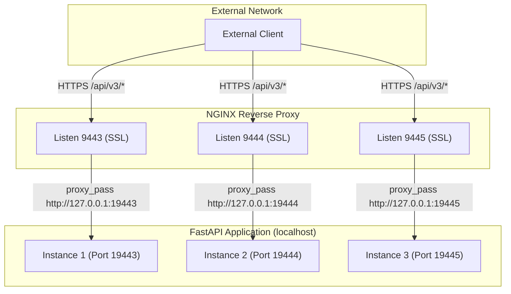
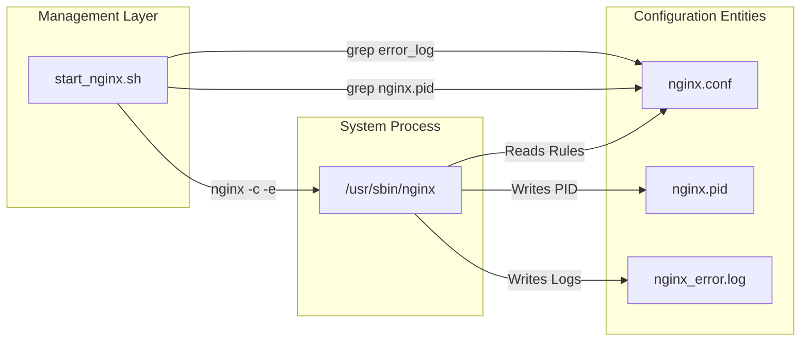

# Page: NGINX Reverse Proxy

# NGINX Reverse Proxy

Relevant source files

The following files were used as context for generating this wiki page:

- [nginx.conf.template](nginx.conf.template)
- [start_nginx.sh](start_nginx.sh)

The VenueServer utilizes NGINX as a high-performance reverse proxy and SSL/TLS termination layer. It sits in front of the FastAPI application instances, providing secure communication, request buffering, and port-based routing to multiple backend instances.

## Configuration Structure

The NGINX configuration is managed via a template file, `nginx.conf.template`, which is processed during environment setup to produce a final `nginx.conf`. This template uses environment variables to define paths and hostnames specific to the deployment environment.

### Global Settings
- **Worker Processes**: Set to 2 to handle concurrent connections [nginx.conf.template:1]().
- **PID Path**: Dynamically generated based on `${HOME}` and `${SHORT_HOSTNAME}` [nginx.conf.template:3]().
- **Temp Paths**: NGINX requires write access to several temporary directories for client bodies and proxy buffering. These are mapped to the user's `ingenium` workspace [nginx.conf.template:14-18]().
- **Timeouts**: Connection, send, and read timeouts are set to 300 seconds to accommodate long-running API requests [nginx.conf.template:29-33]().

### Logging Configuration
NGINX uses a custom log format named `main` that includes ISO8601 timestamps and remote address information [nginx.conf.template:23-27](). Logs are separated by server instance:
- **Global Error Log**: `${HOME}/ingenium/${SHORT_HOSTNAME}/logs/nginx_error.log` [nginx.conf.template:5]().
- **Per-Port Logs**: Each server block (9443, 9444, 9445) maintains its own `access_log` and `error_log` [nginx.conf.template:41-42, 72-73, 103-104]().

**Sources:** [nginx.conf.template:1-42](), [nginx.conf.template:72-73](), [nginx.conf.template:103-104]()

---

## SSL/TLS Termination

NGINX handles all encryption, allowing the FastAPI application to run as plain HTTP on localhost. 

### Security Protocols and Ciphers
The configuration enforces high-security standards:
- **Protocols**: Restricted to **TLSv1.2** [nginx.conf.template:46]().
- **HSTS**: The `Strict-Transport-Security` header is added with a 1-year max-age [nginx.conf.template:39]().
- **Ciphers**: A specific list of ECDHE-based ciphers is defined to ensure Forward Secrecy and strong encryption (e.g., `ECDHE-RSA-AES256-GCM-SHA384`) [nginx.conf.template:47]().

### Certificate Management
Certificates are expected to be located in the `${ING_VENUE_DIR}/config/.secret/` directory:
- **Public Cert**: `.server.crt` [nginx.conf.template:44]().
- **Private Key**: `.server.key` [nginx.conf.template:45]().

**Sources:** [nginx.conf.template:39-47]()

---

## Port Mapping and Upstream Proxy

The VenueServer deployment model supports multiple instances on a single host. NGINX differentiates these instances by the external listening port and proxies them to corresponding internal ports on `127.0.0.1`.

### Data Flow Diagram: External Ingress to Internal FastAPI

The following diagram illustrates how NGINX maps external SSL requests to the internal uvicorn/FastAPI processes.

### Proxy Directives
For every `location ~ ^/api/v3/` block, NGINX applies the following headers to ensure the backend application receives correct client metadata:
- `Host $host` [nginx.conf.template:54]()
- `X-Real-IP $remote_addr` [nginx.conf.template:55]()
- `X-Forwarded-For $proxy_add_x_forwarded_for` [nginx.conf.template:56]()
- `X-Forwarded-Host $server_name` [nginx.conf.template:57]()

Requests to any path other than `/api/v3/` return a `404 Not Found` [nginx.conf.template:62-64]().

**Sources:** [nginx.conf.template:51-64](), [nginx.conf.template:82-95](), [nginx.conf.template:113-126]()

---

## Service Management (`start_nginx.sh`)

The `start_nginx.sh` script provides a wrapper for managing the NGINX process using the generated configuration file.

### Process Lifecycle Commands

| Command | Action | Implementation |
| :--- | :--- | :--- |
| `start` | Launches NGINX | `nginx -c $CONF_PATH -e $ERROR_LOG_PATH` [start_nginx.sh:37]() |
| `stop` | Stops NGINX | `nginx -c $CONF_PATH -s stop -e $ERROR_LOG_PATH` [start_nginx.sh:44]() |
| `reload` | Restarts NGINX | Calls `stop` (relying on system restart or manual start) [start_nginx.sh:47]() |

### Implementation Details
The script dynamically parses the `nginx.conf` to identify the `PID_PATH` and `ERROR_LOG_PATH` before executing commands [start_nginx.sh:27-31](). It uses the `-e` flag during startup to suppress default error messages that might occur if the system-wide NGINX log directory is not writable by the user [start_nginx.sh:37]().

### Component Interaction: Management Script to Configuration

This diagram shows how the management script interacts with the configuration file and the system `nginx` binary.

**Sources:** [start_nginx.sh:1-52]()
