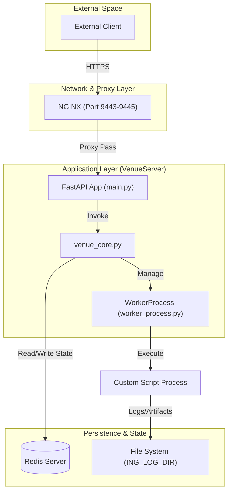

# Page: Overview

# Overview

<details>
<summary>Relevant source files</summary>

The following files were used as context for generating this wiki page:

- [README.md](README.md)
- [main.py](main.py)
- [requirements.txt](requirements.txt)

</details>


The **Ingenium Venue Agent** (also referred to as **VenueServer**) is a high-performance backend service designed to manage and execute custom scripts within the Ingenium ecosystem. It provides a secure, RESTful interface for triggering long-running processes, monitoring their execution state in real-time, and retrieving generated artifacts.

The system is built to handle the complexities of script lifecycle management, including process isolation, signal handling (halting), and robust logging, all while ensuring security through RSA-signed JSON Web Tokens (JWT).

### Core Functionality
*   **Script Execution:** Validates script integrity via SHA256 hashes before spawning isolated child processes.
*   **State Management:** Utilizes Redis as a high-speed state store to track script progress across multiple instances.
*   **Artifact Management:** Automatically packages logs, inputs, and outputs into compressed tarballs for retrieval.
*   **Security:** Enforces scope-based authorization using JWTs and provides middleware for request validation.

---

### High-Level Architecture

The Venue Agent follows a multi-tier architecture designed for scalability and reliability. A typical deployment involves an NGINX reverse proxy handling SSL termination and routing requests to one or more FastAPI application instances.

**System Component Interaction**

**Sources:** [main.py:163-164](), [README.md:32-41](), [README.md:45-51]().

For a deep dive into the networking topology, port mapping, and the interaction between these components, see **[System Architecture](#1.1)**.

---

### Code Entity Mapping

The following diagram bridges the gap between the conceptual "Natural Language Space" and the actual "Code Entity Space" by mapping system responsibilities to specific Python modules and classes.

**Functional Mapping to Code Entities**
```mermaid
graph LR
    subgraph "Web & Security"
        "REST Endpoints" --> "main.py (prefix_router)"
        "Auth Middleware" --> "main.py (check_jwt)"
        "JWT Decoding" --> "utils.py (get_decoded_token)"
    end

    subgraph "Execution Engine"
        "Script Lifecycle" --> "core/venue_core.py"
        "Process Management" --> "core/worker_process.py (WorkerProcess)"
        "Data Validation" --> "core/schema.py (Pydantic Models)"
    end

    subgraph "External Services"
        "State Store" --> "redis-py (Redis)"
        "Web Server" --> "uvicorn"
    end
```
**Sources:** [main.py:52-53](), [main.py:167-168](), [core/venue_core.py:1-10](), [core/worker_process.py:1-15](), [requirements.txt:1-5]().

---

### Key Components

| Component | Responsibility | Primary Files |
|:---|:---|:---|
| **FastAPI Web Layer** | Handles REST API requests, OpenAPI documentation, and request logging. | [main.py]() |
| **Execution Engine** | Coordinates script startup, hashing, and status retrieval. | [core/venue_core.py](), [core/worker_process.py]() |
| **Data Models** | Defines the structure of requests and responses using Pydantic. | [core/schema.py]() |
| **Security Utilities** | Manages RSA public keys and JWT verification. | [utils.py]() |
| **State Store** | Provides shared memory for script status across instances. | `redis` (External) |

---

### Technology Stack

The Venue Agent is built on a modern Python 3.12 stack, leveraging asynchronous frameworks and industry-standard libraries for security and performance.

*   **Framework:** FastAPI for the web interface.
*   **Server:** Uvicorn as the ASGI web server.
*   **Database:** Redis for transient state management.
*   **Security:** PyJWT and Cryptography for RS256 token validation.
*   **System Tools:** psutil for process monitoring and tailer for log streaming.

**Sources:** [requirements.txt:1-9]().

For a full list of dependencies, version constraints, and the rationale behind each technology choice, see **[Dependencies and Technology Stack](#1.2)**.

---

### Deployment Model

The Venue Agent supports a multi-instance deployment model where multiple `VenueServer` processes can run on a single host, distinguished by their listening ports (e.g., `19443`, `19444`, `19445`). NGINX acts as the unified entry point, mapping standard HTTPS ports to these internal application ports.

**Sources:** [README.md:37-41](), [README.md:145-146]().
