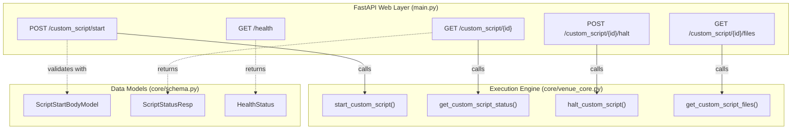
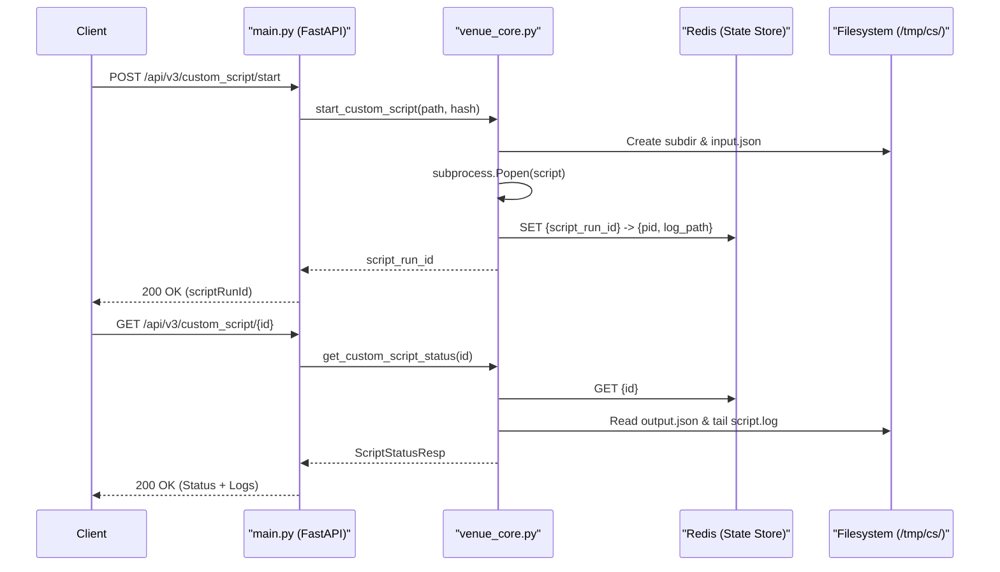

# Page: REST API Reference

# REST API Reference

Relevant source files

The following files were used as context for generating this wiki page:

- [core/schema.py](core/schema.py)
- [core/venue_core.py](core/venue_core.py)
- [main.py](main.py)
- [openapi.yaml](openapi.yaml)

The VenueServer exposes a set of RESTful HTTP endpoints under the `/api/v3/` prefix to facilitate the execution, monitoring, and management of custom scripts within the Ingenium environment [main.py:52](). These endpoints are designed for integration with automated test runners and front-end dashboards.

All endpoints, with the exception of the health check and OpenAPI documentation, require a valid JSON Web Token (JWT) for authentication [main.py:171-183]().

### API Entry Points

The following table summarizes the primary endpoints available in the VenueServer:

| Method | Endpoint | Description | Auth Required |
| :--- | :--- | :--- | :--- |
| `GET` | `/api/v3/health` | Service health status. | No |
| `POST` | `/api/v3/custom_script/start` | Initiates a new script execution. | Yes |
| `GET` | `/api/v3/custom_script/{id}` | Polls status and log tailing for a run. | Yes |
| `POST` | `/api/v3/custom_script/{id}/halt` | Terminates a running script. | Yes |
| `GET` | `/api/v3/custom_script/{id}/files` | Downloads execution artifacts (tar.gz). | Yes |

### Logical Mapping: API Routes to Core Logic

The diagram below maps the RESTful routes defined in the FastAPI `prefix_router` to their corresponding implementation logic in the `venue_core` module and the data schemas used for validation.

**API Route to Code Entity Mapping**

**Sources:** [main.py:52-160](), [core/venue_core.py:206-350](), [core/schema.py:11-74]()

---

### Custom Script API Endpoints

The `/custom_script` family of endpoints manages the lifecycle of script execution. When a script is started via `POST /start`, the server performs a SHA256 integrity check [core/venue_core.py:187-203]() and spawns a new process [core/venue_core.py:154-155](). Users can then poll the status, retrieve the last 25 lines of logs [core/venue_core.py:178](), or terminate the process if it hangs.

For full specification of request/response payloads and script state transitions, see **[Custom Script API Endpoints](#3.1)**.

### Health Check Endpoint

The `GET /api/v3/health` endpoint provides a simple mechanism for load balancers and system monitoring tools (like `systemd`) to verify the operational status of the VenueServer [main.py:55-64](). It returns a `HealthStatus` object indicating if the service is `OK`, `ERROR`, or `UNKNOWN` [core/schema.py:6-9]().

For details on response schemas and monitoring integration, see **[Health Check Endpoint](#3.2)**.

### Authentication and Authorization

Security is enforced via a JWT middleware `check_jwt` [main.py:167-168](). The server validates the `Authorization: Bearer <token>` header against a local RSA public key [utils.py:18-20](). Beyond identity, the server checks for specific `ACCEPTED_SCOPES` to ensure the requester has permission to execute scripts on the target venue [utils.py:10-16]().

For details on the security model and scope requirements, see **[Authentication and Authorization](#3.3)**.

### Data Flow Architecture

This diagram illustrates how a request flows from the external REST API through the internal state management (Redis) and the filesystem.

**Request and State Data Flow**

**Sources:** [main.py:78-87](), [core/venue_core.py:125-171](), [core/venue_core.py:246-285]()

---
**Sources:**
- [main.py:52-160]() (Endpoint definitions and middleware)
- [core/venue_core.py:125-350]() (Execution and status logic)
- [core/schema.py:6-78]() (Request/Response models)
- [utils.py:10-20]() (Auth constants and logic)
