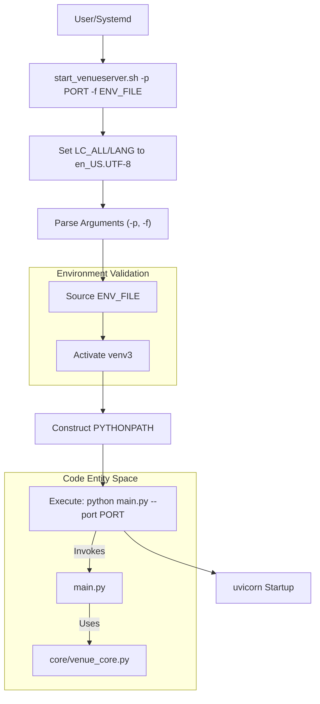

# Page: Server Startup and Configuration (start_venueserver.sh)

# Server Startup and Configuration (start_venueserver.sh)

<details>
<summary>Relevant source files</summary>

The following files were used as context for generating this wiki page:

- [config/venueserver_dev_envs.sh](config/venueserver_dev_envs.sh)
- [core/__init__.py](core/__init__.py)
- [start_venueserver.sh](start_venueserver.sh)

</details>


The `start_venueserver.sh` script is the primary entry point for launching the Venue Agent server. It handles environment preparation, virtual environment activation, path configuration, and the final execution of the FastAPI application via `uvicorn`.

## Script Purpose and Logic Flow

The script ensures that the VenueServer runs in a consistent environment by explicitly setting locales, sourcing required environment variables from a configuration file, and managing the `PYTHONPATH` to ensure dependency compatibility.

### Startup Sequence Diagram

The following diagram illustrates the flow from script invocation to the execution of `main.py`.

**Figure 1: VenueServer Startup Sequence**

Sources: [start_venueserver.sh:1-90]()

## Command Line Arguments

The script requires two specific flags to operate:

| Argument | Description | Required | Example |
| :--- | :--- | :--- | :--- |
| `-p` | The TCP port the VenueServer will listen on. | Yes | `19443` |
| `-f` | Path to the shell script defining environment variables. | Yes | `config/venueserver_dev_envs.sh` |

Sources: [start_venueserver.sh:10-21](), [start_venueserver.sh:28-44]()

## Environment Configuration

### Locale and Shell Setup
To prevent `uvicorn` and certain Python libraries from crashing due to encoding issues, the script explicitly exports UTF-8 locales:
* `LC_ALL='en_US.UTF-8'` [start_venueserver.sh:7-7]()
* `LANG='en_US.UTF-8'` [start_venueserver.sh:8-8]()

### Environment Variable File (`-f`)
The script sources the file provided via the `-f` argument [start_venueserver.sh:55-55](). This file (e.g., `config/venueserver_dev_envs.sh`) must define critical paths used by the application logic in `core/venue_core.py` and `main.py`.

Key variables typically defined in this file include:
* `ING_VENUE_DIR`: The root directory of the venue-agent repository [config/venueserver_dev_envs.sh:3-3]().
* `ING_LOG_DIR`: The directory where `ing_vs.log` and other logs are stored [config/venueserver_dev_envs.sh:4-4]().
* `CUSTOM_SCRIPT_BASE_DIR`: The base directory where user-uploaded scripts are stored and executed [config/venueserver_dev_envs.sh:7-7]().
* `ING_MTAK_DIR`: Path to MTAK-related libraries, appended to `PYTHONPATH` [start_venueserver.sh:80-80]().

Sources: [start_venueserver.sh:53-60](), [config/venueserver_dev_envs.sh:1-8]()

## Python Environment and Path Management

### Virtual Environment Activation
The script expects a virtual environment named `venv3` to exist in the same directory as the script [start_venueserver.sh:4-4](). It activates this environment using `source $VENV_DIR/bin/activate` [start_venueserver.sh:71-71](). If the directory is missing, the script exits with an error [start_venueserver.sh:72-75]().

### PYTHONPATH Construction
A critical step in the startup process is the manual construction of `PYTHONPATH`. This is done to ensure that local packages in the virtual environment take precedence over system-level installations, specifically to resolve version conflicts for the `Click` library required by FastAPI.

The `PYTHONPATH` is assembled as follows:
1. `$VENV_DIR/lib/python3.6/site-packages`
2. `$VENV_DIR/lib64/python3.6/site-packages`
3. `$ING_MTAK_DIR` (External dependency path)
4. Existing `$PYTHONPATH`

**Figure 2: Python Path Precedence**
```mermaid
stack
    label "Highest Priority (Local venv3)"
    "venv3/lib/python3.6/site-packages"
    "venv3/lib64/python3.6/site-packages"
    "ING_MTAK_DIR (External Tools)"
    "System Site-Packages"
    label "Lowest Priority"
```
Sources: [start_venueserver.sh:77-85]()

## Server Launch

The final action of the script is to invoke the Python interpreter from the virtual environment to run `main.py`. The port parsed from the `-p` argument is passed as a CLI argument to the Python script.

```bash
$VENV_DIR/bin/python main.py --port $PORT
```

This execution triggers the `uvicorn` server within `main.py` to begin listening for REST API requests.

Sources: [start_venueserver.sh:87-89]()
