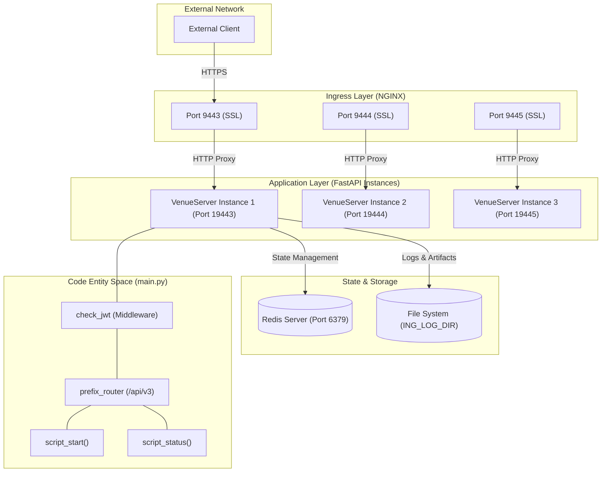
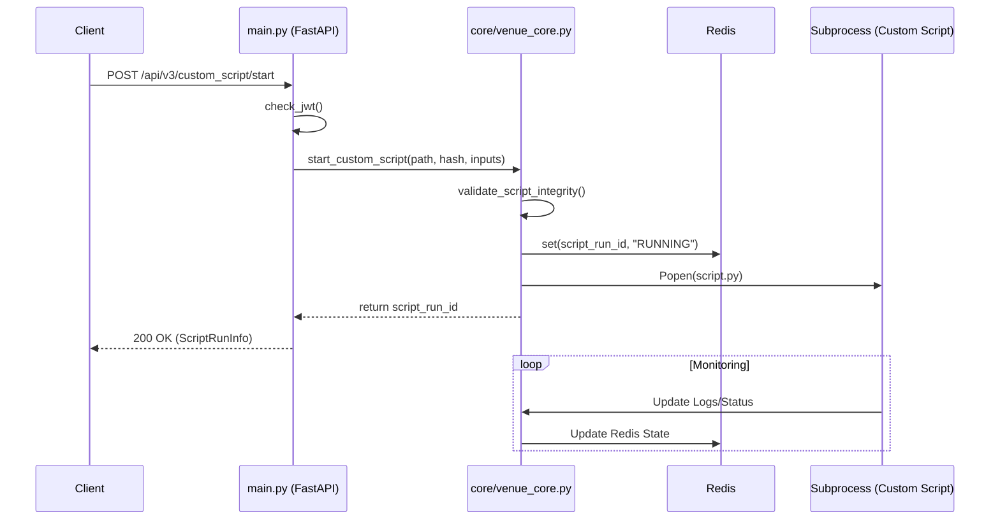

# Page: System Architecture

# System Architecture

Relevant source files

The following files were used as context for generating this wiki page:

- [README.md](README.md)
- [main.py](main.py)
- [nginx.conf.template](nginx.conf.template)
- [start_redis.sh](start_redis.sh)

The Ingenium Venue Agent (VenueServer) utilizes a multi-tier architecture designed for secure, isolated execution of custom scripts within a mission control environment. It leverages a high-performance FastAPI application layer, a Redis-backed state store, and an NGINX reverse proxy for SSL termination and request routing.

## High-Level Component Overview

The system is composed of four primary layers that interact to provide a robust execution environment:

1.  **Ingress Layer (NGINX):** Handles TLS termination (SSL) and maps external secure ports to internal application instances.
2.  **Application Layer (FastAPI):** Implements the REST API, JWT authentication middleware, and business logic for script management.
3.  **State Layer (Redis):** Acts as a shared, persistent data store for script execution metadata and status tracking.
4.  **Execution Layer (Subprocesses):** Spawns isolated shell processes for custom script execution, managed by the application's core logic.

### System Interaction Diagram

The following diagram illustrates the flow of a request from an external client through the architecture to the code entities.

**Architecture Flow: Client to Code Entity**

**Sources:** [README.md:32-69](), [nginx.conf.template:36-127](), [main.py:52-164](), [main.py:167-200]()

---

## Networking and Deployment Model

The VenueServer is designed for multi-instance deployment on a single host. This allows different "Venues" or user groups to have dedicated execution environments while sharing the same underlying infrastructure.

### Port Mapping Topology
NGINX acts as the gateway, mapping high-level SSL ports to local unencrypted ports where the FastAPI instances listen.

| External Port (SSL) | Internal Port (FastAPI) | Purpose |
| :--- | :--- | :--- |
| 9443 | 19443 | Venue Instance 1 |
| 9444 | 19444 | Venue Instance 2 |
| 9445 | 19445 | Venue Instance 3 |

### Multi-Instance Logic
Each instance is typically launched via `start_venueserver.sh` with a specific port and environment configuration [README.md:32-40](). While instances run as separate processes, they can share a single Redis backend for state coordination if necessary, though they are usually isolated by their specific environment variables such as `ING_LOG_DIR` and `CUSTOM_SCRIPT_BASE_DIR` [README.md:99-104]().

**Sources:** [nginx.conf.template:51-60](), [nginx.conf.template:82-91](), [nginx.conf.template:113-122](), [README.md:49-51]()

---

## Application Layer Architecture

The FastAPI application serves as the orchestrator. It is responsible for validating incoming requests, enforcing security via JWT, and interfacing with the execution engine.

### Request Lifecycle
1.  **Ingress:** A request arrives at NGINX and is proxied to the `uvicorn` server running `main.py` [nginx.conf.template:51-60]().
2.  **Authentication:** The `check_jwt` middleware intercepts the request, validates the RS256 token using `utils.get_decoded_token`, and populates `request.state.username` [main.py:167-200]().
3.  **Routing:** The `prefix_router` directs the request to the appropriate handler (e.g., `script_start`) [main.py:52-77]().
4.  **Core Logic:** The handler calls functions in `venue_core.py` to interact with the OS and Redis [main.py:83-86]().
5.  **Execution:** If starting a script, the system spawns a background process and returns a `script_run_id` immediately [main.py:87]().

### Data Flow Diagram

**Data Flow: API to Execution Engine**

**Sources:** [main.py:78-93](), [main.py:167-200](), [README.md:32-44]()

---

## State and Persistence

### Redis State Store
Redis is a critical component used for storing the transient state of script executions. It allows the VenueServer to remain stateless regarding individual request cycles; any instance can query the status of a `script_run_id` as long as it has access to the same Redis backend [README.md:23-31]().

### File System (Artifacts)
While Redis stores metadata, the physical outputs of scripts (logs, generated files) are stored on the local file system within the `ING_LOG_DIR` and `CUSTOM_SCRIPT_BASE_DIR` hierarchies [main.py:9-24](). The `script_file` endpoint bundles these into a `tar.gz` for client download [main.py:149-153]().

**Sources:** [README.md:106-113](), [start_redis.sh:2](), [main.py:151-153]()
