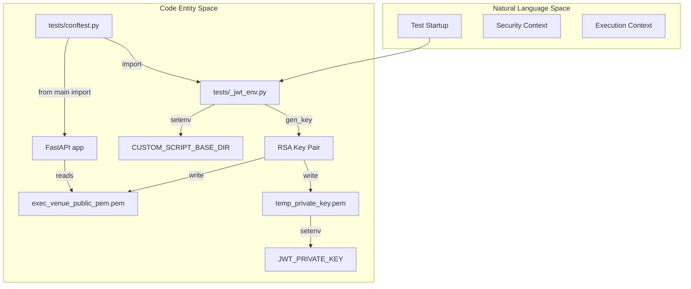
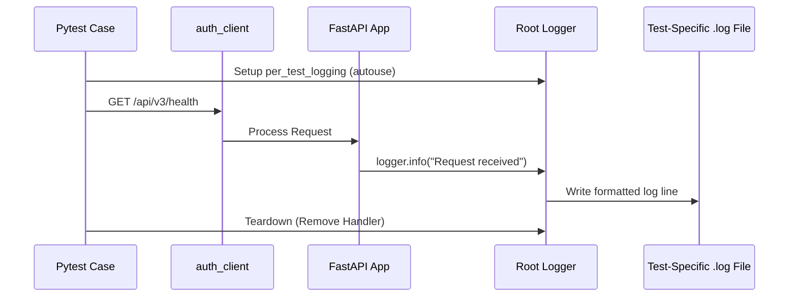

# Page: Test Infrastructure and JWT Fixtures

# Test Infrastructure and JWT Fixtures

Relevant source files

The following files were used as context for generating this wiki page:

- [tests/_jwt_env.py](tests/_jwt_env.py)
- [tests/conftest.py](tests/conftest.py)
- [tests/env.csh](tests/env.csh)

This page documents the automated testing infrastructure for the Venue Agent, focusing on the dynamic generation of security credentials, environment configuration, and test-case isolation. The infrastructure ensures that the FastAPI application can be tested with full RS256 JWT authentication without requiring pre-existing keys or manual configuration.

## Overview of Test Startup

The test infrastructure relies on `pytest` and a specialized initialization module `tests/_jwt_env.py`. When the test suite is invoked, `tests/_jwt_env.py` is imported by `tests/conftest.py` [tests/conftest.py:1](). This triggers a sequence of operations to prepare the environment before the FastAPI `app` is even loaded [tests/conftest.py:18]().

### Initialization Sequence

1.  **RSA Key Generation**: An ephemeral 2048-bit RSA key pair is generated using the `cryptography` library [tests/_jwt_env.py:13-24]().
2.  **Public Key Injection**: The generated public key is written to `exec_venue_public_pem.pem` in the project root [tests/_jwt_env.py:31-33](). This is the specific file location the production `utils.py` module monitors for JWT verification.
3.  **Private Key Persistence**: The private key is written to a temporary file, and its path is stored in the `JWT_PRIVATE_KEY` environment variable [tests/_jwt_env.py:38-40]().
4.  **Environment Configuration**: The `CUSTOM_SCRIPT_BASE_DIR` is set to the `tests/` directory to allow the execution engine to find test scripts [tests/_jwt_env.py:48]().

### System Initialization Flow

The following diagram illustrates how the test environment bridges the gap between the file system and the application's internal state.

**Test Environment Setup Flow**

Sources: [tests/_jwt_env.py:1-48](), [tests/conftest.py:1-18]()

---

## JWT Fixtures

The test suite provides several fixtures in `tests/conftest.py` to simulate different authentication states. These fixtures use the `PyJWT` library to sign tokens using the ephemeral private key generated during startup.

| Fixture Name | Token Characteristics | Intended Use Case |
| :--- | :--- | :--- |
| `jwt_token` | Valid, expires in 1 hour, includes `execute:testbed` scope [tests/conftest.py:65-90](). | Nominal API testing. |
| `expired_jwt_token` | Issued 2 hours ago, expired 1 hour ago [tests/conftest.py:123-148](). | Testing 401 Unauthorized responses. |
| `no_scope_jwt_token` | Valid expiration, but empty `scopes` list [tests/conftest.py:94-119](). | Testing 403 Forbidden responses (RBAC). |

### auth_client Fixture
The `auth_client` fixture provides a `FastAPI.testclient.TestClient` pre-configured with a valid `Authorization: Bearer <token>` header [tests/conftest.py:151-159](). This allows tests to perform requests without manually attaching credentials to every call.

Sources: [tests/conftest.py:65-159]()

---

## Logging and Isolation

To facilitate debugging, the infrastructure provides per-test log isolation.

### per_test_logging Fixture
This `autouse` fixture runs for every test case [tests/conftest.py:23-33](). It performs the following:
1.  **Filename Sanitization**: Converts the pytest `nodeid` (e.g., `tests/test_custom_script.py::test_start`) into a safe filename [tests/conftest.py:35-41]().
2.  **Dynamic Handler Attachment**: Creates a `logging.FileHandler` and attaches it to the root logger [tests/conftest.py:48-56]().
3.  **Automatic Cleanup**: The handler is removed after the test completes, ensuring that logs from one test do not leak into the file of the next.

**Data Flow: Request to Isolated Log**

Sources: [tests/conftest.py:23-61]()

---

## Environment Variables Reference

The testing infrastructure relies on specific environment variables to bridge the configuration between the test runner and the application.

| Variable | Source | Description |
| :--- | :--- | :--- |
| `JWT_PRIVATE_KEY` | `_jwt_env.py` | Path to the temporary private RSA key [tests/_jwt_env.py:40](). |
| `JWT_ALGORITHM` | `_jwt_env.py` | Set to `RS256` [tests/_jwt_env.py:42](). |
| `CUSTOM_SCRIPT_BASE_DIR` | `_jwt_env.py` | Points to the `tests/` directory to locate test scripts [tests/_jwt_env.py:48](). |
| `TEST_AMPCS_SESSION_ID_A` | `env.csh` | Mock session ID for MTAK testing [tests/env.csh:1](). |

Sources: [tests/_jwt_env.py:40-48](), [tests/env.csh:1-2]()
