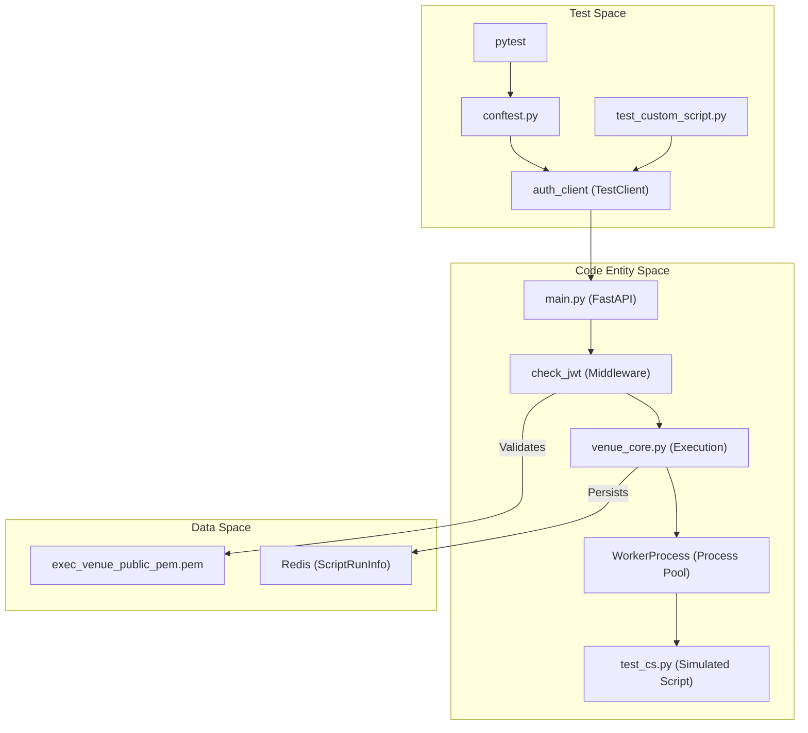

# Page: Testing

# Testing

<details>
<summary>Relevant source files</summary>

The following files were used as context for generating this wiki page:

- [tests/README.md](tests/README.md)
- [tests/conftest.py](tests/conftest.py)

</details>


The VenueServer test suite provides comprehensive coverage of the system's REST API, security mechanisms, and core execution engine. It utilizes `pytest` as the primary testing framework and includes a robust infrastructure for simulating real-world execution environments, including JWT authentication and process management.

## Test Infrastructure

The testing environment is initialized via `tests/conftest.py` and `tests/_jwt_env.py`. This infrastructure ensures that every test run is isolated and secure by dynamically generating the necessary cryptographic keys and environment variables required by the FastAPI application.

Key infrastructure features include:
*   **Dynamic JWT Fixtures**: Automatic generation of RSA key-pairs at startup. The public key is injected into the application's expected path (`exec_venue_public_pem.pem`), allowing the test suite to sign valid, expired, or unauthorized tokens for security testing [tests/conftest.py:64-149]().
*   **Auth Client**: A `TestClient` fixture that automatically includes the `Authorization: Bearer <token>` header in all requests [tests/conftest.py:150-159]().
*   **Log Isolation**: Each test case generates its own unique log file, mapping the `pytest` node ID to a physical file for easier debugging of failed runs [tests/conftest.py:23-61]().

For details, see [Test Infrastructure and JWT Fixtures](#5.1).

**Sources:** [tests/conftest.py:1-162](), [tests/_jwt_env.py:1-40]()

## Custom Script Test Suite

The most critical component of the VenueServer is the custom script execution engine. The test suite validates the full lifecycle of a script run, from the initial `POST /start` request to artifact retrieval.

*   **Lifecycle Testing**: Tests cover starting a script, polling for status, halting execution via `SIGTERM`, and downloading the resulting `.tar.gz` artifacts [tests/test_custom_script.py:1-200]().
*   **Security & Integrity**: Validates that the server rejects requests with mismatched SHA256 hashes, path traversal attempts, or invalid JWT scopes [tests/test_custom_script.py:210-250]().
*   **Stress Testing**: Includes "heavy-writes" scenarios to ensure the Redis state store and file system can handle high-frequency logging from child processes.

For details, see [Custom Script Test Suite](#5.2).

**Sources:** [tests/test_custom_script.py:1-300](), [tests/test_cs.py:1-100]()

## Health and MTAK Tests

Beyond script execution, the suite verifies system availability and integration with the Mission Tool Automation Kit (MTAK).

*   **Health Checks**: Verifies the `GET /api/v3/health` endpoint and ensures that non-GET methods are rejected with a `405 Method Not Allowed` [tests/test_health.py:1-20]().
*   **MTAK Lifecycle**: Tests the ability to start MTAK sessions, send Flight Software (FSW) commands, and perform clean shutdowns. These tests require a live AMPCS environment [tests/test_mtak.py:1-50]().
*   **Multi-Session**: Validates that the server can manage multiple concurrent MTAK sessions without state leakage [tests/test_mtak_multi.py:1-60]().

For details, see [Health and MTAK Tests](#5.3).

**Sources:** [tests/test_health.py:1-20](), [tests/test_mtak.py:1-50](), [tests/test_mtak_multi.py:1-60]()

## Example Client Scripts

The `tests/examples/` directory contains standalone Python scripts that serve as both functional tests and documentation for API consumers. These scripts demonstrate how to interact with the VenueServer using standard libraries like `requests`.

| Script | Purpose |
| :--- | :--- |
| `run_cs.py` | Demonstrates the full custom script flow (start, poll, download). |
| `send_cmd.py` | Example of sending individual commands to a session. |
| `session_info.py` | Retrieves metadata about active AMPCS/MTAK sessions. |
| `bus_1553.py` | Example of specialized hardware bus interaction via the API. |

For details, see [Example Client Scripts](#5.4).

**Sources:** [tests/examples/run_cs.py:1-50](), [tests/examples/client_example.py:1-40]()

## Execution Overview

The following diagram illustrates how the test suite interacts with the core application components.

### Test Interaction Model

**Sources:** [tests/conftest.py:150-159](), [main.py:1-100](), [core/venue_core.py:1-150]()

### JWT Validation Flow in Tests
```mermaid
graph LR
    subgraph "Natural Language: Auth Setup"
        "Generate Keys" --> "Sign Token"
        "Sign Token" --> "Inject Public Key"
    end

    subgraph "Code Entity: Security Implementation"
        "Sign Token" -.-> L["jwt.encode() in conftest.py"]
        "Inject Public Key" -.-> M["_jwt_env.py writes PEM"]
        L --> N["auth_client.headers"]
        N --> O["get_decoded_token() in utils.py"]
        O -- "Uses" --> P["RSA_PUBLIC_KEY"]
    end
```
**Sources:** [tests/conftest.py:64-90](), [tests/_jwt_env.py:10-35](), [core/utils.py:45-75]()

## Running the Tests

Tests are executed using `pytest`. Because some tests interact with AMPCS, specific environment variables must be sourced.

1.  **Activate Environment**: `source tests/ve3/bin/activate.csh` [tests/README.md:22]()
2.  **Configure AMPCS**: `source env.csh` [tests/README.md:32]()
3.  **Run All Tests**: `pytest` [tests/README.md:39]()
4.  **Debug Mode**: `pytest -s` (disables stdout capture) [tests/README.md:44]()

**Sources:** [tests/README.md:1-52]()
