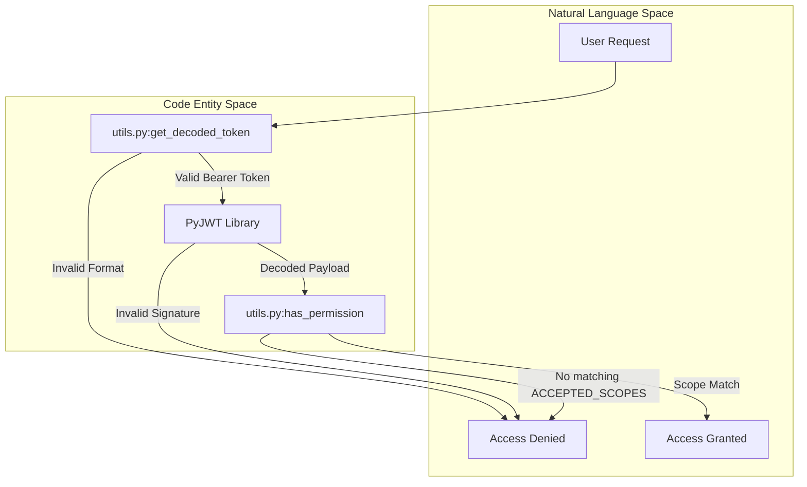
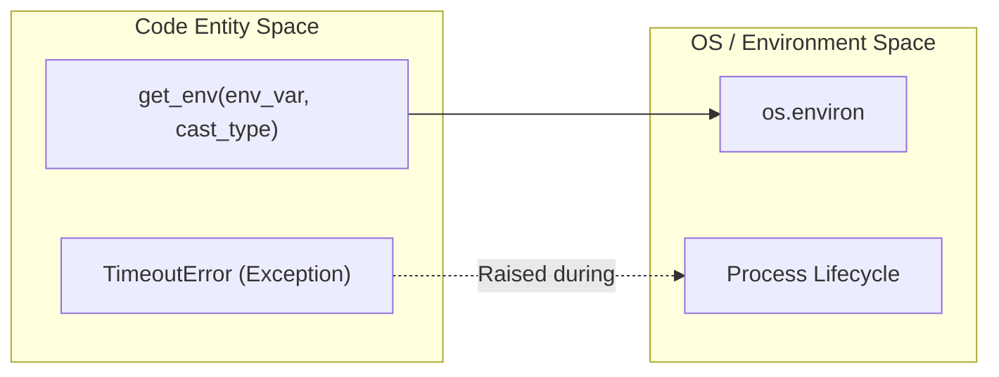

# Page: Utilities and Authentication (utils.py, core_utils.py)

# Utilities and Authentication (utils.py, core_utils.py)

Relevant source files

The following files were used as context for generating this wiki page:

- [core/core_utils.py](core/core_utils.py)
- [utils.py](utils.py)

The VenueServer utilizes two primary utility modules to handle cross-cutting concerns: `utils.py` for security, JWT validation, and authorization; and `core_utils.py` for environment management and system-level exceptions.

## Security and Authentication (utils.py)

The `utils.py` module implements the authentication layer using RSA-signed JSON Web Tokens (JWT). It manages the loading of public keys, decoding of Bearer tokens, and verification of required permissions.

### RSA Public Key Loading
At module initialization, the server attempts to load an RSA public key from a file named `exec_venue_public_pem.pem` located in the same directory as the script [utils.py:8-12](). 

The loading process includes:
1.  **Reading the PEM file**: The file is read into memory as a string [utils.py:20-21]().
2.  **Integrity Check**: A CRC32 checksum is calculated for the public key to facilitate debugging and ensure the correct key is in use [utils.py:22-25]().
3.  **Persistence**: The key is stored in `exec_venue_public_pem` for use in decoding operations [utils.py:53-54]().

### JWT Decoding and Validation
The `get_decoded_token` function handles the extraction and verification of the JWT from the HTTP `Authorization` header.

| Step | Action | Logic |
| :--- | :--- | :--- |
| 1 | Header Format Check | Verifies the header starts with `Bearer ` [utils.py:40-42](). |
| 2 | Token Extraction | Splits the header to retrieve the raw JWT string [utils.py:41](). |
| 3 | Signature Verification | Uses `jwt.decode` with the `RS256` algorithm and the loaded public key [utils.py:53-54](). |
| 4 | Return | Returns the decoded dictionary (claims) to the caller [utils.py:56](). |

### Scope-Based Authorization
Authorization is governed by the `has_permission` function and the `ACCEPTED_SCOPES` list. The server supports both legacy string-based scopes and modern dictionary-based scopes (introduced in R14.3 to include `venue_group_id`) [utils.py:61-62]().

**Accepted Scopes [utils.py:9]():**
*   `execute:wsts`
*   `execute:sit`
*   `execute:testbed`
*   `execute:other`

**Authorization Flow Diagram**

The following diagram illustrates how a request's credentials flow from the raw header to an authorized state.

"JWT Authorization Flow"

Sources: [utils.py:9-16](), [utils.py:36-65]()

## Core Utilities (core_utils.py)

The `core_utils.py` module provides fundamental helper functions and custom exceptions used throughout the `core/` package, particularly for environment configuration and process management.

### Environment Variable Management
The `get_env` function is a wrapper around `os.environ.get` that provides basic type casting and empty-string handling [core_utils.py:23-30]().

*   **Parameters**: Accepts the variable name and a `cast_type` (defaults to `str`).
*   **Behavior**: If the variable is missing or contains only whitespace, it returns `None` [core_utils.py:25-30]().
*   **Casting**: Explicitly supports `str` and `int` conversions [core_utils.py:26-29]().

### System-Level Definitions
The module defines a custom `TimeoutError` exception [core_utils.py:32-33](). This is used by other components, such as the `WorkerProcess`, to signal when operations (like script execution or process termination) exceed their allotted time.

**Utility Interaction Diagram**

This diagram shows how `core_utils.py` interacts with the operating system environment.

"Environment and System Interaction"

Sources: [core_utils.py:23-33]()

## Key Constants and Globals

The following table summarizes the global configuration maintained within these utility modules.

| Constant / Variable | File | Description |
| :--- | :--- | :--- |
| `PUBLIC_PEM_FILE` | `utils.py` | Filename of the RSA public key: `exec_venue_public_pem.pem` [utils.py:8](). |
| `ACCEPTED_SCOPES` | `utils.py` | List of strings required in the JWT `scopes` claim [utils.py:9](). |
| `exec_venue_public_pem` | `utils.py` | The string content of the loaded RSA key [utils.py:14](). |
| `key_crc32` | `utils.py` | Hexadecimal CRC32 of the public key for validation [utils.py:16](). |

Sources: [utils.py:8-16](), [core_utils.py:1-33]()
