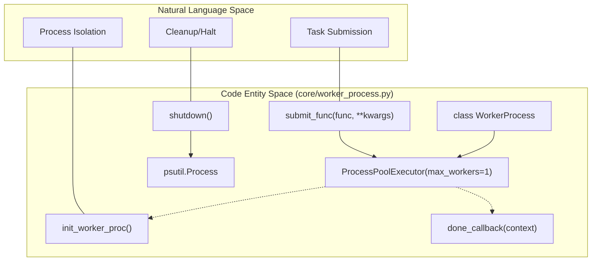
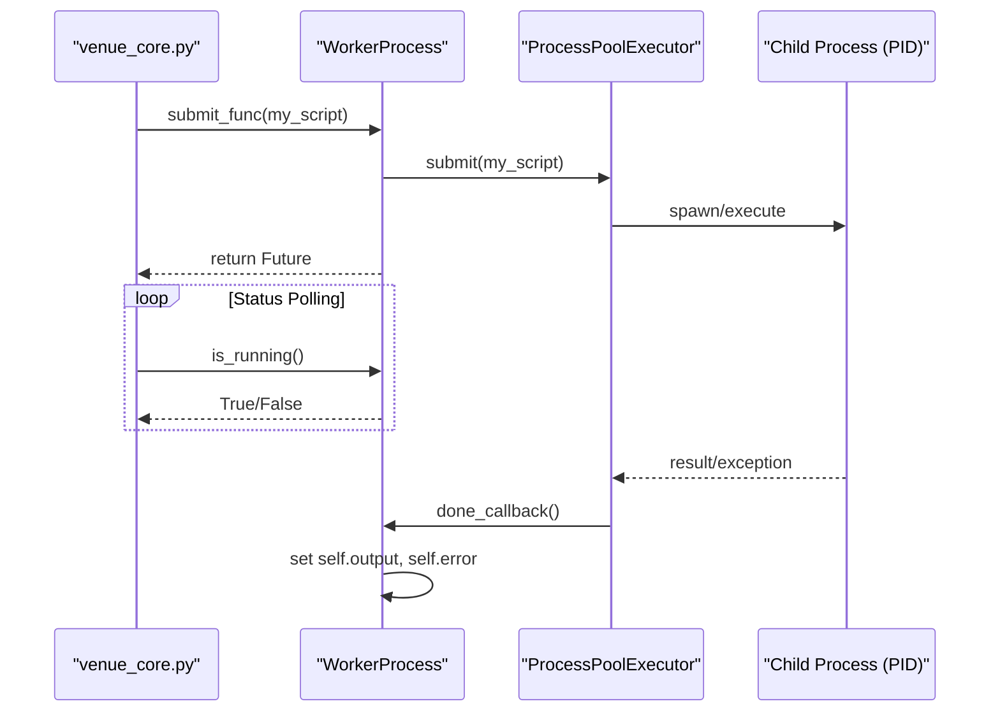

# Page: Worker Process Manager (worker_process.py)

# Worker Process Manager (worker_process.py)

Relevant source files

The following files were used as context for generating this wiki page:

- [core/worker_process.py](core/worker_process.py)

The `WorkerProcess` manager provides a robust wrapper around Python's `ProcessPoolExecutor` to handle the execution of long-running tasks in a dedicated child process. It is specifically designed to manage the lifecycle of a single worker pool, ensuring that child processes (such as MTAK or custom scripts) are properly cleaned up and that the parent FastAPI application remains stable even if the worker process is terminated.

### Core Architecture and Data Flow

The `WorkerProcess` class maintains a `ProcessPoolExecutor` with exactly one worker. This isolation ensures that script execution does not block the main event loop of the FastAPI server.

#### Process Initialization
When a worker pool is initialized via `_init_pool`, it immediately submits the `init_worker_proc` function. This function performs critical signal handling configuration to prevent the parent process from shutting down if the child is killed [core/worker_process.py:13-21]().

#### Execution Flow
1.  **Submission**: `submit_func` takes a callable and its arguments, checking `is_running()` to ensure the worker isn't busy [core/worker_process.py:118-120]().
2.  **Tracking**: It returns a `Future` object and attaches `done_callback` to handle post-execution state updates [core/worker_process.py:125-127]().
3.  **Completion**: The `done_callback` extracts results (output and error) and clears the internal `future` reference [core/worker_process.py:40-50]().

#### Process Lifecycle Diagram
The following diagram illustrates the relationship between the Manager and the underlying Process entities.

**Worker Process Entity Mapping**

Sources: [core/worker_process.py:23-25](), [core/worker_process.py:34-38](), [core/worker_process.py:118-129]().

---

### Key Functions and Implementation Details

#### 1. Worker Initialization (`init_worker_proc`)
This function runs inside the child process immediately after the pool is created. It sets `signal.set_wakeup_fd(-1)` to avoid issues where FastAPI might attempt to shut down if the worker process is killed [core/worker_process.py:13-19](). It also resets `SIGTERM` and `SIGINT` to default behaviors [core/worker_process.py:17-18]().

#### 2. Process Cleanup (`shutdown`)
The `shutdown` method is responsible for a "hard" cleanup of the worker and all its descendants (recursive cleanup).
*   It identifies the worker PID [core/worker_process.py:62-63]().
*   It uses `psutil` to find all recursive child processes [core/worker_process.py:72]().
*   It issues `signal.SIGKILL` to all children first, then to the worker process itself [core/worker_process.py:77-86]().
*   It polls `psutil.pids()` for up to 5 seconds to ensure all processes have exited [core/worker_process.py:91-101]().

#### 3. State Management (`reset` and `is_running`)
*   **`is_running()`**: Safely checks if a `future` exists and if it is done, using local variables to avoid race conditions [core/worker_process.py:137-152]().
*   **`reset()`**: Orchestrates a full recovery by calling `shutdown()`, clearing internal status variables, and re-initializing the process pool [core/worker_process.py:103-117]().

**Task Execution and Monitoring Flow**

Sources: [core/worker_process.py:118-136](), [core/worker_process.py:40-50](), [core/worker_process.py:137-152]().

---

### Error Handling and Resilience

The `WorkerProcess` manager handles several failure modes:

| Scenario | Handling Mechanism | Code Reference |
| :--- | :--- | :--- |
| **Busy Worker** | Throws `Exception('Worker is busy.')` if a task is submitted while another is running. | [core/worker_process.py:119-120]() |
| **Broken Pool** | Catches `BrokenProcessPool` and logs a warning to restart the worker. | [core/worker_process.py:130-132]() |
| **Zombie Processes** | `shutdown()` recursively kills all children found via `psutil`. | [core/worker_process.py:72-80]() |
| **Race Conditions** | `is_running()` uses local variable assignments for `self.future` to prevent `NoneType` errors during callback execution. | [core/worker_process.py:143-146]() |
| **Timeout** | `wait_for_completion` allows a caller to block with a timeout, raising `TimeoutError` if exceeded. | [core/worker_process.py:154-162]() |

Sources: [core/worker_process.py:118-162](), [core/worker_process.py:61-89]().
