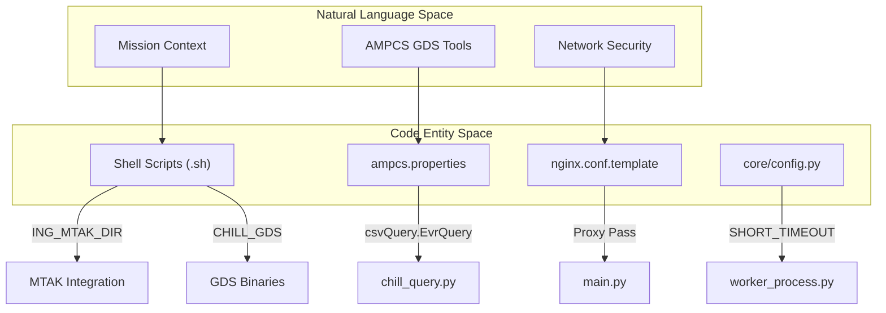
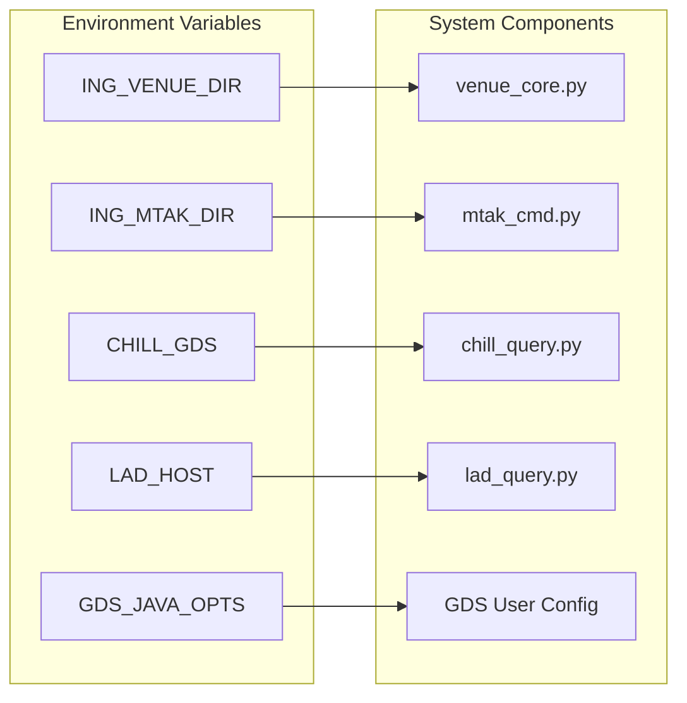

# Page: Configuration & Environment

# Configuration & Environment

Relevant source files

The following files were used as context for generating this wiki page:

- [config/europa_dev_envs.sh](config/europa_dev_envs.sh)
- [config/gds_config/ampcs.properties](config/gds_config/ampcs.properties)
- [config/psyche_dev_envs.sh](config/psyche_dev_envs.sh)
- [core/config.py](core/config.py)

The Ingenium VenueServer relies on a multi-layered configuration strategy to handle mission-specific logic (Europa vs. Psyche), infrastructure settings, and runtime constants. This architecture ensures that the core application remains mission-agnostic while providing the necessary hooks for integration with the AMMOS Mission Operations Center (AMMOS) and Ground Data System (GDS) components.

### Configuration Hierarchy

The system resolves configuration through three primary layers:
1.  **Shell Environment Variables**: Defined in mission-specific scripts, these control file paths, network ports for GlobalLAD, and the location of MTAK and GDS binaries.
2.  **Infrastructure Configs**: YAML and properties files that define logging behavior, NGINX proxying, and the CSV schema for AMPCS `chill` command outputs.
3.  **Runtime Constants**: Python-defined timeouts and lookback windows used by the FastAPI application.

### Mission-Specific Environments

Mission configurations are managed via `.sh` scripts that must be sourced before starting the VenueServer. These scripts establish the operational context for the server, including the `CHILL_GDS` path [config/europa_dev_envs.sh:19-19]() [config/psyche_dev_envs.sh:18-18]() and the `ING_MTAK_DIR` [config/europa_dev_envs.sh:4-4]() [config/psyche_dev_envs.sh:4-4]().

A critical distinction between missions is the handling of MIL-STD-1553 bus logging. For Psyche, `BUS_1553_LOGFILE_PATH` is defined to point to WSTS results [config/psyche_dev_envs.sh:14-14](), whereas it is left empty for Europa [config/europa_dev_envs.sh:15-15]().

For a complete reference of all exported variables and mission differences, see **[Mission Environment Configurations](#5.1)**.

### Infrastructure & GDS Integration

The VenueServer integrates with external GDS tools primarily through property files and reverse proxy configurations:
*   **AMPCS Properties**: The `ampcs.properties` file defines the `csvQuery` schemas for EVR, EHA, and Product queries [config/gds_config/ampcs.properties:3-7](). This ensures the VenueServer can correctly parse the CSV output from `chill` CLI tools.
*   **NGINX**: Acts as the SSL/TLS termination point and maps external ports (e.g., 9443) to internal VenueServer instances.
*   **Logging**: A centralized `log_config.yaml` manages rotating file handlers and Uvicorn integration.

For details on NGINX setup, logging, and GDS property mapping, see **[Infrastructure Configuration (NGINX, Logging, GDS Properties)](#5.2)**.

### Runtime Constants

Low-level application behavior is governed by constants defined in `core/config.py`. These values are used across the `venue_core` and `mtak_cmd` modules to manage process lifecycles and data retrieval windows.

| Constant | Value | Purpose |
| :--- | :--- | :--- |
| `SHORT_TIMEOUT` | 10 | Default timeout for quick operations [core/config.py:1](). |
| `SCLKSCET_LOOKBACK` | 30 | Lookback window (seconds) for SCLK-SCET correlation [core/config.py:2](). |
| `REVERSE_SCMF_TIMEOUT` | 60 | Timeout for SCMF uplink operations [core/config.py:3](). |

Sources: [core/config.py:1-3](), [config/europa_dev_envs.sh:1-21](), [config/psyche_dev_envs.sh:1-20](), [config/gds_config/ampcs.properties:1-8]()

### Configuration Data Flow

The following diagram illustrates how configuration entities in the code map to the physical environment and external GDS components.

**Configuration Mapping: Code to Environment**

Sources: [config/europa_dev_envs.sh:4-19](), [config/gds_config/ampcs.properties:3-3](), [core/config.py:1-1]()

### System Environment Variable Mapping

The VenueServer uses specific environment variables to locate its dependencies and configure its internal logic.

**Environment Variable to System Component Mapping**

Sources: [config/europa_dev_envs.sh:3-21](), [config/psyche_dev_envs.sh:3-20]()
