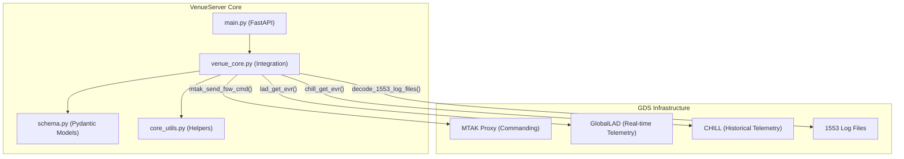
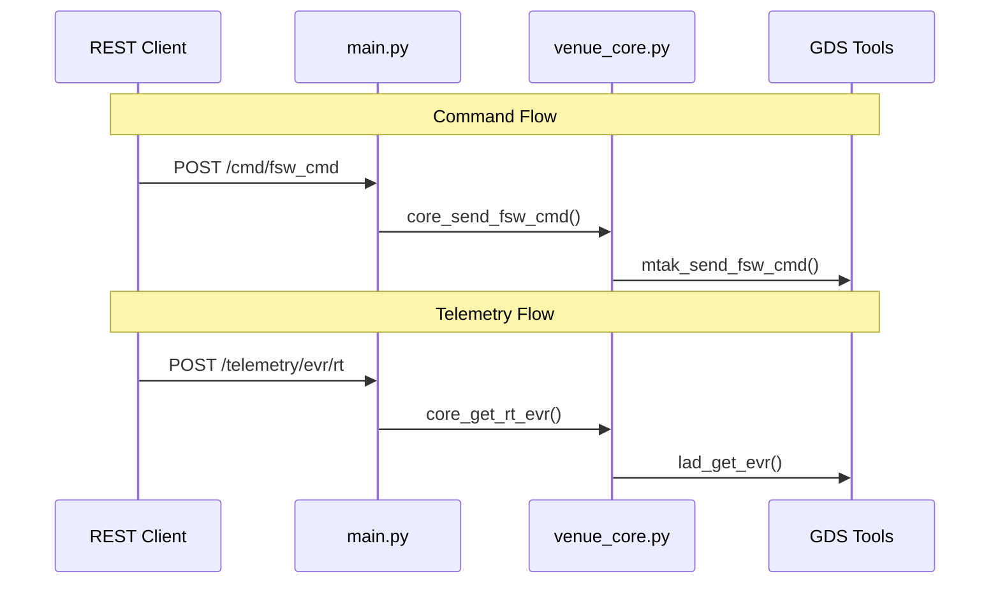

# Page: Core Application

# Core Application

Relevant source files

The following files were used as context for generating this wiki page:

- [core/__init__.py](core/__init__.py)
- [core/venue_core.py](core/venue_core.py)
- [main.py](main.py)

The **Core Application** represents the central Python logic of the VenueServer. It acts as the bridge between the external-facing REST API and the underlying JPL Ground Data System (GDS) tools, including MTAK, GlobalLAD, and CHILL.

The core is structured to handle command dispatching, telemetry retrieval, and data processing while maintaining strict validation via Pydantic models.

### System Interaction Overview

The following diagram illustrates how the core application components relate to the physical GDS infrastructure and the code entities that manage them.

**Diagram: Core Application to GDS Mapping**

**Sources:** [main.py:27-28](), [core/venue_core.py:1-4](), [core/venue_core.py:30-38]()

---

### Component Breakdown

The core application is divided into four primary functional areas:

#### 1. FastAPI Entry Point
The `main.py` file defines the web server configuration and the RESTful interface. It uses a prefixed `APIRouter` (`/api/v3`) to organize endpoints for commanding, telemetry, and health checks. It also implements middleware for JWT authentication and audit logging.

For details, see [FastAPI Entry Point (main.py)](#2.1).
**Sources:** [main.py:96-117](), [main.py:169-179]()

#### 2. Integration Layer (`venue_core.py`)
This module serves as the primary orchestrator. It contains the "core" prefixed functions (e.g., `core_send_fsw_cmd`, `core_get_rt_evr`) that translate API requests into specific GDS tool calls. It manages the logic for switching between real-time queries (GlobalLAD) and historical queries (CHILL) based on user-provided time ranges.

For details, see [venue_core.py — Integration Layer](#2.2).
**Sources:** [core/venue_core.py:73-92](), [core/venue_core.py:205-207]()

#### 3. Data Models (`schema.py`)
All data entering or leaving the VenueServer is validated against Pydantic models. This ensures that command strings, session IDs, and telemetry filters conform to expected types before they reach the integration layer.

For details, see [Data Models (schema.py)](#2.3).
**Sources:** [main.py:79-89](), [core/venue_core.py:34]()

#### 4. Utility Functions
The system relies on two utility modules:
*   `core_utils.py`: Contains mission-critical logic for time conversion (SCET/SCLK/DOY), path resolution for log files, and subprocess management.
*   `utils.py`: Handles security concerns, including RSA key loading for JWT verification and scope-based authorization.

For details, see [Utility Functions (core_utils.py & utils.py)](#2.4).
**Sources:** [core/venue_core.py:30-33](), [main.py:90-92]()

---

### Command and Telemetry Flow

The following diagram bridges the natural language concepts of "Commanding" and "Telemetry" to the specific Python functions in the Integration Layer.

**Diagram: Functional Logic Flow**

**Sources:** [main.py:169-187](), [core/venue_core.py:73-92](), [core/venue_core.py:205-209]()

### Core Configuration Constants
The core application relies on environment variables to locate GDS assets. These are loaded and logged at startup to ensure the environment is correctly configured for the specific mission (Europa or Psyche).

| Variable | Purpose | Code Reference |
| :--- | :--- | :--- |
| `ING_VENUE_DIR` | Base directory for VenueServer | [main.py:37]() |
| `CUSTOM_SCRIPT_BASE_DIR` | Location of user-defined Python scripts | [core/venue_core.py:41]() |
| `BUS_1553_LOGFILE_PATH` | Path to MIL-STD-1553 bus logs | [core/venue_core.py:42]() |
| `CHILL_GDS` | Path to CHILL command line tools | [main.py:47]() |

**Sources:** [main.py:34-53](), [core/venue_core.py:39-44]()
