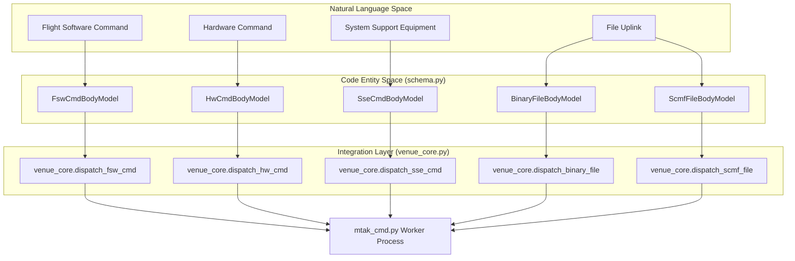
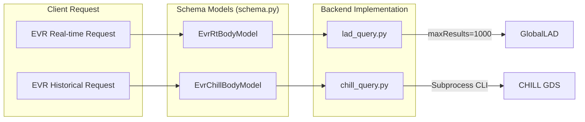

# Page: Data Models (schema.py)

# Data Models (schema.py)

Relevant source files

The following files were used as context for generating this wiki page:

- [core/schema.py](core/schema.py)

The `core/schema.py` module defines the structural backbone of the VenueServer. It utilizes **Pydantic** to provide robust data validation, serialization, and automatic OpenAPI documentation for all REST API interactions. These models ensure that incoming requests from clients (like MTAK or custom scripts) and outgoing responses from the server maintain a strict contract with the underlying AMPCS and GDS subsystems.

### Command Models

The command models represent the various ways instructions are dispatched to the spacecraft or Ground Support Equipment (GSE). They all share common fields like `sessionId` and `timeout`, but vary based on the target system (FSW, HW, SSE) or the method of delivery (SCMF, Binary File).

#### Command Dispatch Logic
The following diagram illustrates how the `schema.py` models map to the internal dispatch logic in `venue_core.py` and `mtak_cmd.py`.

**Diagram: Command Model Flow**

*Sources: [core/schema.py:39-85](), [core/venue_core.py:101-200]()*

#### Key Command Schemas

| Class Name | Purpose | Key Fields |
| :--- | :--- | :--- |
| `FswCmdBodyModel` | Standard FSW commands. | `commandString`, `validate`, `stringSelection` [core/schema.py:39-48]() |
| `HwCmdBodyModel` | Direct Hardware commands. | `commandStem`, `stringSelection` [core/schema.py:56-63]() |
| `SseCmdBodyModel` | SSE specific commands. | `commandString` [core/schema.py:64-68]() |
| `BinaryFileBodyModel` | Uplinks a raw file by wrapping it in an SCMF. | `sourceFilePath`, `targetFilePath`, `fileType` [core/schema.py:69-79]() |
| `ScmfFileBodyModel` | Uplinks an existing SCMF file. | `filePath`, `disableChecks` [core/schema.py:80-85]() |

---

### Telemetry Query Models

Telemetry models are split between **Real-time (GlobalLAD)** and **Historical (CHILL)**. Real-time models typically require a `sessionId` to query the live stream, while CHILL models focus on time ranges and database filters.

#### Telemetry Source Mapping
The system differentiates between `EvrRtBodyModel` (Real-time) and `EvrChillBodyModel` (Historical/CHILL).

**Diagram: Telemetry Request Mapping**

*Sources: [core/schema.py:86-109](), [core/schema.py:135-154]()*

#### Query Model Details
*   **`EvrRtBodyModel` / `EvrRtMultiBodyModel`**: Used for querying the live AMPCS session. Supports wildcards in `evrName` and `evrLevel`. [core/schema.py:86-109]()
*   **`EvrChillBodyModel`**: Queries the CHILL database. Introduces `TimeType` (ERT, SCET, SCLK) and `EvrType` (FSW_REALTIME, FSW_RECORDED, SSE). [core/schema.py:135-154]()
*   **`EhaRtBodyModel` / `EhaChillBodyModel`**: Similar to EVR models but for Engineering Health (EHA) channels. CHILL EHA queries include `alarmType` filters. [core/schema.py:155-212]()

---

### 1553 Bus and Data Product Models

These models handle specialized data extraction from MIL-STD-1553 bus logs and GDS Data Products.

*   **`Bus1553BodyModel`**: Used to request decoded 1553 traffic. It requires a `logFilePath` and a `timeType` (SCLK or SCET). [core/schema.py:236-244]()
*   **`DpChillBodyModel`**: Used to query the CHILL database for Data Products (files generated by the spacecraft). Filters include `dpName`, `dpType`, and `fileState`. [core/schema.py:213-234]()

---

### Custom Script Models

The VenueServer allows execution of server-side scripts. The models manage the input parameters and the lifecycle of these executions.

*   **`CustomScriptBodyModel`**: Contains the `scriptName` and a dictionary of `args` to pass to the script. [core/schema.py:246-249]()
*   **`CustomScriptResponse`**: Returns the `exitCode`, `stdout`, and `stderr` of the executed process. [core/schema.py:251-255]()

---

### Enums and Constants

To ensure type safety and valid API inputs, `schema.py` defines several `Enum` classes.

| Enum Name | Values | Description |
| :--- | :--- | :--- |
| `StringSelection` | `DEFAULT`, `A`, `B`, `AB` | Determines which Flight Computer string (side) receives the command. [core/schema.py:33-37]() |
| `TimeType` | `ERT`, `SCET`, `SCLK` | Specifies the time system for historical queries. [core/schema.py:125-128]() |
| `EvrType` | `FSW_REALTIME`, `FSW_RECORDED`, `SSE` | Filters the source of Event Records in CHILL. [core/schema.py:110-114]() |
| `HealthStatusEnum`| `OK`, `ERROR`, `UNKNOWN` | Used for the `/health` endpoint response. [core/schema.py:10-13]() |

### Implementation Details: Pydantic Configuration
Many models include specific Pydantic `Field` configurations:
*   **Validation**: `validate_` is aliased to `validate` to avoid conflicts with Pydantic's internal namespace while maintaining the expected API key name. [core/schema.py:43-44]()
*   **Constraints**: `timeout` fields often have a `ge=0` or `ge=25` constraint to ensure logical execution windows. [core/schema.py:24-25](), [core/schema.py:47]()
*   **Extra**: The `BaseModel` usage typically defaults to strict schema adherence, preventing clients from sending extraneous data that could lead to undefined behavior.

*Sources: [core/schema.py:1-255]()*
