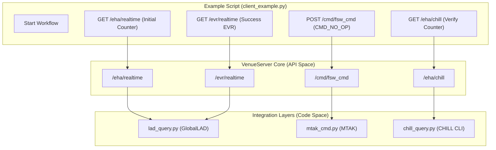
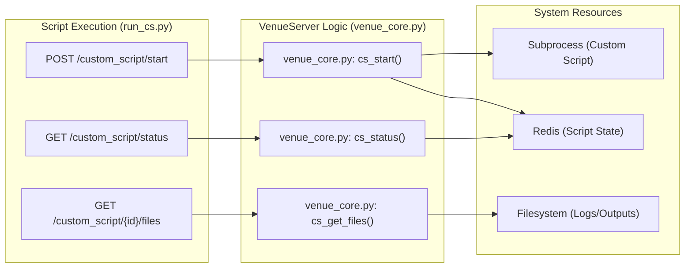

# Page: Example Scripts

# Example Scripts

Relevant source files

The following files were used as context for generating this wiki page:

- [tests/examples/bus_1553.py](tests/examples/bus_1553.py)
- [tests/examples/check_chill_eha.py](tests/examples/check_chill_eha.py)
- [tests/examples/check_chill_evr.py](tests/examples/check_chill_evr.py)
- [tests/examples/check_dps.py](tests/examples/check_dps.py)
- [tests/examples/check_rt_eha.py](tests/examples/check_rt_eha.py)
- [tests/examples/check_rt_evr.py](tests/examples/check_rt_evr.py)
- [tests/examples/client_example.py](tests/examples/client_example.py)
- [tests/examples/run_cs.py](tests/examples/run_cs.py)
- [tests/examples/send_cmd.py](tests/examples/send_cmd.py)
- [tests/examples/send_file.py](tests/examples/send_file.py)
- [tests/examples/send_sse_cmds.py](tests/examples/send_sse_cmds.py)
- [tests/examples/session_info.py](tests/examples/session_info.py)
- [tests/examples/set_tsr.py](tests/examples/set_tsr.py)
- [tests/examples/start_mtak.py](tests/examples/start_mtak.py)
- [tests/examples/stop_mtak.py](tests/examples/stop_mtak.py)

The `tests/examples/` directory contains a suite of Python scripts designed to demonstrate direct interaction with the VenueServer REST API. These scripts serve as both functional examples for developers and manual verification tools for system integrators. They cover the full spectrum of VenueServer capabilities, including command dispatch (FSW, HW, SSE), telemetry retrieval (Real-time and Historical), data product management, MIL-STD-1553 bus log analysis, and custom script execution.

## Core Configuration and Authentication

Most example scripts rely on `session_info.py` to handle boilerplate setup, specifically JWT token generation and mission-specific constant resolution.

### session_info.py
This script manages the security context and environment-specific parameters:
*   **JWT Generation**: It reads a private RSA key `exec_venue_private_pem.pem` [tests/examples/session_info.py:7-15]() and generates a token with broad scopes (e.g., `execute:wsts`, `redline`, `admin`) [tests/examples/session_info.py:21-37]().
*   **Mission Constants**: It detects the host environment (Europa vs. Psyche) via `socket.gethostname()` to set correct command names and telemetry IDs, such as `CMD_NO_OP` and `CMD_COUNTER_EHA` [tests/examples/session_info.py:42-57]().

**Sources:** [tests/examples/session_info.py:1-58]()

---

## Command Dispatch Examples

These scripts demonstrate how to send different types of commands through the `/cmd/` endpoints.

### send_cmd.py
A minimal example that sends a single Flight Software (FSW) command (`CMD_NO_OP`) to the `/cmd/fsw_cmd` endpoint [tests/examples/send_cmd.py:12-21](). It uses the `sessionId` and `exec_shared_dict` headers provided by `session_info.py`.

### send_sse_cmds.py
Demonstrates System Support Equipment (SSE) command dispatch. It includes an `argparse` interface to specify the session ID and number of runs [tests/examples/send_sse_cmds.py:27-34](). It iterates through a list of SSE commands (e.g., `dss version`, `wde nop`) and plots the response latency using `matplotlib` [tests/examples/send_sse_cmds.py:42-88]().

### send_file.py
Demonstrates file uplink capabilities:
1.  **SSE Configuration**: Increases the uplink rate on Psyche WSTS via an SSE command [tests/examples/send_file.py:10-22]().
2.  **Binary File Uplink**: Shows the payload for uploading a `.bin` file to a target path on the spacecraft [tests/examples/send_file.py:28-41]().
3.  **SCMF Uplink**: Demonstrates sending a Spacecraft Command Message File (SCMF) via the `/cmd/scmf` endpoint [tests/examples/send_file.py:48-58]().

**Sources:** [tests/examples/send_cmd.py:1-25](), [tests/examples/send_sse_cmds.py:1-89](), [tests/examples/send_file.py:1-60]()

---

## Telemetry Query Examples

These scripts illustrate the dual-path telemetry architecture: Real-time (via GlobalLAD) and Historical (via CHILL).

### Event Record (EVR) Queries
*   **check_rt_evr.py**: Queries real-time EVRs using the `/evr/realtime` and `/evr/realtime_multi` endpoints [tests/examples/check_rt_evr.py:14-23](). It supports wildcard searches (e.g., `*COMPLE*`) [tests/examples/check_rt_evr.py:38-47]().
*   **check_chill_evr.py**: Queries historical EVRs via `/evr/chill`. It demonstrates advanced filtering by `evrType` (e.g., `FSW_REALTIME`, `SSE`) and `evrLevels` [tests/examples/check_chill_evr.py:64-74](), [tests/examples/check_chill_evr.py:190-195]().

### Engineering Health Area (EHA) Queries
*   **check_rt_eha.py**: Fetches current channel values from GlobalLAD via `/eha/realtime` [tests/examples/check_rt_eha.py:14-23]().
*   **check_chill_eha.py**: Retrieves historical channel samples from CHILL via `/eha/chill` [tests/examples/check_chill_eha.py:14-25]().

### Data Product Queries
*   **check_dps.py**: First enables data products via an FSW command [tests/examples/check_dps.py:9-21](), waits for processing, and then queries the `/dp` endpoint for files with a `COMPLETE` status for specific APIDs [tests/examples/check_dps.py:38-49]().

**Sources:** [tests/examples/check_rt_evr.py:1-114](), [tests/examples/check_chill_evr.py:1-220](), [tests/examples/check_rt_eha.py:1-58](), [tests/examples/check_chill_eha.py:1-61](), [tests/examples/check_dps.py:1-51]()

---

## Integration and Advanced Workflows

### client_example.py: Full Command/Telemetry Loop
This script provides a comprehensive workflow demonstration:
1.  **Initial State**: Records the current command counter via real-time EHA [tests/examples/client_example.py:18-26]().
2.  **Command**: Sends a `CMD_NO_OP` [tests/examples/client_example.py:45-55]().
3.  **Verification**: Polls the real-time EVR endpoint until a success EVR is found [tests/examples/client_example.py:60-83]().
4.  **Final State**: Verifies that the command counter has incremented by querying both real-time and historical EHA [tests/examples/client_example.py:116-188]().

### run_cs.py: Custom Script Lifecycle
Demonstrates the management of external scripts:
*   **Start**: Submits a script (e.g., `crc32_checksum_file`) with input parameters and expected hashes [tests/examples/run_cs.py:12-59]().
*   **Monitor**: Polls the `/custom_script/status` endpoint using the `scriptRunId` [tests/examples/run_cs.py:68-85]().
*   **Retrieve**: Downloads the resulting output files and logs as a `.tar.gz` archive [tests/examples/run_cs.py:89-97]().
*   **Control**: Demonstrates halting a running script via `/custom_script/halt` [tests/examples/run_cs.py:111-118]().

### bus_1553.py: 1553 Log Analysis
Demonstrates the 1553 pipeline:
1.  **Reset**: Sends SSE commands to stop and start the bus logger [tests/examples/bus_1553.py:11-26]().
2.  **Query**: Calls the `/bus1553` endpoint with a time range and specific variable name (e.g., `REU_A_RSB_CMD_WORD_1`) to retrieve decoded bus traffic [tests/examples/bus_1553.py:46-56]().

**Sources:** [tests/examples/client_example.py:1-202](), [tests/examples/run_cs.py:1-128](), [tests/examples/bus_1553.py:1-61]()

---

## Data Flow and Entity Mapping

The following diagrams illustrate how the example scripts bridge the gap between high-level user actions and the internal VenueServer code entities.

### Command and Telemetry Loop Flow
This diagram maps the `client_example.py` workflow to the VenueServer API and internal query layers.

Title: Client Example Workflow Mapping

**Sources:** [tests/examples/client_example.py:1-202](), [tests/examples/session_info.py:1-58]()

### Custom Script Lifecycle Mapping
This diagram shows how `run_cs.py` interacts with the custom script management system.

Title: Custom Script Entity Mapping

**Sources:** [tests/examples/run_cs.py:1-128]()

---

## Utility Scripts

| Script | Purpose |
| :--- | :--- |
| `start_mtak.py` | Initializes the MTAK session via `/mtak/start`. |
| `stop_mtak.py` | Shuts down the MTAK session via `/mtak/stop`. |
| `set_tsr.py` | Updates the Telemetry Sampling Rate via the `/cmd/sse` endpoint. |

**Sources:** [tests/examples/start_mtak.py](), [tests/examples/stop_mtak.py](), [tests/examples/set_tsr.py]()
