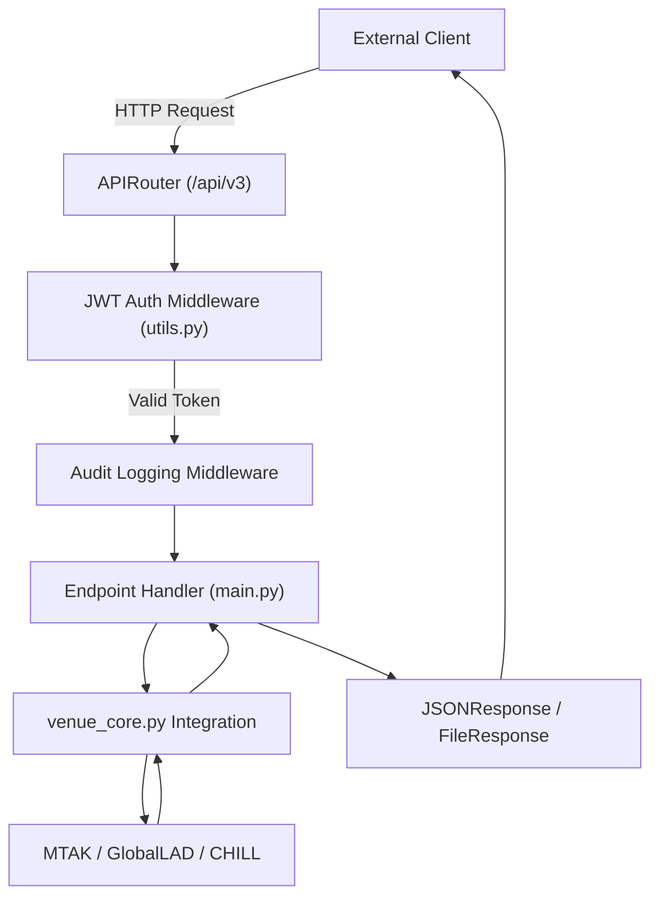
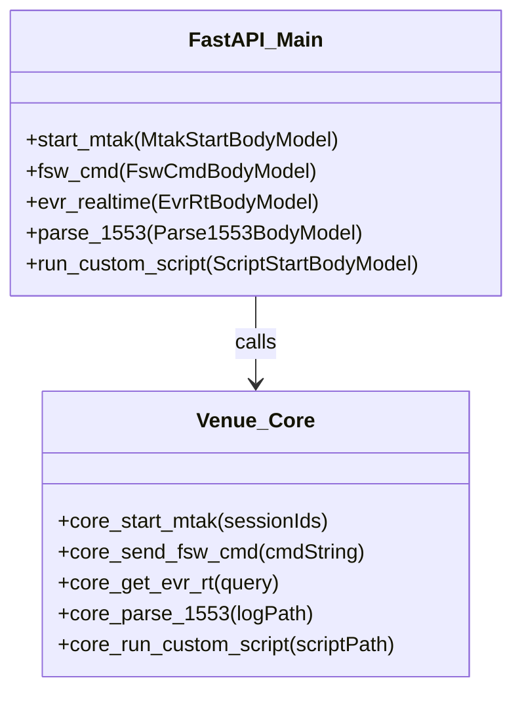

# Page: FastAPI Entry Point (main.py)

# FastAPI Entry Point (main.py)

<details>
<summary>Relevant source files</summary>

The following files were used as context for generating this wiki page:

- [log_config.yaml](log_config.yaml)
- [main.py](main.py)
- [openapi.yaml](openapi.yaml)
- [utils.py](utils.py)

</details>


The `main.py` file serves as the primary entry point for the VenueServer. It initializes the FastAPI application, configures middleware for security and logging, and defines the RESTful API surface area under the `/api/v3` prefix. It acts as the routing layer that translates HTTP requests into calls for the `venue_core` integration layer.

## Application Initialization and Middleware

The application is initialized with a custom OpenAPI schema and several middleware layers to handle cross-cutting concerns like authentication and audit logging.

### Middleware Stack
1.  **JWT Authentication**: Intercepts requests to validate the `Authorization: Bearer <token>` header using RSA256 public key verification [utils.py:36-56](). It checks for specific scopes such as `execute:wsts` or `execute:sit` [utils.py:58-65]().
2.  **Audit Logging**: Captures request details (method, path, client IP) and response status codes, logging them to the rotating file handler defined in `log_config.yaml` [log_config.yaml:13-20]().
3.  **Error Handling**: Global exception handlers catch `RequestValidationError` and general `Exception` types to return standardized `ErrorResponse` JSON objects [main.py:141-146]().

### Logging Restoration
A critical initialization step is `restore_root_logger()`. Because the MTAK library can interfere with standard Python logging, this function explicitly resets the root logger level and handlers to `DEBUG` to ensure all system events are captured [main.py:5-11]().

### Request Lifecycle Diagram
This diagram shows how a request flows from the FastAPI entry point through the middleware into the core logic.

**VenueServer Request Pipeline**

Sources: [main.py:96-97](), [utils.py:36-65](), [main.py:130-146]()

## API Surface Area (Prefix: /api/v3)

All operational endpoints are registered via a `prefix_router` [main.py:96]().

### MTAK Management
Used to manage the lifecycle of the Mission Test Automation Kit worker processes.
*   **`POST /mtak/start`**: Initializes MTAK for specific AMPCS session IDs [main.py:120-146]().
*   **`POST /mtak/shutdown`**: Cleans up MTAK processes and resources [main.py:148-167]().

### Command Dispatch
Routes commands to the spacecraft or testbed via MTAK.
*   **`POST /cmd/fsw_cmd`**: Dispatches Flight Software commands [main.py:169-195]().
*   **`POST /cmd/hw_cmd`**: Dispatches Hardware/Direct commands [main.py:197-200]().
*   **`POST /cmd/sse_cmd`**: Dispatches System Support Equipment commands.
*   **`POST /cmd/binary_file`**: Uplinks binary files by wrapping them in SCMF (Spacecraft Command Message Format) [openapi.yaml:11-52]().

### Telemetry and Data Querying
Provides access to real-time and historical telemetry.
*   **`POST /evr/realtime`**: Fetches Event Records from GlobalLAD [main.py:78-82]().
*   **`POST /eha/chill`**: Fetches historical Engineering Health Analysis (channels) from CHILL [main.py:82-83]().
*   **`POST /dp/query`**: Queries for Data Products [main.py:83-84]().

### Specialized Endpoints
*   **`POST /bus1553/parse`**: Decodes MIL-STD-1553 bus logs using XML dictionaries [main.py:84]().
*   **`POST /custom_script/start`**: Executes arbitrary Python scripts within the Venue environment [main.py:85]().
*   **`GET /health`**: Returns the `HealthStatus` of the VenueServer instance [main.py:107-117]().

## Code Entity Mapping

The following diagram maps the FastAPI route handlers in `main.py` to their corresponding implementation functions in `venue_core.py`.

**Route to Core Logic Mapping**

Sources: [main.py:136-138](), [main.py:183-187](), [main.py:27]()

## OpenAPI and Schema Customization

The VenueServer utilizes Pydantic models defined in `schema.py` to enforce strict request validation. The `main.py` file integrates these models into the FastAPI documentation [main.py:78-89]().

| Feature | Implementation |
| :--- | :--- |
| **Schema Validation** | Uses `MtakStartBodyModel`, `FswCmdBodyModel`, etc., for automatic 422 error generation on bad input [main.py:79-88](). |
| **Custom OpenAPI** | The `get_openapi` function is overridden to inject custom metadata and security schemes (JWT) into the `openapi.json` [main.py:74](). |
| **Response Models** | Every endpoint defines a `responses` dictionary mapping status codes to Pydantic models like `CmdDispatchedResp` or `ErrorResponse` [main.py:170-175](). |

Sources: [main.py:73-90](), [openapi.yaml:1-52]()

## Error Handling Pattern

The application follows a consistent try-except pattern for all REST endpoints. If a core function fails, the exception is logged with a full stack trace, and a 400-level `ErrorResponse` is returned to the client.

```python
# Standard Pattern in main.py
try:
    # Logic calling venue_core
    result = venue_core.some_function(body.param)
    return result
except Exception as ex:
    msg = 'Context-specific error message'
    logging.exception(msg) # Logs to ing_vs.log
    response.status_code = 400
    return ErrorResponse(message=f'{msg}. {traceback.format_exc()}')
```
Sources: [main.py:141-146](), [main.py:190-195](), [log_config.yaml:20]()
