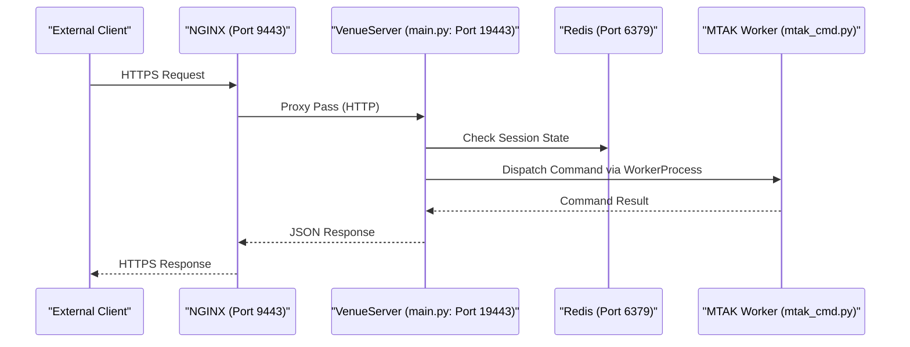

# Page: Getting Started & Deployment

# Getting Started & Deployment

<details>
<summary>Relevant source files</summary>

The following files were used as context for generating this wiki page:

- [config/europa_dev_envs.sh](config/europa_dev_envs.sh)
- [config/psyche_dev_envs.sh](config/psyche_dev_envs.sh)
- [requirements.txt](requirements.txt)
- [setup_venueserver.sh](setup_venueserver.sh)
- [start_nginx.sh](start_nginx.sh)
- [start_redis.sh](start_redis.sh)
- [start_venueserver.sh](start_venueserver.sh)

</details>


This page provides a technical guide for the initial setup, environment configuration, and deployment of the VenueServer. The deployment architecture relies on a stack including NGINX as a reverse proxy, Redis for state management, and multiple FastAPI instances running within dedicated Python virtual environments.

## Deployment Overview

The VenueServer deployment is designed to be mission-agnostic, using environment variables to toggle between Europa and Psyche mission configurations. The setup process automates the creation of a `virtualenv`, installation of mission-specific dependencies (AMPCS/MTAK), and generation of infrastructure configurations (NGINX).

### System Component Interaction

The following diagram illustrates the relationship between the deployment scripts and the runtime entities.

**Deployment Process and Runtime Entity Mapping**
```mermaid
graph TD
    subgraph "Setup Phase"
        [setup_venueserver.sh] --> |"Creates"| VENV["venv3 (Python VirtualEnv)"]
        [setup_venueserver.sh] --> |"Reads"| REQS["requirements.txt"]
        [setup_venueserver.sh] --> |"Generates"| NG_CONF["nginx.conf"]
    end

    subgraph "Runtime Phase"
        [start_redis.sh] --> |"Spawns"| REDIS["redis-server"]
        [start_nginx.sh] --> |"Spawns"| NGINX["nginx (Reverse Proxy)"]
        [start_venueserver.sh] --> |"Spawns"| UVICORN["main.py (FastAPI/Uvicorn)"]
    end

    NGINX --> |"Proxies to"| UVICORN
    UVICORN --> |"State Store"| REDIS
    UVICORN --> |"Uses"| VENV
```
Sources: `setup_venueserver.sh:1-102`(), `start_venueserver.sh:1-90`(), `start_nginx.sh:1-54`(), `start_redis.sh:1-3`()

---

## Environment Configuration

The VenueServer uses shell scripts to export environment variables required by both the Python application and the underlying AMPCS tools.

### Mission-Specific Variables
Two primary configuration files are provided: `config/europa_dev_envs.sh` and `config/psyche_dev_envs.sh`.

| Variable | Description | Europa Default | Psyche Default |
| :--- | :--- | :--- | :--- |
| `ING_VENUE_DIR` | Root directory of VenueServer source | `/home/hongmank/github/venueserver2` | `/home/hongmank/github/venueserver2` |
| `ING_MTAK_DIR` | Path to MTAK Python library | `/home/hongmank/github/mtak/r8.x/python` | `/home/hongmank/github/mtak/r8.x/python` |
| `CHILL_GDS` | Root of the AMPCS installation | `/ammos/ampcs/mpcs/eurc/current` | `/ammos/ampcs/mpcs/psyche/current` |
| `CUSTOM_SCRIPT_BASE_DIR` | Base path for custom scripts | `/proj/europa/sit` | `/teamtools/ingenium` |
| `BUS_1553_LOGFILE_PATH` | Template for 1553 log discovery | *(Empty)* | `/var/ammos/archive/...` |
| `LAD_PORT` | GlobalLAD service port | `8887` | `8887` |

### Key Path Integrations
The environment scripts modify the system `PATH` to include AMPCS binaries and tools:
`export PATH=$CHILL_GDS/bin:$CHILL_GDS/bin/tools:/usr/local/bin:/usr/bin:/usr/local/sbin:/usr/sbin` [config/europa_dev_envs.sh:20-20]().

Sources: `config/europa_dev_envs.sh:1-21`(), `config/psyche_dev_envs.sh:1-20`()

---

## Installation Steps

### 1. Virtual Environment Setup
The `setup_venueserver.sh` script handles the creation of a `venv3` directory and installs two sets of requirements:
1. **AMPCS Requirements**: Located in `$ING_MTAK_DIR/ampcs_requirements.txt` [setup_venueserver.sh:67-67]().
2. **VenueServer Requirements**: Defined in the local `requirements.txt` [setup_venueserver.sh:68-68]().

The script also forces the installation of `click>=7.0.0` to ensure compatibility with `uvicorn` [setup_venueserver.sh:89-90]().

### 2. NGINX Configuration Generation
During setup, `envsubst` is used to populate `nginx.conf.template` with environment variables like `$HOSTNAME` and `$ING_VENUE_DIR`, producing a localized `nginx.conf` [setup_venueserver.sh:93-99]().

Sources: `setup_venueserver.sh:59-102`(), `requirements.txt:1-11`()

---

## Running the Services

The deployment requires three distinct service types to be running.

### 1. Redis State Store
Redis is used for session management and inter-process communication between the FastAPI frontend and the MTAK worker processes.
```bash
./start_redis.sh
```
Sources: `start_redis.sh:1-3`()

### 2. NGINX Reverse Proxy
NGINX handles SSL termination and routes external traffic (typically ports 9443-9445) to the internal FastAPI ports (typically 19443-19445).
```bash
./start_nginx.sh start
```
The script manages the PID file and error logs as defined in the generated `nginx.conf` [start_nginx.sh:27-40]().

### 3. VenueServer Instance(s)
The `start_venueserver.sh` script launches a FastAPI instance. It requires a port and an environment file.

```bash
# Example for Europa on port 19443
./start_venueserver.sh -p 19443 -f config/europa_dev_envs.sh
```

**Internal Execution Logic:**
1. **Locale Enforcement**: Sets `LC_ALL` and `LANG` to `en_US.UTF-8` to prevent `uvicorn` startup failures [start_venueserver.sh:7-8]().
2. **PYTHONPATH Construction**: Prepends the virtual environment's `site-packages` and the `ING_MTAK_DIR` to the `PYTHONPATH` to ensure local package overrides [start_venueserver.sh:80-80]().
3. **Execution**: Invokes `main.py` using the virtual environment's Python interpreter [start_venueserver.sh:89-89]().

### Deployment Data Flow

**Request Lifecycle from Deployment Perspective**

Sources: `start_venueserver.sh:80-90`(), `start_nginx.sh:33-40`(), `setup_venueserver.sh:93-99`()

---

## Troubleshooting Deployment

| Issue | Likely Cause | Resolution |
| :--- | :--- | :--- |
| `uvicorn` fails to start | Locale not set | Ensure `LC_ALL` is exported as `en_US.UTF-8` [start_venueserver.sh:7-8](). |
| `ImportError` for MTAK | `ING_MTAK_DIR` incorrect | Verify the path in the `.sh` env file [config/europa_dev_envs.sh:4-4](). |
| NGINX fails to start | Port conflict or permissions | Check `NGINX_CONF` for the `error_log` location [start_nginx.sh:27-28](). |
| Missing dependencies | `pip install` failed | Re-run `setup_venueserver.sh -f <env_file>` [setup_venueserver.sh:83-90](). |

Sources: `start_venueserver.sh:1-90`(), `setup_venueserver.sh:1-102`()
