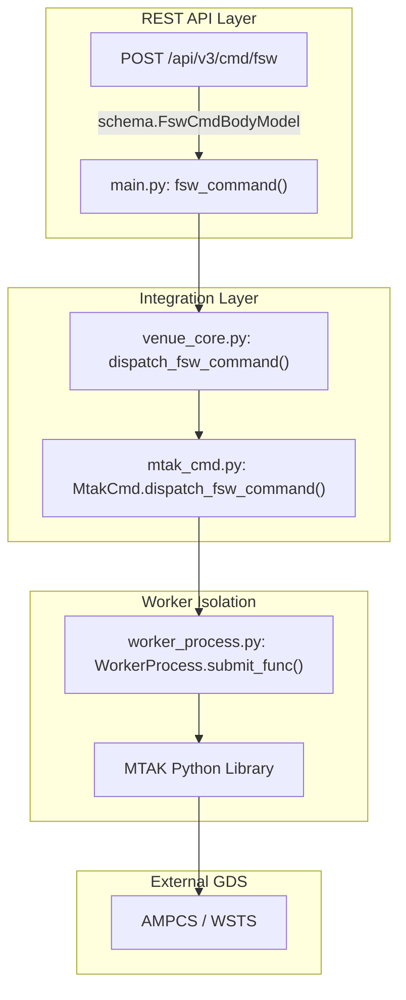
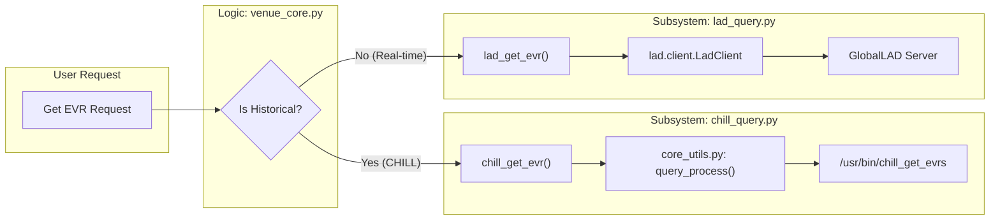

# Page: Glossary

# Glossary

Relevant source files

The following files were used as context for generating this wiki page:

- [README.md](README.md)
- [config/gds_config/ampcs.properties](config/gds_config/ampcs.properties)
- [core/chill_query.py](core/chill_query.py)
- [core/core_utils.py](core/core_utils.py)
- [core/decode_1553.py](core/decode_1553.py)
- [core/lad_query.py](core/lad_query.py)
- [core/schema.py](core/schema.py)
- [utils.py](utils.py)

This page provides definitions for codebase-specific terms, acronyms, and domain concepts used within the VenueServer. It maps high-level mission operations concepts to their specific implementations in the Python source code.

## Core Concepts

### AMPCS (AMMOS Mission Operations Center Prototyping System)
The primary Ground Data System (GDS) used by Europa and Psyche missions. VenueServer acts as a RESTful wrapper around AMPCS command and telemetry capabilities.
*   **Implementation**: Integration is handled via shell command execution of `chill_*` utilities [core/chill_query.py:10-154]() and the `mtak` library [mtak_cmd.py:1-240]().
*   **Configuration**: AMPCS paths are defined by the `CHILL_GDS` environment variable [README.md:148-150]().

### MTAK (Mission Test Automation Kit)
A JPL-developed library used for high-level commanding and session management. VenueServer uses MTAK to dispatch FSW, HW, and SSE commands.
*   **Implementation**: Managed in `mtak_cmd.py` [mtak_cmd.py:1-240]().
*   **Worker Isolation**: To prevent signal interference with FastAPI, MTAK runs in a dedicated `WorkerProcess` using `ProcessPoolExecutor` [worker_process.py:12-45]().

### Venue
A specific test or flight environment (e.g., WSTS, Testbed, ATLO).
*   **VenueType Enum**: Defined in `core_utils.py` as `WSTS`, `TESTBED`, or `ATLO` [core/core_utils.py:56-60]().
*   **Detection**: Determined at runtime via the `INGENIUM_VENUE_TYPE` environment variable [core/core_utils.py:168-180]().

---

## Telemetry & Data Terms

### EVR (Event Record)
Discrete log messages emitted by Flight Software (FSW) or System Support Equipment (SSE).
*   **Real-time**: Queried via `lad_get_evr` which uses the GlobalLAD `client.EvrQuery` [core/lad_query.py:41-105]().
*   **Historical**: Queried via `chill_get_evr` which executes the `chill_get_evrs` binary [core/chill_query.py:13-64]().

### EHA (Engineering Health Analysis / Telemetry Channels)
Continuous or periodic sensor data (e.g., voltages, temperatures).
*   **Real-time**: Retrieved via `lad_get_eha` [core/lad_query.py:190-230]().
*   **Historical**: Retrieved via `chill_get_eha` using `chill_get_chanvals` [core/chill_query.py:66-109]().

### GlobalLAD (Low Latency Access to Data)
A service providing low-latency access to real-time telemetry.
*   **Implementation**: Interfaced through the `lad` Python package in `lad_query.py` [core/lad_query.py:5-15]().
*   **Constraints**: Limited to `realtimeOnly()` queries and a maximum of 1000 results [core/lad_query.py:62-93]().

### CHILL
The historical data query component of AMPCS.
*   **Implementation**: Wrapped in `chill_query.py` [core/chill_query.py:1-154]().
*   **Format**: Output is parsed based on schemas defined in `ampcs.properties` [config/gds_config/ampcs.properties:1-8]().

---

## Commanding Terms

### SCMF (Spacecraft Command Message File)
A binary file format used for uplinking commands or data to the spacecraft.
*   **Implementation**: Dispatched via `MtakCmd.dispatch_scmf_file` [mtak_cmd.py:167-175]().
*   **Model**: `ScmfFileBodyModel` [core/schema.py:80-84]().

### String Selection
Refers to the redundant sides of the Flight Computer (Side A or Side B).
*   **Enum**: `StringSelection` (DEFAULT, A, B, AB) [core/schema.py:33-37]().
*   **Logic**: If `DEFAULT` is selected, the system falls back to the `defaultCmdString` configured at MTAK startup [core/schema.py:22-28]().

---

## Technical Architecture Mapping

### Natural Language to Code Entity Mapping: Command Pipeline
The following diagram bridges the conceptual "Send Command" action to the specific classes and functions in the codebase.

Title: Command Dispatch Data Flow

**Sources**: [main.py:350-370](), [core/venue_core.py:120-150](), [mtak_cmd.py:120-140](), [worker_process.py:70-90]()

### Natural Language to Code Entity Mapping: Telemetry Query
The following diagram bridges the conceptual "Get EVRs" action to the specific query subsystems.

Title: Telemetry Retrieval Path Selection

**Sources**: [core/venue_core.py:250-300](), [core/chill_query.py:13-64](), [core/lad_query.py:41-105](), [core/core_utils.py:137-155]()

---

## Glossary Table

| Term | Definition | Code Pointer |
| :--- | :--- | :--- |
| **SCLK** | Spacecraft Clock (seconds since epoch). | [core/core_utils.py:14](), [core/schema.py:128]() |
| **SCET** | Spacecraft Event Time (UTC). | [core/core_utils.py:202-212](), [core/schema.py:127]() |
| **ERT** | Earth Received Time. | [core/schema.py:126](), [config/gds_config/ampcs.properties:3]() |
| **DOY** | Day of Year (YYYY-DOYTHH:MM:SS). | [core/core_utils.py:234-245]() |
| **JWT** | JSON Web Token for authentication. | [utils.py:5-56]() |
| **SSE** | System Support Equipment (GSE commanding). | [core/schema.py:64-68](), [mtak_cmd.py:145-155]() |
| **1553** | MIL-STD-1553 Bus used for instrument comms. | [core/decode_1553.py:1-131]() |
| **PathConverter** | Utility to resolve file paths using templates. | [core/core_utils.py:300-350]() |

**Sources**: [core/core_utils.py:1-350](), [core/schema.py:1-150](), [utils.py:1-66](), [core/decode_1553.py:1-131]()