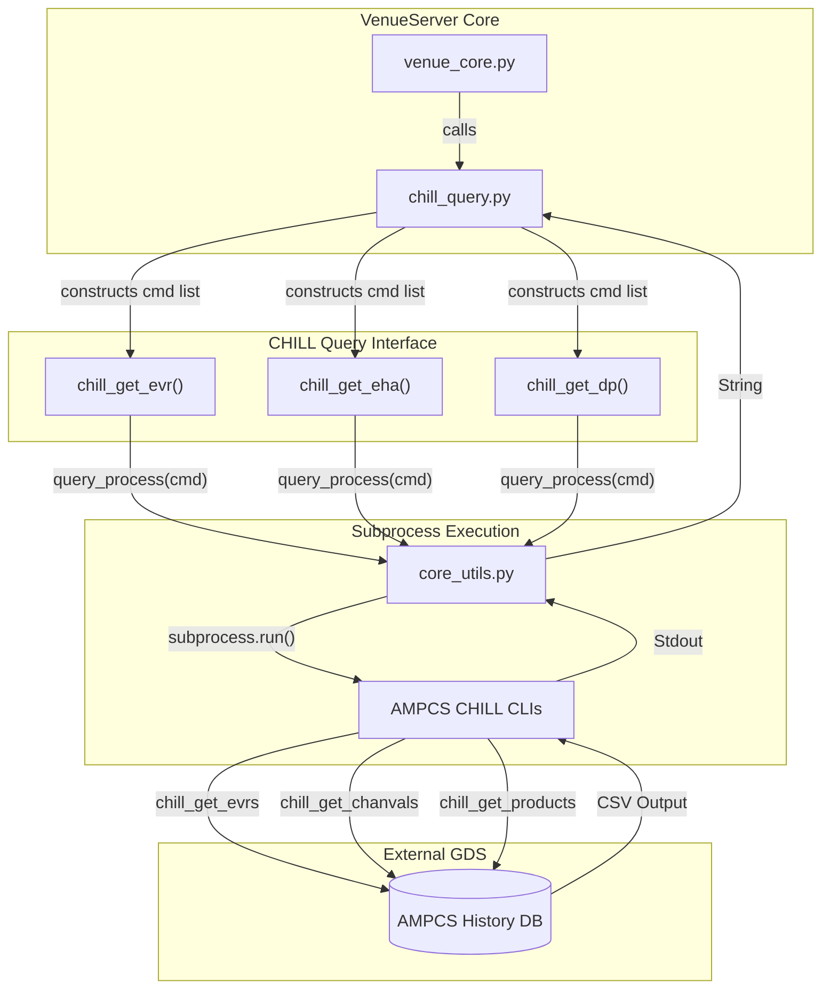

# Page: Historical Telemetry via CHILL (chill_query.py)

# Historical Telemetry via CHILL (chill_query.py)

Relevant source files

The following files were used as context for generating this wiki page:

- [config/gds_config/ampcs.properties](config/gds_config/ampcs.properties)
- [core/chill_query.py](core/chill_query.py)

The VenueServer provides access to historical mission telemetry through the CHILL (Command and History Interface with Low Latency) subsystem. While GlobalLAD is used for real-time telemetry streams, CHILL is the primary interface for querying historical Event Records (EVRs), Engineering Health Analysis (EHA) channel values, and Data Products (DP) stored within the AMPCS database.

The `core/chill_query.py` module acts as a wrapper around the AMPCS CHILL command-line interface (CLI) tools, translating high-level Python requests into formatted shell commands.

## Architecture and Data Flow

The CHILL query interface follows a synchronous execution pattern where the VenueServer spawns a subprocess to run a specific CHILL CLI tool, waits for the result, and returns the raw output (typically in CSV format) to the caller.

### CHILL Query Data Flow
This diagram illustrates how a request from the `venue_core.py` integration layer flows through `chill_query.py` to the system CLI and finally back as structured data.

**Sources:** `core/chill_query.py:13-154`(), `core/chill_query.py:4`()

## Implementation Details

The module `core/chill_query.py` implements three primary functions, each corresponding to a specific AMPCS CLI tool. These functions handle the mapping of Python arguments to CLI flags such as `--testKey` (for Session IDs) and `--timeType`.

### 1. Event Records (EVR) Query
The `chill_get_evr` function wraps the `chill_get_evrs` command. It supports filtering by event ID, name patterns, severity levels, and FSW modules.

*   **Function:** `chill_get_evr` [core/chill_query.py:13-63]()
*   **CLI Tool:** `chill_get_evrs` [core/chill_query.py:50]()
*   **Key Parameters:**
    *   `evrTypes`: Filters by source (e.g., 'f' for FSW, 's' for SSE). [core/chill_query.py:52]()
    *   `namePattern`: Regex or string match for EVR names. [core/chill_query.py:53]()
    *   `level`: Severity level (e.g., ACTIVITY, WARNING). [core/chill_query.py:55]()

### 2. Engineering Health (EHA) Query
The `chill_get_eha` function wraps `chill_get_chanvals` to retrieve telemetry channel values (DN/EU).

*   **Function:** `chill_get_eha` [core/chill_query.py:66-109]()
*   **CLI Tool:** `chill_get_chanvals` [core/chill_query.py:98]()
*   **Key Parameters:**
    *   `channelIds`: Comma-separated list of GDS channel IDs. [core/chill_query.py:101]()
    *   `inAlarmFilter`: Filters for specific alarm states (RED, YELLOW). [core/chill_query.py:102]()

### 3. Data Products (DP) Query
The `chill_get_dp` function wraps `chill_get_products` to locate files and products downlinked from the spacecraft.

*   **Function:** `chill_get_dp` [core/chill_query.py:112-154]()
*   **CLI Tool:** `chill_get_products` [core/chill_query.py:143]()
*   **Key Parameters:**
    *   `dpStatus`: Completeness filters like `--completeOnly`. [core/chill_query.py:145]()
    *   `apIds`: Application Process IDs associated with the products. [core/chill_query.py:146]()

**Sources:** `core/chill_query.py:13-154`()

## Time Handling and Constraints

CHILL queries require specific time configurations when `startTime` or `endTime` are provided. The `timeType` parameter must be specified to tell the AMPCS database which clock to reference.

| Time Type | Description |
| :--- | :--- |
| `SCLK` | Spacecraft Clock (ticks) |
| `SCET` | Spacecraft Event Time (UTC) |
| `ERT` | Earth Received Time (UTC) |

If either `startTime` or `endTime` is present, the logic automatically appends the `--timeType`, `--beginTime`, and `--endTime` flags to the command list [core/chill_query.py:57-60](), [core/chill_query.py:103-106](), [core/chill_query.py:148-151]().

**Sources:** `core/chill_query.py:33-38`(), `core/chill_query.py:57-60`()

## Configuration: ampcs.properties

The output format of the CHILL CLI tools is governed by a configuration file named `ampcs.properties`. This file ensures that the CSV data returned by the subprocess matches the schema expected by the VenueServer's parsers.

The VenueServer uses a standardized CSV schema for both Europa and Psyche missions to maintain compatibility across different ground stations.

| Query Type | Config Key | Schema Columns (Subset) |
| :--- | :--- | :--- |
| **EVR** | `csvQuery.EvrQuery` | `sessionId, name, module, level, eventId, sclk, scet, ert, message` |
| **EHA** | `csvQuery.ChanvalQuery` | `channelId, name, ert, scet, sclk, dn, eu, status, dnAlarmState` |
| **DP** | `csvQuery.ProductQuery` | `vcid, apid, productType, scet, ert, sclk, fullPath, fileSize` |

**Sources:** `config/gds_config/ampcs.properties:3-7`()

## Error Handling

The module defines a list of `chill_error_statuses`: `['FATAL', 'ERROR', 'CRITICAL']` [core/chill_query.py:11](). While the primary command execution is handled by `query_process` in `core_utils.py`, these statuses are used by calling layers to identify failures in the CHILL response strings.

Subprocess execution is managed with timeouts:
*   `SHORT_TIMEOUT`: Default for standard queries. [core/chill_query.py:5]()
*   `REVERSE_SCMF_TIMEOUT`: Used for specialized command history lookups. [core/chill_query.py:5]()

**Sources:** `core/chill_query.py:4-11`()
