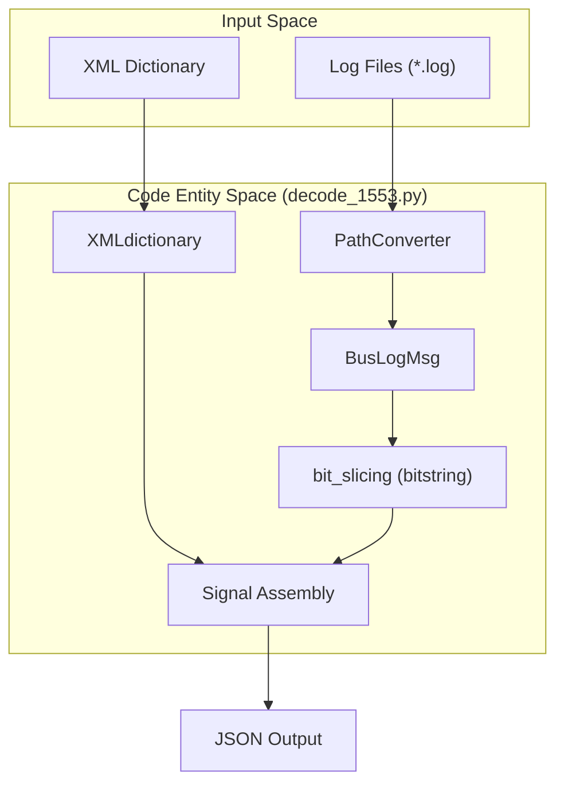
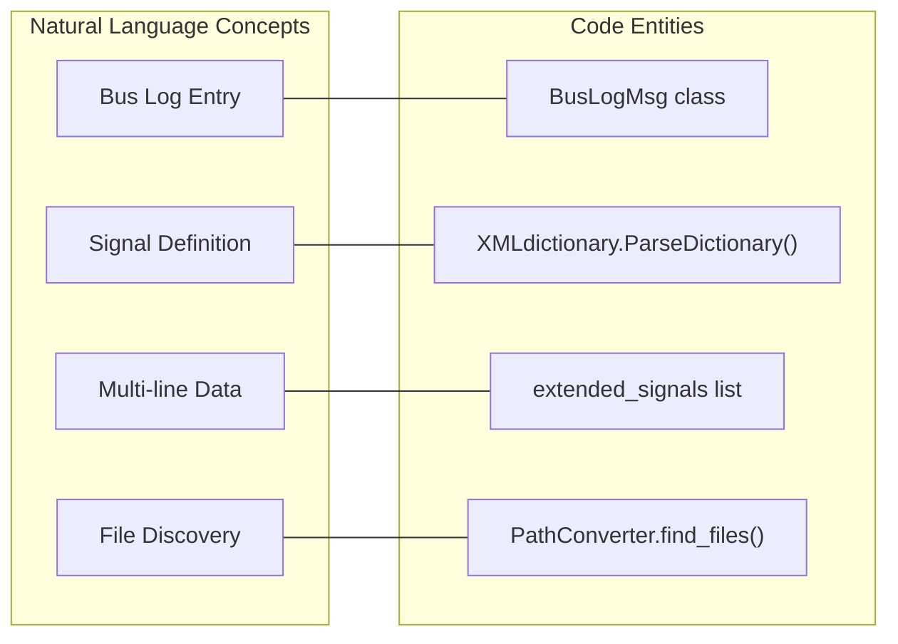

# Page: MIL-STD-1553 Bus Log Decoder (decode_1553.py)

# MIL-STD-1553 Bus Log Decoder (decode_1553.py)

Relevant source files

The following files were used as context for generating this wiki page:

- [core/core_utils.py](core/core_utils.py)
- [core/decode_1553.py](core/decode_1553.py)

The MIL-STD-1553 Bus Log Decoder provides a pipeline for transforming raw 1553 bus traffic logs into engineering-unit telemetry. It utilizes an XML-based signal dictionary to define bit-level mappings, calibrations, and multi-line signal assembly logic.

## Overview and Data Flow

The decoding process is orchestrated by `decode_1553.py`, which integrates with the `PathConverter` utility to locate log files and the `XMLdictionary` class to ingest telemetry definitions.

### Decoding Pipeline Diagram

The following diagram illustrates the flow from raw log files to decoded JSON responses.

"1553 Decoding Data Flow"

Sources: [core/decode_1553.py:1-40](), [core/core_utils.py:2465-2480]()

---

## Signal Schema Ingestion (XMLdictionary)

The `XMLdictionary` class handles the ingestion of XML-based telemetry definitions. It identifies two primary types of signals: standard 1553 signals and extended (multi-line) signals.

### Key Components:
*   **Signal Collection**: Located under the `mil1553_signals` tag [core/decode_1553.py:31-33]().
*   **Extended Signals**: Located under the `extended_signals` tag, used for data spanning multiple bus messages [core/decode_1553.py:35-38]().
*   **Calibration Metadata**:
    *   **Enums**: Maps numeric bit values to symbolic strings [core/decode_1553.py:74-80]().
    *   **Polynomials**: Defines coefficients and indices for engineering unit conversion [core/decode_1553.py:101-112]().
    *   **Data Word Maps**: Specifies the `word`, `bit_start`, and `num_bits` for slicing [core/decode_1553.py:90-99]().

Sources: [core/decode_1553.py:23-128]()

---

## Log Parsing and Bit Slicing

### BusLogMsg Class
The `BusLogMsg` class represents a single entry in the 1553 log. It parses space-delimited log lines and extracts metadata such as Remote Terminal (RT), Sub-Address (SA), Transmit/Receive (T/R) status, and the raw data words [core/decode_1553.py:131-172]().

### Bit Slicing with `bitstring`
Once a message is parsed, the decoder uses the `bitstring` library's `BitArray` to extract specific bits defined in the `data_word_map`.
*   The decoder converts hex words into bit streams [core/decode_1553.py:9-14]().
*   It applies the `bit_start` and `num_bits` offsets to extract the raw integer value [core/decode_1553.py:94-98]().

### Implementation Mapping

"Natural Language to Code Entity Mapping"

Sources: [core/decode_1553.py:23-131](), [core/core_utils.py:2465-2480]()

---

## Extended Signal Assembly

Extended signals represent data that is fragmented across multiple 1553 messages. The decoder maintains state to assemble these signals based on the `word_count` and specific RT/SA/TR combinations defined in the XML [core/decode_1553.py:49-62]().

*   **Logic**: The decoder identifies the start of an extended sequence and buffers subsequent words until the required `word_count` is reached.
*   **Validation**: It checks `remote_terminal`, `sub_address`, and `transmit_receive` fields to ensure message continuity [core/decode_1553.py:55-60]().

Sources: [core/decode_1553.py:49-62]()

---

## Time Handling (IRIG and ISO)

The decoder supports multiple time formats found in 1553 logs, primarily driven by the `irig_time` configuration.

| Time Format | Description | Implementation |
| :--- | :--- | :--- |
| **ISO 8601** | Standard `YYYYMMDDTHHMMSS` format. | [core/decode_1553.py:157-159]() |
| **IRIG** | Day-of-Year format (`DDD:HH:MMS:S.f`). Requires an `assumed_year`. | [core/decode_1553.py:146-154]() |
| **SCLK** | Spacecraft Clock extracted from message word 2. | [core/decode_1553.py:162-162]() |

Sources: [core/decode_1553.py:143-162]()

---

## Log File Discovery

The decoder uses `PathConverter` from `core_utils.py` to resolve the actual filesystem path of the 1553 logs. This allows the system to handle mission-specific directory structures using templates.

*   **Path Resolution**: `PathConverter` replaces placeholders (e.g., `%Y`, `%j`) with actual time values to locate the correct log file for a given query window [core/core_utils.py:2465-2480]().
*   **Filtering**: The system filters log lines based on `query_start_time` and `query_end_time` to return only relevant traffic [core/decode_1553.py:137-141]().

Sources: [core/core_utils.py:2465-2510](), [core/decode_1553.py:132-142]()
