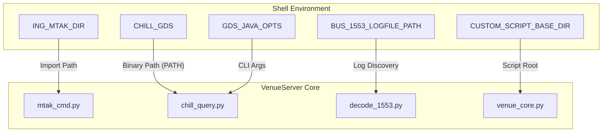
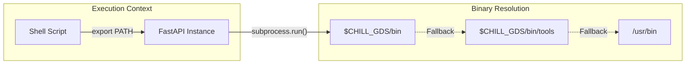

# Page: Mission Environment Configurations

# Mission Environment Configurations

Relevant source files

The following files were used as context for generating this wiki page:

- [config/europa_dev_envs.sh](config/europa_dev_envs.sh)
- [config/psyche_dev_envs.sh](config/psyche_dev_envs.sh)

The Ingenium VenueServer is designed to support multiple flight projects (e.g., Europa Clipper and Psyche) by utilizing mission-specific shell environment configuration scripts. These scripts establish the necessary environment variables for directory paths, GDS integration, telemetry retrieval, and hardware-specific logging.

## Purpose and Scope

Environment configuration is handled via bash scripts located in the `config/` directory. These scripts are sourced prior to starting the VenueServer instances to ensure that the application correctly resolves dependencies like the Mission Test Automation Kit (MTAK), AMMOS Mission Operations Center (AMMOS) Ground Data System (AMPCS), and project-specific file paths.

Sources: [config/europa_dev_envs.sh:1-21](), [config/psyche_dev_envs.sh:1-21]()

---

## Core Environment Variables

The following variables are common across all mission configurations but point to project-specific paths.

### VenueServer Infrastructure
*   `ING_VENUE_DIR`: The root directory of the VenueServer installation. Used to locate configuration files like `gds_config`.
    *   Europa: [config/europa_dev_envs.sh:3-3]()
    *   Psyche: [config/psyche_dev_envs.sh:3-3]()
*   `ING_MTAK_DIR`: Path to the MTAK Python library. This is critical for the `mtak_cmd.py` module to import the MTAK session management classes.
    *   Europa: [config/europa_dev_envs.sh:4-4]()
    *   Psyche: [config/psyche_dev_envs.sh:4-4]()
*   `ING_LOG_DIR`: Directory where VenueServer application logs are stored.
    *   Europa: [config/europa_dev_envs.sh:5-5]()
    *   Psyche: [config/psyche_dev_envs.sh:5-5]()

### Custom Script Execution
*   `CUSTOM_SCRIPT_BASE_DIR`: Defines the root directory for project-specific automation scripts.
    *   Europa: `/proj/europa/sit` [config/europa_dev_envs.sh:7-7]()
    *   Psyche: `/teamtools/ingenium` [config/psyche_dev_envs.sh:7-7]()

### GlobalLAD (Real-time Telemetry)
These variables configure the connection to the Global Look-at-Data (GlobalLAD) service.
*   `LAD_HOST`: The hostname of the LAD server. If unset, the system defaults to the local `HOSTNAME` [config/europa_dev_envs.sh:9-10]().
*   `LAD_PORT`: The TCP port for the LAD service (typically `8887`) [config/europa_dev_envs.sh:11-11]().
*   `LAD_HTTPS`: Boolean flag indicating if SSL/TLS should be used for LAD queries [config/europa_dev_envs.sh:12-12]().

### AMPCS / CHILL Integration
*   `CHILL_GDS`: The root installation path of the mission's AMPCS deployment.
    *   Europa: `/ammos/ampcs/mpcs/eurc/current` [config/europa_dev_envs.sh:19-19]()
    *   Psyche: `/ammos/ampcs/mpcs/psyche/current` [config/psyche_dev_envs.sh:18-18]()
*   `GDS_JAVA_OPTS`: Java system properties passed to AMPCS CLI tools. It specifically sets `GdsUserConfigDir` to point to the VenueServer's local GDS configuration [config/europa_dev_envs.sh:21-21]().

---

## Mission Configuration Comparison

The primary differences between mission configurations lie in the **MIL-STD-1553 Bus Logging** setup and the **GDS binary paths**.

### Data Flow: Environment to System Components

The following diagram illustrates how these environment variables are consumed by the various subsystems within the VenueServer.

**Environment Variable Distribution Map**

Sources: [config/europa_dev_envs.sh:4-21](), [config/psyche_dev_envs.sh:4-21]()

### Detailed Differences Table

| Variable | Europa Configuration | Psyche Configuration |
| :--- | :--- | :--- |
| **`CHILL_GDS`** | `/ammos/ampcs/mpcs/eurc/current` | `/ammos/ampcs/mpcs/psyche/current` |
| **`BUS_1553_LOGFILE_PATH`** | *Empty* (Not used for Europa) | Template path including `$YYYY`, `$DOY`, and `$GDS_HOSTNAME` |
| **`LOGFILE_1553_DICT...`** | *Empty* | `/gds/psyche/dictionary/psyche1553/current` |
| **`CUSTOM_SCRIPT_BASE_DIR`**| `/proj/europa/sit` | `/teamtools/ingenium` |

Sources: [config/europa_dev_envs.sh:14-19](), [config/psyche_dev_envs.sh:14-18]()

---

## Path Manipulation and Execution Environment

Both mission scripts explicitly modify the system `PATH` to ensure that AMPCS binaries (`chill_get_evrs`, `chill_get_chanvals`, etc.) take precedence over system defaults.

### PATH Construction
The `PATH` is constructed as follows:
1. `$CHILL_GDS/bin`
2. `$CHILL_GDS/bin/tools`
3. Standard system paths (`/usr/local/bin`, `/usr/bin`, etc.)

This ensures that when `chill_query.py` or `core_utils.py` executes a subprocess via `query_process`, the mission-specific AMPCS tools are correctly located.

**System Path Resolution Logic**

Sources: [config/europa_dev_envs.sh:20-20](), [config/psyche_dev_envs.sh:19-19]()

## 1553 Bus Log Configuration (Psyche Only)

Unlike Europa, the Psyche environment requires specific configuration for the MIL-STD-1553 bus decoder.

*   **`BUS_1553_LOGFILE_PATH`**: This variable uses a template string: `/var/ammos/archive/$YYYY/$DOY/sse/$GDS_HOSTNAME/session_*/$USER/wsts-gds.results/psyche_*`. The `core_utils.PathConverter` class is responsible for resolving these tokens (like `$YYYY` and `$DOY`) into actual filesystem paths at runtime [config/psyche_dev_envs.sh:14-14]().
*   **`IRIG_SOURCE`**: Set to `'false'` in both configurations by default, indicating that the 1553 decoder should use standard timestamps unless otherwise specified [config/psyche_dev_envs.sh:16-16]().

Sources: [config/psyche_dev_envs.sh:14-16]()
