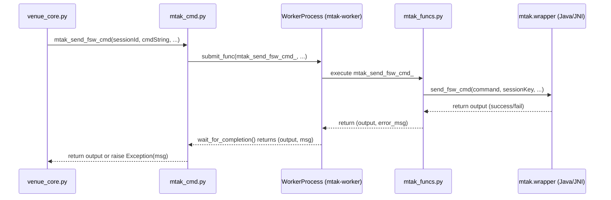
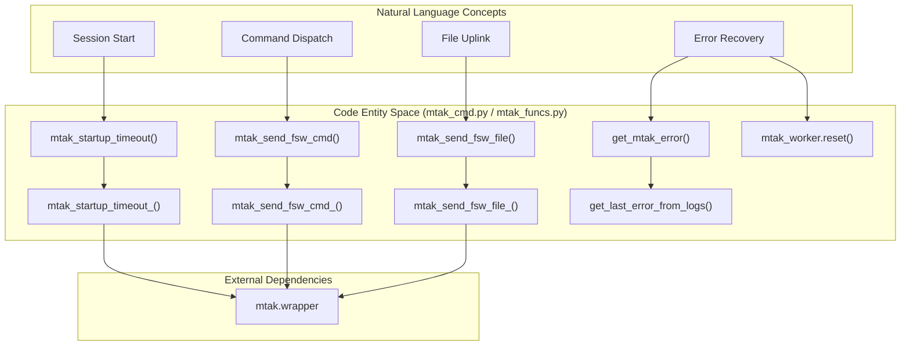

# Page: MTAK Command Dispatcher (mtak_cmd.py)

# MTAK Command Dispatcher (mtak_cmd.py)

Relevant source files

The following files were used as context for generating this wiki page:

- [core/mtak_cmd.py](core/mtak_cmd.py)
- [core/mtak_funcs.py](core/mtak_funcs.py)

The `mtak_cmd.py` module serves as the primary interface between the VenueServer and the Mission Test Automation Kit (MTAK). It manages the lifecycle of MTAK sessions and provides a robust mechanism for dispatching Flight Software (FSW), Hardware (HW), and Spacecraft Support Equipment (SSE) commands, as well as file uplinks. To ensure the stability of the main FastAPI process, all MTAK operations are offloaded to a dedicated worker process.

## Session Lifecycle Management

The dispatcher manages MTAK sessions through explicit startup and shutdown procedures. A session must be initialized before any commands can be dispatched.

### Startup
The `mtak_startup_timeout` function initializes MTAK sessions for specific session IDs [core/mtak_cmd.py:41-47](). It utilizes `mtak.wrapper.startup` (via the worker) to connect to the GDS [core/mtak_funcs.py:54-64](). The startup configuration explicitly disables telemetry reception (EHA, EVRs, Products) to focus the session solely on commanding [core/mtak_funcs.py:57-61]().

### Shutdown and Cleanup
Shutdown is handled by `mtak_shutdown`, which resets the worker process and terminates associated MTAK processes [core/mtak_cmd.py:64-70](). Additionally, an `atexit` hook is registered to ensure that if the main Python process exits (e.g., a custom script finishing), the `MtakDownlinkServerApp` and other child processes are cleaned up automatically [core/mtak_cmd.py:15-20]().

## Worker Isolation Pattern

MTAK operations are executed within a `WorkerProcess` instance named `mtak_worker` [core/mtak_cmd.py:13](). This pattern isolates the Java-based MTAK wrapper from the FastAPI event loop, preventing blocking and ensuring that MTAK crashes or hangs do not destabilize the server.

### Execution Flow
1.  **Submit**: The dispatcher calls `mtak_worker.submit_func()` with a target function from `mtak_funcs.py` and its arguments [core/mtak_cmd.py:53]().
2.  **Wait**: The dispatcher calls `mtak_worker.wait_for_completion(timeout_sec)` [core/mtak_cmd.py:54]().
3.  **Timeout Handling**: If the operation exceeds `timeout_sec`, the worker raises a `TimeoutError` [core/mtak_cmd.py:31-38]().
4.  **Error Retrieval**: If an exception occurs, the worker captures the traceback. The system also attempts to scrape the actual MTAK log file to find the specific GDS error message (e.g., `CommandParseException`) [core/mtak_funcs.py:32-47]().

### Data Flow: Command Dispatch
The following diagram illustrates the flow from a dispatch request to the underlying MTAK wrapper.

**MTAK Dispatch Logic Flow**

Sources: [core/mtak_cmd.py:72-101](), [core/mtak_funcs.py:76-93](), [core/worker_process.py:1-20]()

## Command Dispatch Types

The module supports several distinct commanding interfaces, each mapping to a specific function in the `mtak.wrapper`.

| Command Type | Dispatch Function | MTAK Internal Function | Description |
| :--- | :--- | :--- | :--- |
| **FSW Command** | `mtak_send_fsw_cmd` | `mtk.send_fsw_cmd` | Standard flight software commands with validation [core/mtak_cmd.py:72](). |
| **HW Command** | `mtak_send_hw_cmd` | `mtk.send_hw_cmd` | Hardware-level command stems [core/mtak_cmd.py:104](). |
| **SSE Command** | `mtak_send_sse_cmd` | `mtk.send_sse_cmd` | Support equipment commands [core/mtak_cmd.py:135](). |
| **Binary File** | `mtak_send_fsw_file` | `mtk.send_fsw_file` | Uplinks a local file to a target vehicle location [core/mtak_cmd.py:164](). |
| **SCMF Uplink** | `mtak_send_scmf_file` | `mtk.send_fsw_scmf` | Uplinks a pre-built Spacecraft Command Message File [core/mtak_cmd.py:200](). |

Sources: [core/mtak_cmd.py:72-200](), [core/mtak_funcs.py:76-173]()

## Error Handling and Log Scraping

MTAK errors often occur within the Java layer and may not propagate clearly through the JNI wrapper. To provide better diagnostic information, `mtak_funcs.py` includes logic to scrape the MTAK log file when an operation fails.

1.  **Tail Logs**: The `get_last_lines` function uses `FileReadBackwards` to read the end of the MTAK log [core/mtak_funcs.py:12-30]().
2.  **Filter Errors**: `get_last_error_from_logs` searches for "ERROR" or "FATAL" keywords in the last 50 lines [core/mtak_funcs.py:32-39]().
3.  **Augment Exception**: `get_mtak_error` combines the Python exception with the scraped log entry to provide a comprehensive error message to the user [core/mtak_funcs.py:41-47]().

**Entity Mapping: Natural Language to Code**

Sources: [core/mtak_cmd.py:41-200](), [core/mtak_funcs.py:32-173]()

## Timeout Handling

Every commanding function accepts a `timeout_sec` parameter [core/mtak_cmd.py:72, 104, 135](). This timeout is enforced by the `WorkerProcess.wait_for_completion` method. If MTAK hangs (e.g., due to a lost connection to the GDS), the worker process is capable of being forcefully terminated and restarted by the `mtak_worker.reset()` call within `mtak_shutdown` [core/mtak_cmd.py:70]().

Sources: [core/mtak_cmd.py:31-39](), [core/mtak_cmd.py:70](), [core/mtak_cmd.py:91]()
