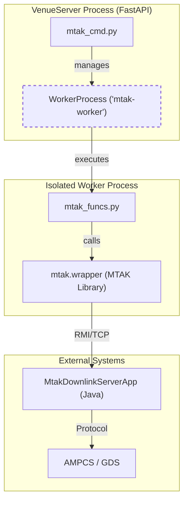
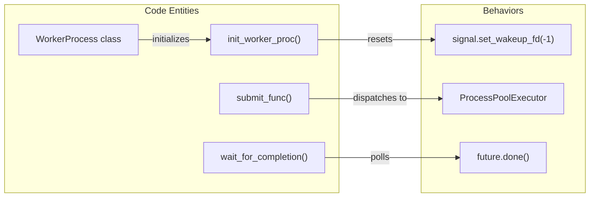

# Page: MTAK Integration

# MTAK Integration

Relevant source files

The following files were used as context for generating this wiki page:

- [core/mtak_cmd.py](core/mtak_cmd.py)
- [core/mtak_funcs.py](core/mtak_funcs.py)
- [core/worker_process.py](core/worker_process.py)

The VenueServer integrates with the **Mission Test Automation Kit (MTAK)** to provide commanding capabilities for Flight Software (FSW), Hardware (HW), and System Support Equipment (SSE). This integration allows the VenueServer to act as a bridge between RESTful API clients and the underlying AMPCS (Advanced Multi-Mission Operations System) infrastructure via the MTAK Python wrapper.

Because MTAK and its associated Java-based processes can be resource-intensive or prone to hanging during initialization, the VenueServer employs a **Worker Process Isolation** pattern. This ensures that MTAK operations do not block the main FastAPI event loop and that any failures in the MTAK layer can be recovered by forcefully restarting the worker process without affecting the primary web server.

### System Interaction Overview

The following diagram illustrates the relationship between the VenueServer's internal modules and the MTAK system.

**MTAK Command Pipeline Architecture**

**Sources:** [core/mtak_cmd.py:13-13](), [core/worker_process.py:23-38](), [core/mtak_funcs.py:6-6]()

---

### MTAK Command Dispatcher

The `mtak_cmd.py` module serves as the high-level interface for all MTAK operations. It abstracts the complexities of session management and command transmission. It utilizes a dedicated `WorkerProcess` instance named `mtak-worker` to perform blocking calls.

Key responsibilities include:
*   **Session Lifecycle**: Managing `mtak_startup_timeout` and `mtak_shutdown` to initialize and tear down MTAK sessions [core/mtak_cmd.py:41-70]().
*   **Command Dispatch**: Providing specific functions for different command types, such as `mtak_send_fsw_cmd`, `mtak_send_hw_cmd`, and `mtak_send_sse_cmd` [core/mtak_cmd.py:72-162]().
*   **File Uplink**: Handling the transmission of binary files and Spacecraft Command Message Files (SCMF) via `mtak_send_fsw_file` and `mtak_send_scmf_file` [core/mtak_cmd.py:164-200]().
*   **Automatic Cleanup**: Registering an `atexit` hook to ensure that the `mtak-worker` (and its child Java processes) are terminated when the VenueServer exits [core/mtak_cmd.py:11-20]().

For details on dispatch logic and timeout handling, see **[MTAK Command Dispatcher (mtak_cmd.py)](#3.1)**.

**Sources:** [core/mtak_cmd.py:1-200]()

---

### Worker Process Isolation

To maintain system stability, the VenueServer executes all MTAK-related functions inside a separate process managed by the `WorkerProcess` class. This class uses a `ProcessPoolExecutor` with `max_workers=1` to ensure sequential execution of commands and isolation from the main thread.

**Code Entity Mapping: Worker Isolation**

**Sources:** [core/worker_process.py:13-21](), [core/worker_process.py:118-129](), [core/worker_process.py:154-162]()

The isolation pattern provides:
*   **Signal Handling**: The `init_worker_proc` function resets signal handlers to prevent the worker from interfering with FastAPI's signal management [core/worker_process.py:13-21]().
*   **Forced Termination**: If a command hangs, the `shutdown` method uses `psutil` to find and `SIGKILL` the worker process and all its recursive children (e.g., Java MTAK processes) [core/worker_process.py:56-101]().
*   **Recovery**: The `reset` method can re-initialize the process pool if it becomes broken or unresponsive [core/worker_process.py:103-116]().

For details on the implementation of the process pool and signal isolation, see **[Worker Process Isolation (worker_process.py)](#3.2)**.

**Sources:** [core/worker_process.py:1-162]()

---

### Function Implementations

The actual interaction with the `mtak.wrapper` library occurs within `mtak_funcs.py`. These functions are designed to be "picklable" so they can be sent across the process boundary to the worker.

These functions wrap the standard MTAK library calls:
*   `mtak_startup_timeout_`: Calls `mtk.startup` with session keys and configuration flags [core/mtak_funcs.py:49-74]().
*   `mtak_send_fsw_cmd_`: Wraps `mtk.send_fsw_cmd` [core/mtak_funcs.py:76-93]().
*   `mtak_send_hw_cmd_`: Wraps `mtk.send_hw_cmd` [core/mtak_funcs.py:95-111]().
*   **Error Extraction**: In the event of a failure, these functions attempt to read the last 50 lines of the MTAK log file to provide a more descriptive error message than a simple stack trace [core/mtak_funcs.py:32-47]().

**Sources:** [core/mtak_funcs.py:1-173]()
