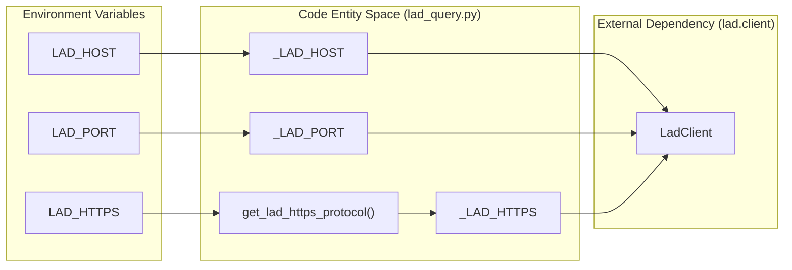
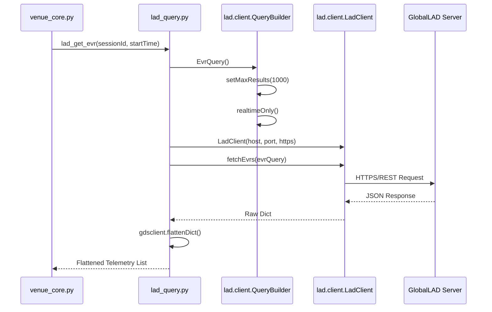

# Page: Real-Time Telemetry via GlobalLAD (lad_query.py)

# Real-Time Telemetry via GlobalLAD (lad_query.py)

Relevant source files

The following files were used as context for generating this wiki page:

- [core/lad_query.py](core/lad_query.py)

The `lad_query.py` module serves as the primary interface between the VenueServer and the **GlobalLAD (LAD)** service. It provides functions to query real-time Event Records (EVRs), Engineering Health Analysis (EHA) channel values, and Spacecraft Clock (SCLK) to Spacecraft Event Time (SCET) correlations. Unlike the CHILL interface which handles historical data, this module is strictly constrained to real-time telemetry retrieval via the `realtimeOnly()` query parameter.

## System Configuration and Connection

The module initializes its connection parameters from environment variables, allowing for mission-specific configurations (e.g., Europa vs. Psyche).

| Variable | Description | Default |
| :--- | :--- | :--- |
| `LAD_HOST` | The hostname of the GlobalLAD server. | System `HOSTNAME` |
| `LAD_PORT` | The port for GlobalLAD communication. | `8887` |
| `LAD_HTTPS` | Boolean string ("true"/"false") for SSL/TLS. | `False` |

The connection is managed by the `lad.client.LadClient` class, which is instantiated for each query [core/lad_query.py:99-102]().

### GlobalLAD Connection Architecture

This diagram illustrates how the `lad_query.py` module maps configuration variables to the underlying `LadClient` entity.

Title: GlobalLAD Interface Mapping

Sources: [core/lad_query.py:17-35]()

## Telemetry Query Implementation

The module implements specialized functions for different telemetry types. All queries are limited to a maximum of **1000 results** to prevent memory exhaustion and match typical GlobalLAD configurations [core/lad_query.py:62-62]().

### Event Records (EVR)
EVR queries are performed using `lad_get_evr` (single filter) or `lad_get_evr_multi` (multiple filters).
- **Functionality**: Filters by `sessionId`, `evrName`, `eventId`, and `evrLevel` [core/lad_query.py:41-43]().
- **Constraint**: Always invokes `evrq.realtimeOnly()` to ensure low-latency access to the live telemetry stream [core/lad_query.py:93-93]().
- **Time Types**: Supports `ERT`, `SCET`, and `SCLK` via the `TimeType` schema [core/lad_query.py:73-78]().

### Channel Values (EHA)
Engineering data is retrieved via `lad_get_eha` and `lad_get_eha_multi`.
- **Functionality**: Queries specific `channelId` values within a session [core/lad_query.py:190-191]().
- **Data Flow**: Uses `client.ChanValQuery()` to build the request and `gdsclient.flattenDict` to process the nested response from GlobalLAD [core/lad_query.py:202-228]().

### SCLK-SCET Correlation
The function `lad_get_sclkscet` is used to synchronize time systems by retrieving the latest correlation data [core/lad_query.py:277-277](). It returns the relationship between the Spacecraft Clock and UTC-based Spacecraft Event Time.

### Telemetry Query Data Flow

This diagram traces the flow from a VenueServer request through the GlobalLAD query builders to the final response.

Title: Telemetry Request Lifecycle

Sources: [core/lad_query.py:56-105](), [core/lad_query.py:202-231]()

## Key Functions Reference

| Function | Purpose | File Reference |
| :--- | :--- | :--- |
| `lad_get_evr` | Fetches real-time EVRs for a single criteria set. | [core/lad_query.py:41-105]() |
| `lad_get_evr_multi` | Fetches real-time EVRs for lists of names/IDs/levels. | [core/lad_query.py:107-188]() |
| `lad_get_eha` | Fetches real-time channel values for a single channel. | [core/lad_query.py:190-231]() |
| `lad_get_eha_multi` | Fetches real-time channel values for multiple channels. | [core/lad_query.py:233-275]() |
| `lad_get_sclkscet` | Retrieves SCLK to SCET time correlation data. | [core/lad_query.py:277-310]() |

## Implementation Details & Constraints

### Timeout Handling
The module defines a default timeout of 60 seconds (`_LAD_TIMEOUT_SEC`) [core/lad_query.py:35-35](). If a query exceeds this limit, it raises a `TimeoutError` [core/lad_query.py:37-38]().

### Result Ordering
A known limitation of the GlobalLAD EVR query is that results are **not ordered** [core/lad_query.py:61-61](). Because of the 1000-result limit, if more than 1000 EVRs exist in the requested time range, some records may be missed because the truncation is non-deterministic regarding time.

### Real-Time Only Constraint
Every telemetry query function in this module explicitly calls `.realtimeOnly()` on the query object [core/lad_query.py:93](), [core/lad_query.py:176](), [core/lad_query.py:222](). This ensures that the VenueServer does not inadvertently trigger heavy historical database lookups on the GlobalLAD server, which are instead routed to the CHILL subsystem via `chill_query.py`.

Sources: [core/lad_query.py:1-310]()
