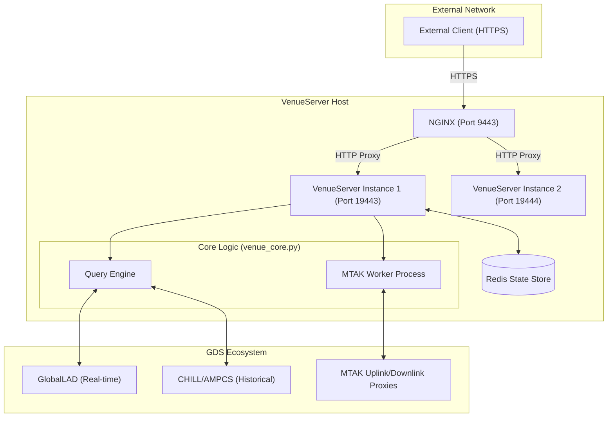
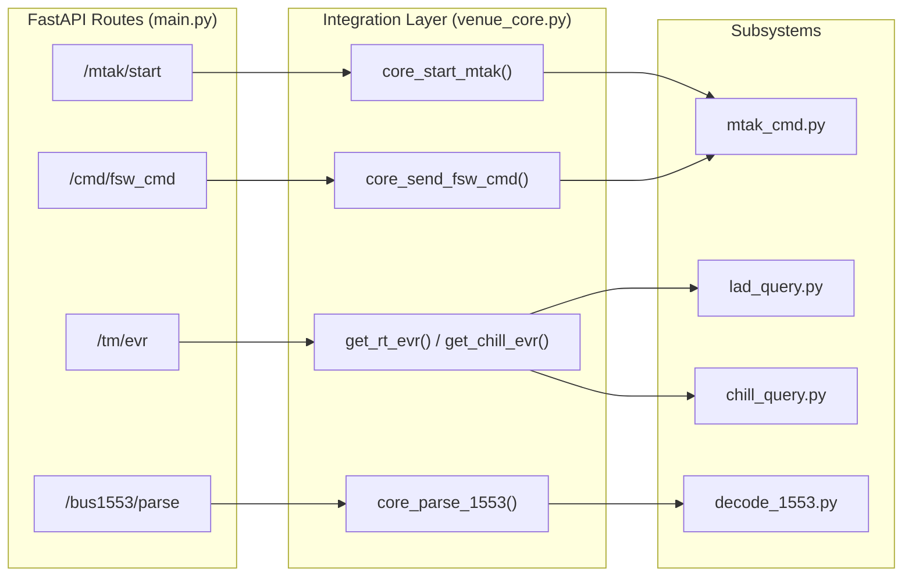

# Page: System Architecture

# System Architecture

Relevant source files

The following files were used as context for generating this wiki page:

- [README.md](README.md)
- [core/venue_core.py](core/venue_core.py)
- [main.py](main.py)
- [nginx.conf.template](nginx.conf.template)

The Ingenium VenueServer is a multi-tier web application designed to provide a RESTful interface for ground data system (GDS) operations. It serves as an abstraction layer over the Advanced Multi-Mission Operations System (AMMOS) Mission Control System (AMPCS), the Mission Test Automation Kit (MTAK), and various telemetry providers.

## High-Level Architecture

The system utilizes a reverse proxy architecture to manage multiple application instances, ensuring secure external access via HTTPS while delegating specific command and telemetry tasks to specialized backend services.

### Components
*   **NGINX Reverse Proxy**: Handles SSL termination and routes external traffic from ports `9443-9445` to internal FastAPI instances [nginx.conf.template:37-127]().
*   **FastAPI VenueServer**: Multiple independent Python processes (typically listening on `19443-19445`) that handle business logic, authentication, and request orchestration [README.md:37-46]().
*   **Redis State Store**: A shared memory store used for maintaining state across the application, specifically for session management and MTAK coordination [README.md:28-36]().
*   **MTAK (Mission Test Automation Kit)**: An integration layer that manages the actual command uplink and telemetry downlink proxies [core/venue_core.py:46-59]().
*   **AMPCS / CHILL**: The primary GDS suite used for historical telemetry (CHILL) and command dictionary management [README.md:148-150]().
*   **GlobalLAD**: A real-time telemetry provider used for low-latency Event Record (EVR) and Engineering Health Analysis (EHA) queries [core/venue_core.py:205-209]().

### System Data Flow Diagram

The following diagram illustrates the flow of a request from an external client through the VenueServer stack to the underlying GDS components.

**Figure 1: Request Lifecycle and System Integration**

**Sources:** [nginx.conf.template:51-60](), [README.md:53-56](), [core/venue_core.py:15-17](), [core/venue_core.py:46-71]().

---

## Code Entity Mapping

The VenueServer bridges high-level API definitions in `main.py` to low-level GDS interactions via `venue_core.py`.

### API to Core Mapping
Each REST endpoint in `main.py` maps to a specific "core" function in `venue_core.py`, which then interacts with specialized modules like `mtak_cmd.py`, `lad_query.py`, or `chill_query.py`.

**Figure 2: API Route to Code Entity Mapping**

**Sources:** [main.py:120-146](), [main.py:169-195](), [main.py:321-355](), [core/venue_core.py:46-61](), [core/venue_core.py:73-92](), [core/venue_core.py:205-245]().

---

## Detailed Component Breakdown

### NGINX Reverse Proxy
NGINX acts as the gateway. It is configured via `nginx.conf.template` to provide:
1.  **SSL Termination**: Uses certificates located in `${ING_VENUE_DIR}/config/.secret/` [nginx.conf.template:44-45]().
2.  **Port Mapping**: 
    *   `9443` $\rightarrow$ `19443` [nginx.conf.template:37-59]()
    *   `9444` $\rightarrow$ `19444` [nginx.conf.template:68-91]()
    *   `9445` $\rightarrow$ `19445` [nginx.conf.template:99-122]()
3.  **Header Propagation**: Forwards `X-Real-IP` and `X-Forwarded-For` to ensure the FastAPI application can identify the original client [nginx.conf.template:55-56]().

### FastAPI Application (`main.py`)
The application uses the `APIRouter` with a `/api/v3` prefix [main.py:96](). Key responsibilities include:
*   **Input Validation**: Uses Pydantic models (e.g., `FswCmdBodyModel`) to validate request bodies before processing [main.py:179]().
*   **Authentication**: Integrates with `utils.py` for JWT validation and RSA key loading [main.py:90-92]().
*   **Error Handling**: Catches exceptions and returns standardized `ErrorResponse` objects [main.py:141-146]().

### Integration Layer (`venue_core.py`)
This module orchestrates the complex interactions required for GDS operations:
*   **Commanding**: Interfaces with `mtak_cmd.py` to dispatch FSW, HW, and SSE commands [core/venue_core.py:2-4]().
*   **Telemetry Dual-Path**: 
    *   **Real-time**: Calls `lad_query.py` for immediate data from GlobalLAD [core/venue_core.py:205-230]().
    *   **Historical**: Calls `chill_query.py` to execute AMPCS CLI tools for archived data [core/venue_core.py:232-245]().
*   **1553 Decoding**: Manages the lifecycle of MIL-STD-1553 bus log parsing by invoking `decode_1553.py` [core/venue_core.py:37-38]().

### MTAK Command Dispatch
MTAK operations are isolated to prevent blocking the main FastAPI event loop. The `mtak_cmd.py` module uses a worker process pattern to manage session lifecycles and command timeouts [core/venue_core.py:57-59]().

| Function | Target System | Description |
| :--- | :--- | :--- |
| `mtak_send_fsw_cmd` | Flight Software | Dispatches FSW commands via MTAK proxy [core/venue_core.py:87-91](). |
| `mtak_send_hw_cmd` | Hardware | Dispatches hardware-level command stems [core/venue_core.py:106-110](). |
| `mtak_send_fsw_file` | FSW Uplink | Handles binary file transfers to the spacecraft [core/venue_core.py:148-154](). |

**Sources:** [main.py:96-104](), [core/venue_core.py:1-45](), [nginx.conf.template:1-129]().
