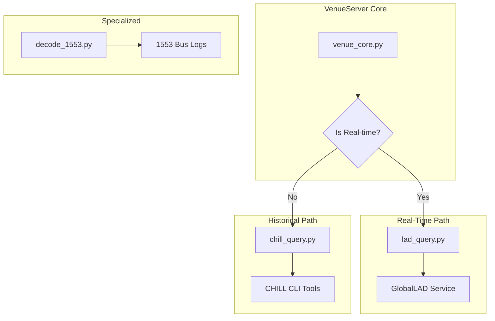
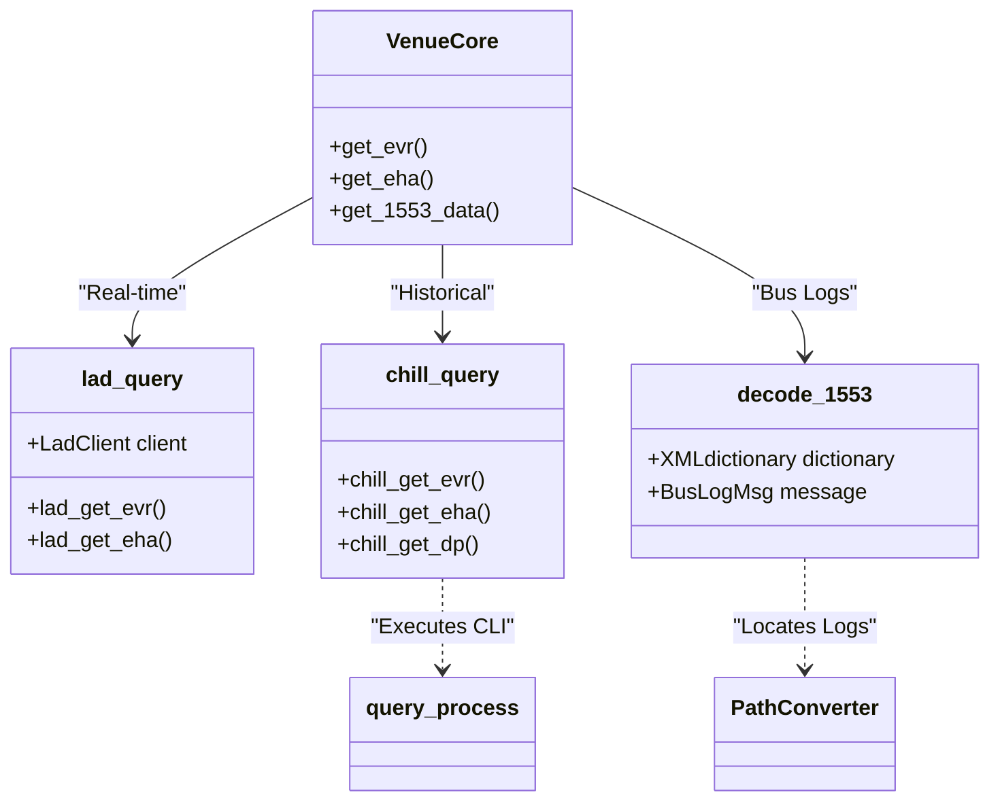

# Page: Telemetry & Data Querying

# Telemetry & Data Querying

Relevant source files

The following files were used as context for generating this wiki page:

- [core/chill_query.py](core/chill_query.py)
- [core/decode_1553.py](core/decode_1553.py)
- [core/lad_query.py](core/lad_query.py)

The VenueServer provides a unified interface for querying spacecraft telemetry and ground system data across three primary domains: real-time telemetry via **GlobalLAD**, historical telemetry via **CHILL**, and specialized MIL-STD-1553 bus log decoding. These subsystems allow users to retrieve Event Records (EVR), Engineering Health Analysis (EHA) channel values, and Data Products (DP).

### Subsystem Architecture Overview

The telemetry architecture is bifurcated based on data "freshness." Real-time queries are routed to the GlobalLAD (Local Archive Database) service, while historical queries (or queries spanning longer durations) are routed to the CHILL (Command/History Interface Lower Level) subsystem.

#### Telemetry Query Flow
The following diagram illustrates how telemetry requests are dispatched based on the source and data type.

**Telemetry Dispatch Logic**

Sources: [core/lad_query.py:27-35](), [core/chill_query.py:7-11](), [core/decode_1553.py:131-142]()

---

### Real-Time Telemetry via GlobalLAD

The `lad_query.py` module interfaces with the **GlobalLAD** system using the `lad` Python client library [core/lad_query.py:6-6](). It is specifically constrained to `realtimeOnly` queries [core/lad_query.py:93-93](), making it the primary path for monitoring live operations.

**Key Features:**
*   **Query Types:** Supports EVRs (`lad_get_evr`) and Channel Values (`lad_get_eha`).
*   **Configuration:** Connection parameters are derived from environment variables `LAD_HOST`, `LAD_PORT`, and `LAD_HTTPS` [core/lad_query.py:31-34]().
*   **Constraints:** Results are typically limited to a `maxResults` value of 1000 to maintain performance [core/lad_get_evr:62-62]().
*   **Time Systems:** Supports ERT, SCET, and SCLK via the `TimeType` schema [core/lad_query.py:73-78]().

For detailed implementation and API parameters, see **[Real-Time Telemetry via GlobalLAD (lad_query.py)](#4.1)**.

Sources: [core/lad_query.py:41-54](), [core/lad_query.py:190-200]()

---

### Historical Telemetry via CHILL

Historical data retrieval is handled by `chill_query.py`, which acts as a wrapper around the AMPCS CHILL command-line interface tools [core/chill_query.py:7-9](). Unlike the real-time client, this module executes subprocesses to query the historical archive.

**Key Features:**
*   **CLI Wrappers:** 
    *   `chill_get_evrs` for Event Records [core/chill_query.py:50-50]().
    *   `chill_get_chanvals` for EHA data [core/chill_query.py:98-98]().
    *   `chill_get_products` for Data Products [core/chill_query.py:143-143]().
*   **Execution:** Queries are dispatched using the `query_process` utility, which handles shell execution and timeouts [core/chill_query.py:63-63]().
*   **Filtering:** Supports complex filtering by `testKey` (Session ID), `namePattern`, `level`, and `timeType` [core/chill_query.py:51-60]().

For details on CLI command assembly and CSV schema configuration, see **[Historical Telemetry via CHILL (chill_query.py)](#4.2)**.

Sources: [core/chill_query.py:13-15](), [core/chill_query.py:66-68](), [core/chill_query.py:112-114]()

---

### MIL-STD-1553 Bus Log Decoder

The `decode_1553.py` module provides specialized decoding for MIL-STD-1553 bus traffic. It transforms raw hex log entries into human-readable engineering values based on an XML-defined signal dictionary.

**Decoding Pipeline:**
1.  **Dictionary Ingestion:** The `XMLdictionary` class parses mission-specific XML files to load signal maps, bit offsets, and calibrations [core/decode_1553.py:23-40]().
2.  **Log Parsing:** The `BusLogMsg` class decomposes raw log lines into discrete fields (RT, SA, Word Count, etc.) [core/decode_1553.py:131-172]().
3.  **Bit Slicing:** Uses the `bitstring` library to extract specific signals from data words [core/decode_1553.py:9-9]().
4.  **Calibration:** Applies polynomial expansions or enumeration mappings to the raw bits [core/decode_1553.py:74-81](), [core/decode_1553.py:101-112]().

For details on the XML schema and multi-line signal assembly, see **[MIL-STD-1553 Bus Log Decoder (decode_1553.py)](#4.3)**.

Sources: [core/decode_1553.py:23-29](), [core/decode_1553.py:131-142]()

---

### Data Query Entity Mapping

This diagram maps the high-level query concepts to the specific Python classes and external tools used in the codebase.

**Entity Relationship Diagram**

Sources: [core/lad_query.py:41-41](), [core/chill_query.py:13-13](), [core/decode_1553.py:23-23](), [core/decode_1553.py:131-131]()
