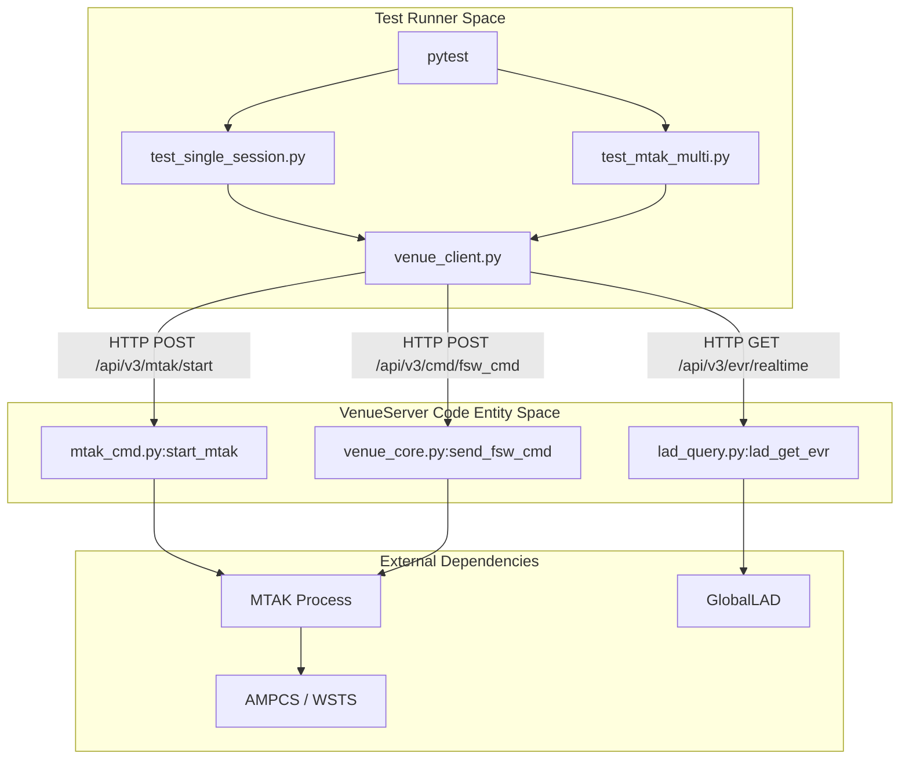
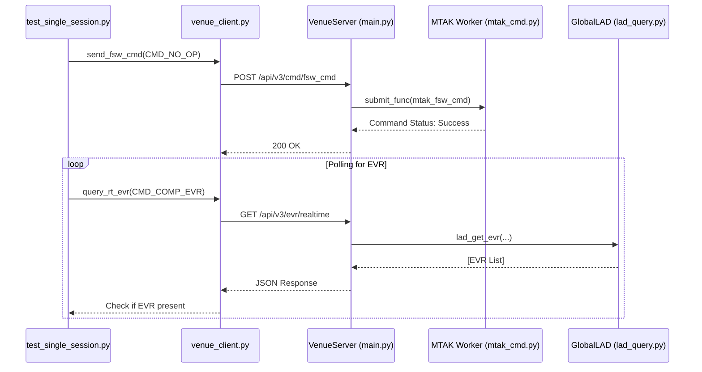

# Page: Test Infrastructure & Integration Tests

# Test Infrastructure & Integration Tests

Relevant source files

The following files were used as context for generating this wiki page:

- [tests/README.md](tests/README.md)
- [tests/env.csh](tests/env.csh)
- [tests/requirements.txt](tests/requirements.txt)
- [tests/test_mtak.py](tests/test_mtak.py)
- [tests/test_mtak_multi.py](tests/test_mtak_multi.py)
- [tests/test_single_session.py](tests/test_single_session.py)
- [tests/venue_client.py](tests/venue_client.py)

This page documents the testing framework for the VenueServer, which focuses on end-to-end integration tests. These tests validate the interaction between the VenueServer FastAPI endpoints, the MTAK command dispatcher, and live AMPCS/WSTS sessions.

## Test Environment Setup

The test infrastructure relies on a specific Python environment and pre-configured AMPCS session identifiers.

### Virtual Environment (`ve3`)
A dedicated virtual environment is used to isolate test dependencies such as `pytest`, `requests`, and `PyJWT` [tests/requirements.txt:1-4](). The setup involves creating a `ve3` directory and installing the required packages [tests/README.md:9-16]().

### Session Configuration (`env.csh`)
Integration tests require live AMPCS sessions (typically from WSTS) to be running [tests/README.md:5-7](). The session IDs are provided to the test suite via environment variables defined in `env.csh` [tests/env.csh:1-2]().

| Variable | Description |
| :--- | :--- |
| `TEST_AMPCS_SESSION_ID_A` | Primary AMPCS session ID for testing. |
| `TEST_AMPCS_SESSION_ID_B` | Secondary session ID used for multi-session validation. |

**Sources:** [tests/README.md:1-45](), [tests/env.csh:1-3](), [tests/requirements.txt:1-4]()

---

## Venue Client Helper (`venue_client.py`)

The `venue_client.py` script acts as a thin wrapper around the VenueServer REST API. it is used by all integration tests to communicate with the server.

### Authentication & JWT Generation
The client automatically generates a JSON Web Token (JWT) using a private RSA key (`exec_venue_private_pem.pem`) to authenticate requests [tests/venue_client.py:8-19]().
* **Function:** `generate_exec_token()` [tests/venue_client.py:25-40]()
* **Claims:** Includes scopes such as `basic`, `execute:wsts`, `redline`, and `admin` [tests/venue_client.py:30-33]().
* **Algorithm:** `RS256` [tests/venue_client.py:35]().

### API Wrappers
The client provides functions for every major API category defined in the VenueServer:

| Category | Key Functions |
| :--- | :--- |
| **MTAK Lifecycle** | `start_mtak`, `shutdown_mtak` [tests/venue_client.py:64-75]() |
| **Commanding** | `send_fsw_cmd`, `send_sse_cmd`, `send_file`, `send_scmf_file` [tests/venue_client.py:77-211]() |
| **Telemetry** | `query_rt_evr`, `query_chill_evr`, `query_rt_eha`, `query_chill_eha`, `query_dp` [tests/venue_client.py:102-183]() |
| **Custom Scripts** | `run_custom_script`, `get_custom_script_status` [tests/venue_client.py:213-225]() |

### Mission-Specific Constants
The client detects the environment via `socket.gethostname()` to set mission-specific command and EVR strings for Europa (`eurc`) or Psyche (`psyche`) [tests/venue_client.py:45-61]().

**Sources:** [tests/venue_client.py:1-228]()

---

## Integration Test Suites

The integration tests use `pytest` to execute scenarios against a running VenueServer instance.

### Test Architecture Diagram
The following diagram illustrates the data flow from the test runner through the `venue_client` to the VenueServer and its downstream dependencies.

Test Infrastructure Flow

**Sources:** [tests/test_single_session.py:1-113](), [tests/test_mtak_multi.py:5-60](), [tests/venue_client.py:64-102]()

### Key Test Files

#### 1. `test_mtak.py`
Focuses on the basic lifecycle of the MTAK worker process.
* `test_start_shutdown`: Verifies that MTAK can be initialized for a session and then terminated [tests/test_mtak.py:4-18]().
* `test_wrong_session_id`: Ensures the server returns a `400` error if an invalid session ID is provided [tests/test_mtak.py:19-24]().

#### 2. `test_mtak_multi.py`
Validates the ability of a single VenueServer instance to manage multiple AMPCS sessions simultaneously.
* **Logic:** Starts MTAK with two session IDs [tests/test_mtak_multi.py:10](), sends a `NO_OP` command to both [tests/test_mtak_multi.py:17-26](), and polls for completion EVRs from both sessions [tests/test_mtak_multi.py:31-55]().

#### 3. `test_single_session.py`
Contains complex scenarios, including Telemetry Selection Record (TSR) loading and telemetry verification.
* **Fixtures:** Uses `mtak_proc` to handle startup/shutdown [tests/test_single_session.py:7-16]() and `tsr` to configure telemetry reporting rates via FSW or SSE commands [tests/test_single_session.py:17-45]().
* **Data Product Test:** `test_rt_dp` verifies that the system can detect and retrieve Data Products (DPs) from the real-time stream.

**Sources:** [tests/test_mtak.py:1-29](), [tests/test_mtak_multi.py:1-61](), [tests/test_single_session.py:1-164]()

---

## Execution Workflow

The integration tests follow a strict setup-execution-teardown pattern to ensure clean state in the MTAK worker processes.

### Command and Telemetry Correlation
Integration tests typically perform a "round-trip" validation as shown in the sequence below:

Command-Telemetry Round Trip

### Execution Commands
Tests are executed using `pytest` within the activated `ve3` environment [tests/README.md:21-40]().
* **Standard run:** `pytest`
* **Debug mode:** `pytest -s` (disables stdout capture to see print statements) [tests/README.md:44]().
* **Targeted test:** `pytest test_mtak.py::test_start_shutdown` [tests/README.md:51]().

**Sources:** [tests/README.md:21-51](), [tests/test_single_session.py:113-137](), [tests/venue_client.py:77-116]()
