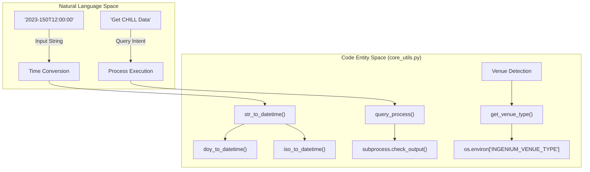
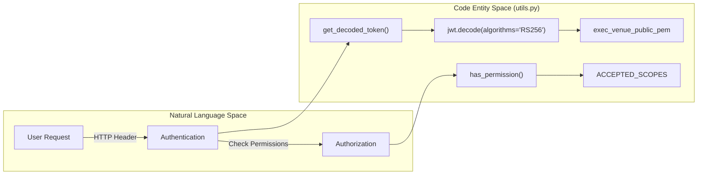

# Page: Utility Functions (core_utils.py & utils.py)

# Utility Functions (core_utils.py & utils.py)

Relevant source files

The following files were used as context for generating this wiki page:

- [core/core_utils.py](core/core_utils.py)
- [utils.py](utils.py)

This section describes the utility modules that provide foundational support for the VenueServer. `core_utils.py` handles mission-specific logic including time conversions, file path resolution, and subprocess management. `utils.py` manages security concerns, specifically RSA public key loading and JWT token validation.

## Core Utilities (core_utils.py)

`core_utils.py` serves as the primary library for data transformation and system interaction within the `venue_core` layer.

### Time System Conversions
The module provides comprehensive utilities for converting between various time formats used in JPL Ground Data Systems: UTC, ISO-8601, Day of Year (DOY), Spacecraft Event Time (SCET), and Spacecraft Clock (SCLK).

*   **Format Parsing**: `str_to_datetime` [core/core_utils.py:202-212]() acts as a multiplexer, attempting to parse strings as ISO-8601 via `iso_to_datetime` [core/core_utils.py:214-233]() before falling back to DOY format via `doy_to_datetime` [core/core_utils.py:234-244]().
*   **Precision Handling**: `normalize_with_microsecs` [core/core_utils.py:124-135]() ensures time strings have consistent 6-digit microsecond precision for comparison or database queries.

### PathConverter Class
The `PathConverter` class is used to resolve absolute file paths based on template strings and environment variables. This is heavily utilized for locating 1553 bus logs and data products.

| Feature | Implementation |
| :--- | :--- |
| **Template Resolution** | Uses `os.path.expandvars` and `glob.glob` to resolve wildcards in paths. |
| **1553 Log Discovery** | Resolves the path defined in `BUS_1553_LOGFILE_PATH` for the decoder. |

### Process Execution and Venue Detection
The module manages the execution of external AMPCS CLI tools and detects the operational environment.

*   **`query_process(cmd, timeout)`**: Wraps `subprocess.check_output` to execute CHILL or GlobalLAD queries [core/core_utils.py:137-155](). It includes specialized logging that abridges large responses to 1024 characters to prevent `rsyslogd` buffer overflows [core/core_utils.py:145-152]().
*   **`get_venue_type()`**: Reads the `INGENIUM_VENUE_TYPE` environment variable to return a `VenueType` enum (WSTS, TESTBED, or ATLO) [core/core_utils.py:168-180]().

### 1553 Log Filtering
Specific logic for the MIL-STD-1553 bus includes:
*   **`get_last_error_from_logs`**: Tails the last 50 lines of a log file and searches for "ERROR" or "FATAL" strings [core/core_utils.py:90-110]().

**Sources:** [core/core_utils.py:19-243]()

---

## Security and Authentication (utils.py)

`utils.py` provides the implementation for the JWT-based authentication used by the FastAPI middleware.

### RSA Key Management
Upon module initialization, the server attempts to load an RSA public key from a local PEM file.

*   **Key Loading**: The file `exec_venue_public_pem.pem` is read from the module directory [utils.py:8-21]().
*   **Integrity Check**: A CRC32 checksum of the public key is calculated and logged to ensure the correct key is in use across different deployments [utils.py:22-25]().

### JWT Validation Workflow
The authentication logic follows a standard Bearer token pattern.

1.  **`get_decoded_token(authorization_header)`**:
    *   Extracts the token from the `Bearer <token>` string [utils.py:37-41]().
    *   Decodes the token using the `RS256` algorithm and the loaded public key [utils.py:53-54]().
2.  **`has_permission(jwt_decoded)`**:
    *   Inspects the `scopes` claim within the decoded payload [utils.py:58-59]().
    *   Validates that the token contains at least one allowed scope from `ACCEPTED_SCOPES` (e.g., `execute:wsts`) [utils.py:61-65]().

**Sources:** [utils.py:8-66]()

---

## Technical Architecture Diagrams

### Data Flow: Time and Process Management
This diagram illustrates how `core_utils.py` bridges the gap between high-level requests and low-level system execution.

**Sources:** [core/core_utils.py:137-155](), [core/core_utils.py:168-180](), [core/core_utils.py:202-212]()

### Authentication Pipeline
This diagram maps the security concepts to the specific functions and variables in `utils.py`.

**Sources:** [utils.py:9-14](), [utils.py:36-56](), [utils.py:58-65]()

## Summary Table of Utility Classes and Functions

| Module | Entity | Purpose |
| :--- | :--- | :--- |
| `core_utils.py` | `VenueType` | Enum defining environment types: `WSTS`, `TESTBED`, `ATLO` [core/core_utils.py:56-60](). |
| `core_utils.py` | `query_process` | Executes CLI commands with abridged logging for `rsyslog` [core/core_utils.py:137-155](). |
| `core_utils.py` | `str_to_datetime` | Robust parser for mixed ISO/DOY time formats [core/core_utils.py:202-212](). |
| `utils.py` | `get_decoded_token` | Validates JWT signatures using `RS256` [utils.py:36-56](). |
| `utils.py` | `has_permission` | Checks for required execution scopes in JWT payload [utils.py:58-66](). |

**Sources:** [core/core_utils.py:56-212](), [utils.py:36-66]()
