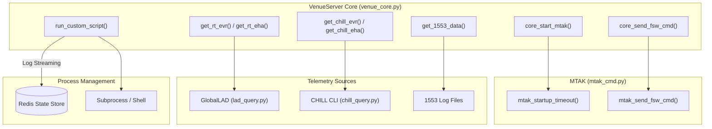
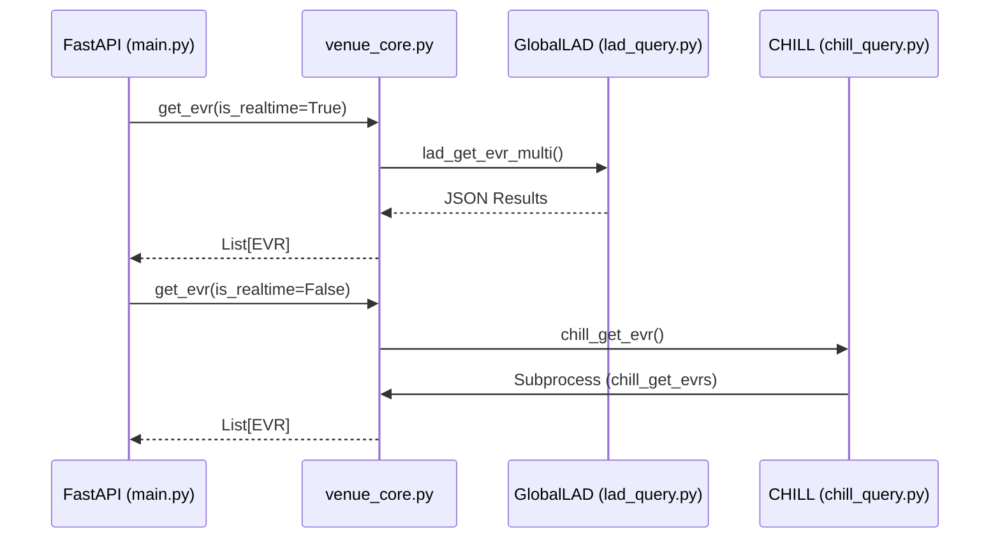

# Page: venue_core.py — Integration Layer

# venue_core.py — Integration Layer

Relevant source files

The following files were used as context for generating this wiki page:

- [core/config.py](core/config.py)
- [core/core_utils.py](core/core_utils.py)
- [core/venue_core.py](core/venue_core.py)

The `core/venue_core.py` module serves as the primary orchestration layer for the VenueServer. It abstracts the complexities of multi-system integration, providing a unified interface for the FastAPI endpoints to interact with command dispatch (MTAK), real-time telemetry (GlobalLAD), historical data (CHILL), and specialized hardware interfaces (1553 Bus).

## System Orchestration Overview

`venue_core.py` acts as the "glue" between the REST API and the underlying Ground Data System (GDS) tools. It manages the lifecycle of external processes and handles the transformation of data between internal Pydantic models and GDS-specific formats.

### Integration Map: Code to System Entities

The following diagram maps specific functions in `venue_core.py` to the external systems they orchestrate.

**System Integration Architecture**

**Sources:** [core/venue_core.py:1-46](), [core/venue_core.py:205-207](), [core/venue_core.py:35-38]()

---

## Command Dispatch Pipeline

Commanding is handled by proxying requests to the `mtak_cmd` module. `venue_core.py` ensures that every command dispatch is timestamped and logged before being handed off to the MTAK worker process.

### Supported Command Types
| Function | Target System | Description |
| :--- | :--- | :--- |
| `core_send_fsw_cmd` | Flight Software | Dispatches FSW commands via MTAK. |
| `core_send_hw_cmd` | Hardware/SCS | Dispatches hardware-level commands. |
| `core_send_sse_cmd` | SSE / Sim | Sends commands to the Simulation Support Equipment. |
| `core_send_fsw_file` | FSW Uplink | Uplinks binary files by wrapping them in SCMFs. |
| `core_send_scmf_file`| FSW Uplink | Uplinks pre-built Spacecraft Command Message Files. |

**Sources:** [core/venue_core.py:73-180]()

---

## Dual-Path Telemetry Retrieval

The integration layer implements a dual-path strategy for telemetry, routing requests based on the temporal nature of the query.

### Real-Time Path (GlobalLAD)
Used for low-latency retrieval of the most recent data points.
- **Functions:** `get_rt_evr()` [core/venue_core.py:205](), `get_rt_eha()` [core/venue_core.py:284]().
- **Logic:** Calls `lad_query.lad_get_evr_multi()` or `lad_query.lad_get_eha_multi()`.
- **Constraint:** Limited to `maxResults=1000` as enforced by the GlobalLAD backend.

### Historical Path (CHILL)
Used for deep-archive queries and complex time-range filtering.
- **Functions:** `get_chill_evr()` [core/venue_core.py:237](), `get_chill_eha()` [core/venue_core.py:314]().
- **Logic:** Constructs shell commands for `chill_get_evrs` or `chill_get_chanvals` and executes them via `core_utils.query_process()`.
- **Time Handling:** Supports SCLK, ERT, and SCET time types.

**Telemetry Flow Diagram**

**Sources:** [core/venue_core.py:205-340](), [core/core_utils.py:137-156]()

---

## 1553 Bus Integration

The 1553 integration retrieves and decodes MIL-STD-1553 bus logs. It utilizes the `PathConverter` logic to locate the correct log files based on the current mission configuration.

1. **File Discovery:** `get_most_recent_1553_logfiles()` identifies logs based on `BUS_1553_LOGFILE_PATH` [core/venue_core.py:42]().
2. **Decoding:** `decode_1553_log_files()` processes the raw binary/hex logs using an XML dictionary defined by `LOGFILE_1553_DICTIONARY_FILE_PATH` [core/venue_core.py:43]().
3. **Filtering:** Applies signal-level filtering (e.g., RT, Subaddress) before returning the decoded JSON structure.

**Sources:** [core/venue_core.py:37-45](), [core/venue_core.py:456-480]()

---

## Custom Script Lifecycle

`venue_core.py` manages the execution of arbitrary Python scripts located in the `CUSTOM_SCRIPT_BASE_DIR` [core/venue_core.py:41]().

### Execution Workflow
1. **Validation:** Checks if the script exists and is executable.
2. **Process Spawning:** Uses `subprocess.Popen` to run the script in a detached state.
3. **Logging:** Redirects `stdout` and `stderr` to a temporary log file under `/tmp/cs/<uuid>.log` [core/venue_core.py:39]().
4. **State Management:**
    - The process ID (PID) and start time are stored in **Redis**.
    - Users can poll the status or retrieve logs using the generated UUID.
5. **Termination:** Provides `stop_custom_script()` which sends `SIGTERM` (and eventually `SIGKILL` via `psutil`) to the script process group.

**Sources:** [core/venue_core.py:11-26](), [core/venue_core.py:39-41](), [core/venue_core.py:530-600]()

---

## Error Handling Patterns

The integration layer employs specific patterns to ensure GDS failures do not crash the VenueServer:

- **Subprocess Timeouts:** All CHILL and MTAK calls utilize `update_timeout()` to prevent orphaned processes from hanging the API thread [core/core_utils.py:113-123]().
- **Log Scraping:** In the event of an MTAK failure, `get_last_error_from_logs()` tails the MTAK log files to extract the specific GDS error message (e.g., "Command not found in dictionary") and return it to the user [core/core_utils.py:90-110]().
- **Time Parsing Errors:** `TimeParsingError` is raised when user-provided timestamps do not match DOY or ISO formats, allowing the API to return a `400 Bad Request` [core/core_utils.py:68-75]().

**Sources:** [core/core_utils.py:68-123](), [core/venue_core.py:28-34]()
