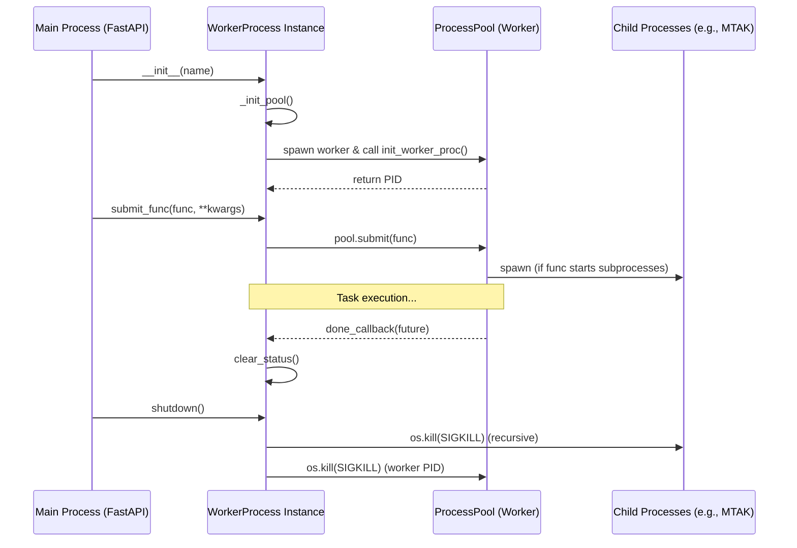
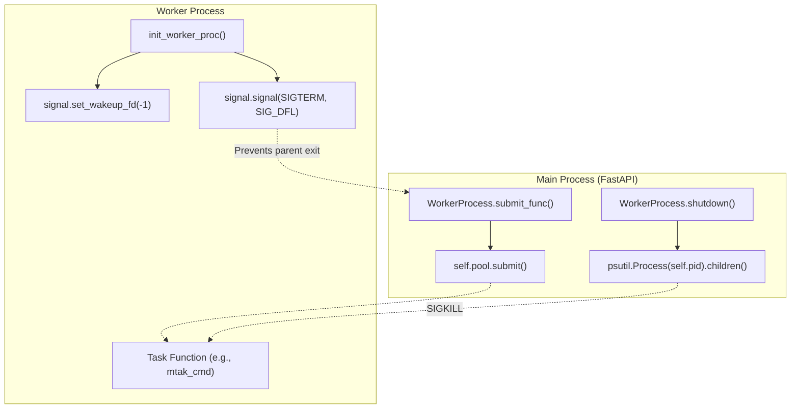

# Page: Worker Process Isolation (worker_process.py)

# Worker Process Isolation (worker_process.py)

Relevant source files

The following files were used as context for generating this wiki page:

- [core/worker_process.py](core/worker_process.py)

The `WorkerProcess` class provides a mechanism for executing blocking or signal-sensitive tasks in a separate operating system process, isolated from the main FastAPI application. This isolation is critical for integrating with the Mission Test Automation Kit (MTAK) and other AMPCS-related components that may interfere with the parent process's signal handling or resource management.

## Overview

The `WorkerProcess` implementation uses a `ProcessPoolExecutor` with a fixed capacity of one worker to ensure serialized execution of tasks. Key features include:
*   **Signal Isolation**: Prevents worker termination signals from propagating to and shutting down the FastAPI server.
*   **Lifecycle Management**: Automated initialization, monitoring, and forced termination of worker processes and their recursive children.
*   **Recovery**: Ability to detect `BrokenProcessPool` exceptions and recreate the execution environment.

### Data Flow and Lifecycle

The following diagram illustrates the lifecycle of a worker process from initialization through task execution and shutdown.

**Worker Process Lifecycle**

Sources: [core/worker_process.py:23-38](), [core/worker_process.py:56-101](), [core/worker_process.py:118-129]()

---

## Key Components

### init_worker_proc
This function serves as the entry point for the worker process within the pool. It performs critical signal reconfiguration to prevent the parent FastAPI process from exiting if the worker is killed.

*   **Signal Reset**: It sets `SIGTERM` and `SIGINT` to `SIG_DFL` (default) [core/worker_process.py:17-18]().
*   **FastAPI Compatibility**: It calls `signal.set_wakeup_fd(-1)` to prevent interference with the parent's event loop [core/worker_process.py:16]().

### WorkerProcess Class
The `WorkerProcess` class wraps the `concurrent.futures.ProcessPoolExecutor` and manages the state of the single worker.

| Method | Description |
| :--- | :--- |
| `_init_pool()` | Initializes the `ProcessPoolExecutor` with `max_workers=1` and captures the worker's PID [core/worker_process.py:34-38](). |
| `submit_func()` | Submits a function for execution. Throws an exception if the worker is currently busy (`is_running`) [core/worker_process.py:118-126](). |
| `is_running()` | Checks if the internal `future` exists and is not yet done [core/worker_process.py:137-146](). |
| `wait_for_completion()` | Blocks until the task is finished or the specified timeout is reached [core/worker_process.py:154-162](). |
| `shutdown()` | Performs a hard kill of the worker process and all its recursive children using `psutil` [core/worker_process.py:56-101](). |

Sources: [core/worker_process.py:23-163]()

---

## Implementation Details

### Process Isolation and Signal Handling
To bridge the "Natural Language Space" (Isolation) to the "Code Entity Space", the following diagram maps specific code functions to their roles in maintaining process health.

**Isolation Implementation Mapping**

Sources: [core/worker_process.py:13-21](), [core/worker_process.py:72-86](), [core/worker_process.py:125]()

### Forced Termination Logic
The `shutdown()` method ensures that no orphaned processes remain, which is common when the worker process spawns MTAK shell commands or other sub-shells.

1.  **Child Discovery**: It uses `psutil.Process(self.pid).children(recursive=True)` to find every descendant process [core/worker_process.py:72]().
2.  **Escalated Kill**: It iterates through the PIDs and issues `os.kill(pid, signal.SIGKILL)` to ensure immediate termination [core/worker_process.py:77-86]().
3.  **Verification Loop**: It polls `psutil.pids()` for up to 5 seconds to verify that all target PIDs have disappeared from the system table [core/worker_process.py:91-97]().

### Error Recovery and Broken Pools
If the worker process crashes (e.g., due to a segmentation fault in a native library or an external `SIGKILL`), the `ProcessPoolExecutor` may enter a "broken" state.

*   **Detection**: `submit_func` catches `BrokenProcessPool` [core/worker_process.py:130-132]().
*   **Reset**: The `reset()` method calls `shutdown()`, clears internal states via `clear_status()`, and re-invokes `_init_pool()` to spawn a fresh worker [core/worker_process.py:103-110]().

Sources: [core/worker_process.py:56-117](), [core/worker_process.py:130-132]()
